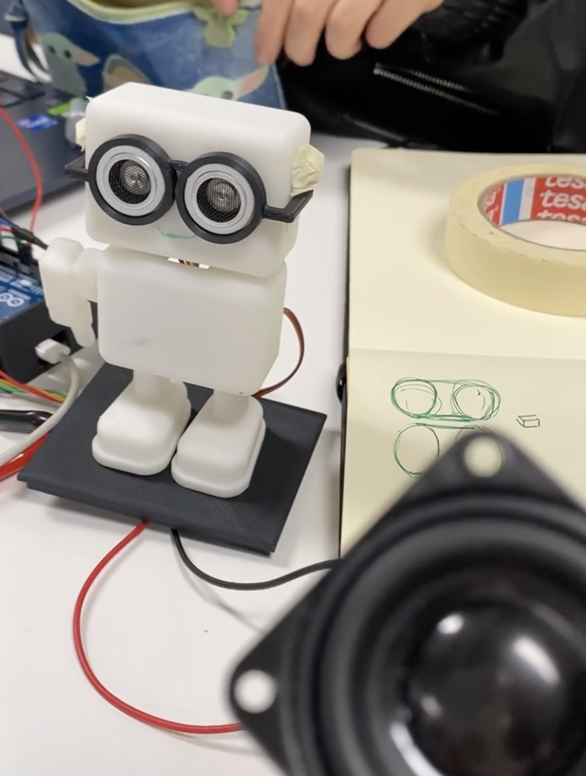
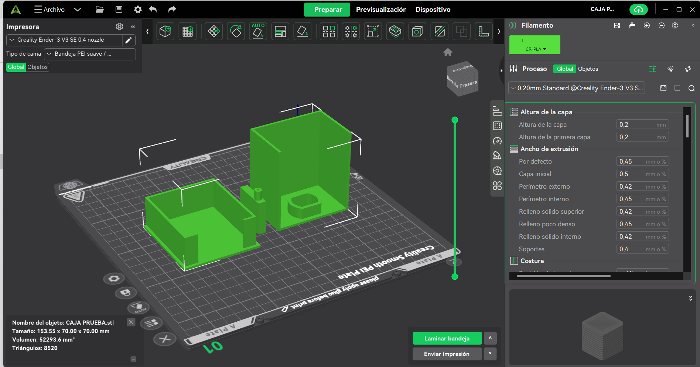

# Proyecto-02 

## Acerca del proyecto

- Grupo: 01
- Nombre de grupo: leonas.ino 
- Integrantes:
  - Yamna Carrión / [yamna-bit](https://github.com/yamna-bit)
  - Sofía Cartes / [sofiacartes](https://github.com/sofiacartes)
  - Millaray Millar / [mmillar95](https://github.com/mmillar95)
  - Vania Paredes /  [21vaniaparedes](https://github.com/21vaniaparedes)
  - Valentina Ruz /[vxlentinaa](https://github.com/vxlentiinaa)

## Presentación textual 

### AND-Y

El proyecto consiste en un robot que saluda mediante la interacción con algún humano, por medio de el sensor de ultrasónico programado con Arduino R4 Minima. A través, de las diferentes distancias puede recorrer tres fases de audios:

`Diálogo:`

`Audios de saludo: Fase 1 y 2`

- Decir "hola humano, ¿porqué estas tan lejos?. Acércate"
- "Hola, no seas tímido, ven más cerca. no tengo, virus creoo, jiji. "

`Datos curiosos que dirá: Fase 3`

- “¿Sabías qué?, los 99% de los problemas se arreglan reiniciando.”
- “La nube no existe, son computadores de otro.”
- “Los datos nunca se borran, sólo se esconden.”
- “El error 404 es mi manera de hacerme el leso.”
- “El primer mouse era de madera.”
  
## Inputs y outputs

Componentes a utilizar:

| Componentes | Cantidad | Unidad          | OBS
|---------|----------------------------------|------------------|------------------|
| Mini Protoboard |  1  | 400 puntos | Conexión VCC GND directa al arduino | 
| Arduino UNO | 1  | R4 Minima  | Conexión directa a corriente | 
| Sensor Ultrasónico |  1 | HC-SR04 | PIN TRIGGER al PIN 11 - PIN ECHO al PIN 12 - VCC a 5V y GND a GND | 
| ServoMotor | 1   | SG90 | VCC a 5V - GND a GND y PIN 13 | 
| Motor Vibrador | 1  | Joystick  | VCC a 5V | 
| Transistor | 1  | FET IRFZ44n | Mosfet-m Esquemático de conexión más abajo| 
| Resistencia | 1  | 1K | Esquemático de conexión más abajo| 
| Resistencia | 1  | 100K | Esquemático de conexión más abajo|
| Diodo | 1  | IN4007 | Esquemático de conexión más abajo| 
| Reproductor MP3 | 1 | DFPlayer mini | VCC a 5V - Negativo altavoz a STK_2 - Positivo altavoz a STK_1 - TX al RX Arduino - RX al TX Arduino - GND a GND  | 
| Tarjeta SD | 1 | 255gb | Reproductor MP3 | 
| Altavoz | 1 | Mini Parlante 3W | Negativo a STK_2 Reproductor - Positivo a STK_1 Reproductor| 
  
### Input

Mediante el sensor ultrasónico, la máquina detecta movimiento/presencia y mide la distancia.

### Output

Al detectar la distancia de la presencia la máquina reacciona de diferentes formas, según los siguientes componentes:

- Altavoz 
- Servomotor al levantar el brazo
- Motor vibrador al detectar presencia de algún humano

### Esquemático de conexión Motor Vibración Joystick
Esquemático hecho por misa en clase.

- Esquema mosfet-m: 

`Reacciones`

1. Cuando detecte una presencia esta comenzará a temblar (de nervios) mediante el motor vibración Joystick la accíon de temblar aumentará entre más cerca estés.
2. El sensor detectará presencia en 3 instancias: 2 - 20 cm, 70 - 90cm, 130 - 150cm.
En cada parámetro la máquina reproduce un audio de voz distinto mediante la microSD en el reproductor MP3 y el altavoz.
3. Los parámetros son:
- 130 - 150cm = Te "grita" que vengas. diciendo: "Hola humano, ¿Por qué estás tan lejos?. Acércate.
- 80 - 100cm = Te grita de nuevo pidiendo que te acerques más, diciendo: "Hola, no seas tímido, ven más cerca, no tengo virus creoo, jiji."
-  2 - 20cm = Levanta un "dedo" usando el servo motor, este se moverá de los 0 grados a los 180 mientras estés a esa distancia. Al mismo tiempo te dirá los siguientes datos curiosos:

- “¿Sabías qué?, los 99% de los problemas se arreglan reiniciando.”
-  “La nube no existe, son computadores de otro.”
-  “Los datos nunca se borran, sólo se esconden.”
-  “El error 404 es mi manera de hacerme el leso.”
-  “El primer mouse era de madera.”

### Bocetos de planificación

### Más procesos de códigos y fotografías en Github

## Etapas del código

`Etapas de proceso de código arriba en files con fecha.`

### 1. Inicialización  del hardware

### 2. Relalizar códigos por parte según componentes a utilizar

### 3. Ver las clases de los archivos

### 4. Juntar el código 

## Etapas de la carcasa 

## Roles del equipo 

  - **Yamna Carrión:** Aportó principalmente junto a Millaray en el diseño de la Carcasa del prototipo e igualmente hizo y revisó código.
  - **Millaray Millar:** Aporte principalo como diseñadora y reina del modelado de nuestro prototipo. Además investigó sobre el reproductor MP3 junto al Altavoz para poder hacerlo funcionar.
  - **Sofía Cartes:** Aporte principal de ordenar Github, Revisar, probar y hacer código.
  - **Vania Paredes:** Aporte principal haciendo, revisando y probando código. Ayudó también a ordenar Githuib.
  - **Valentina Ruz:** Aporte principal haciendo, revisando y probando código. Ayudó también a ordenar Githuib.

`Al final del dia todas complementamos en todos los roles <3`

## Fotografías y videos del proyecto funcionando

## Bibliografía

- El Octavo Bit. (s.f.). Librerías Arduino: NewPing. Recuperado de https://eloctavobit.com/librerias-arduino/newping
- Llamas, L. (s.f.). Ficheros .h y .cpp en C++. Recuperado de https://www.luisllamas.es/cpp-ficheros-h-y-cpp/
- DFRobot. (s.f.). DFRobotDFPlayerMini Library. Recuperado de https://github.com/DFRobot/DFRobotDFPlayerMini
- W3Schools. (s.f.). C++ Tutorial. Recuperado de https://www.w3schools.com/cpp/default.asp
- Arduino. (s.f.). Repositorio oficial de Arduino. Recuperado de https://github.com/Arduino
- Murky Robot. (s.f.). Guía del sensor KY-038. Recuperado de https://www.murkyrobot.com/guias/sensores/ky-038
- ETC2. (s.f.). HC-SR04 Ultrasonic Sensor Datasheet. Recuperado de https://www.alldatasheet.com/datasheet-pdf/download/1132204/ETC2/HCSR04.html
- AG Electrónica. (s.f.). Módulo MP3 Player - Hoja técnica. Recuperado de https://agelectronica.lat/pdfs/textos/M/MP3-PLAYER-MODULE.PDF
- MCIElectronics. (2022, diciembre 27). Interfaz del sensor de sonido con Arduino y dispositivos de control con una palmada. Recuperado de https://cursos.mcielectronics.cl/2022/12/27/interfaz-del-sensor-de-sonido-con-arduino-y-dispositivos-de-control-con-una-palmada/
- Llamas, L. (s.f.). Detectar sonido con Arduino y micrófono KY-038. Recuperado de https://www.luisllamas.es/detectar-sonido-con-arduino-y-microfono-ky-038/
- YouTube. (s.f.). Video sobre el sensor de sonido con Arduino [Video]. Recuperado de https://www.youtube.com/watch?v=BAfZWXbKrf0
- YouTube. (s.f.). Video sobre el sensor ultrasónico HC-SR04 [Video]. Recuperado de https://www.youtube.com/watch?v=8RLBxhA4ooI
- AFEL. (s.f.). Micro servomotor SG90. Recuperado de https://afel.cl/products/micro-servomotor-sg90
- AFEL. (s.f.). Sensor ultrasónico HC-SR04. Recuperado de https://afel.cl/products/sensor-de-ultrasonico-hc-sr04
- Mouser Electronics. (s.f.). Vibration Motor Capsule - Datasheet. Recuperado de https://www.mouser.com/datasheet/2/321/28822-Vibration-Motor-Capsule-Documentation-370386.pdf
- AFEL. (s.f.). Módulo reproductor MP3 DFPlayer Mini. Recuperado de https://afel.cl/products/modulo-reproductor-mp3-dfplayer-mini

### Repositorios

