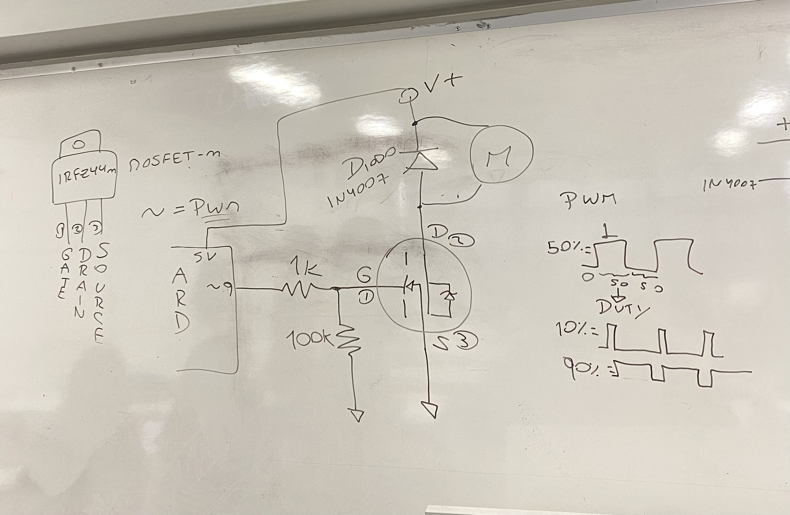
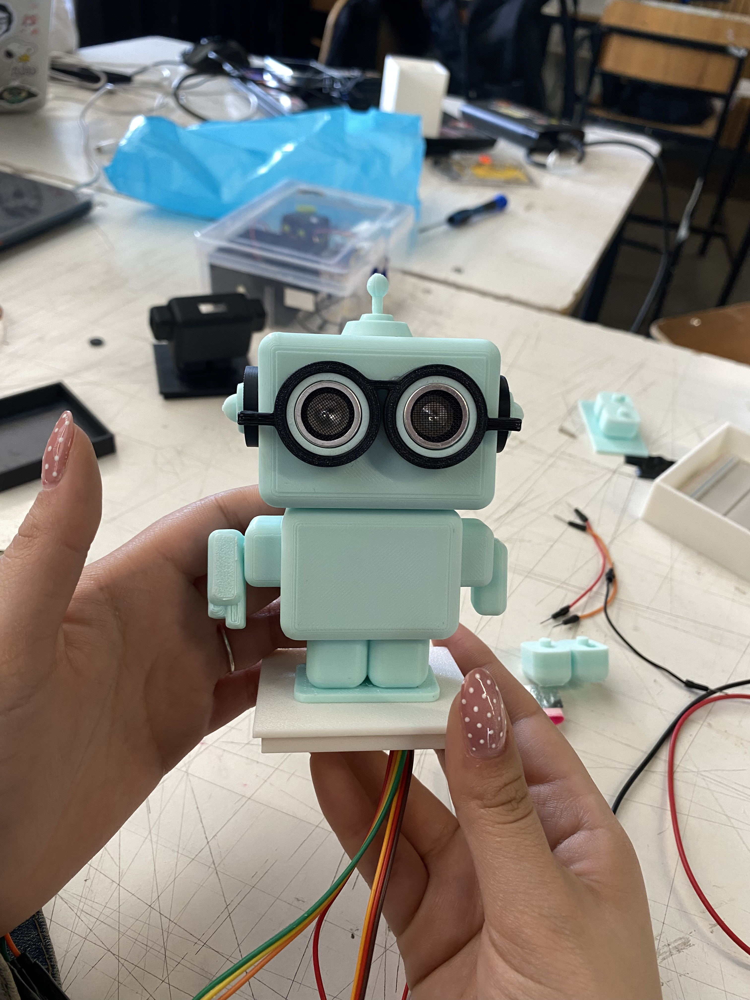

# Proyecto-02

## Acerca del proyecto

- Grupo: 01
- Nombre de grupo: leonas.ino
- Integrantes:
  - Yamna Carrión / [yamna-bit](https://github.com/yamna-bit)
  - Sofía Cartes / [sofiacartes](https://github.com/sofiacartes)
  - Millaray Millar / [mmillar95](https://github.com/mmillar95)
  - Vania Paredes /  [21vaniaparedes](https://github.com/21vaniaparedes)
  - Valentina Ruz /[vxlentinaa](https://github.com/vxlentiinaa)

## Presentación textual

### AND-Y

El proyecto consiste en un robot que saluda mediante la interacción con algún humano, por medio de el sensor de ultrasónico programado con Arduino R4 Minima. A través, de las diferentes distancias puede recorrer tres fases de audios:

`Diálogo:`

`Audios de saludo: Fase 1 y 2`

- Decir "hola humano, ¿porqué estas tan lejos?. Acércate"
- "Hola, no seas tímido, ven más cerca. no tengo, virus creoo, jiji. "

`Datos curiosos que dirá: Fase 3`

- “¿Sabías qué?, los 99% de los problemas se arreglan reiniciando.”
- “La nube no existe, son computadores de otro.”
- “Los datos nunca se borran, sólo se esconden.”
- “El error 404 es mi manera de hacerme el leso.”
- “El primer mouse era de madera.”
  
## Inputs y outputs

Componentes a utilizar:

| Componentes | Cantidad | Unidad          | OBS |
|---------|----------------------------------|------------------|------------------|
| Mini Protoboard | 1 | 400 puntos | Conexión VCC GND directa al arduino |
| Arduino UNO | 1 | R4 Minima | Conexión directa a corriente |
| Sensor Ultrasónico |  1 | HC-SR04 | PIN TRIGGER al PIN 11 - PIN ECHO al PIN 12 - VCC a 5V y GND a GND |
| ServoMotor | 1 | SG90 | VCC a 5V - GND a GND y PIN 13 |
| Motor Vibrador | 1  | Joystick | VCC a 5V Esquemático de conexión más abajo |
| Transistor | 1 | FET IRFZ44n | Mosfet-m Esquemático de conexión más abajo |
| Resistencia | 1 | 1K | Esquemático de conexión más abajo |
| Resistencia | 1 | 100K | Esquemático de conexión más abajo |
| Diodo | 1 | IN4007 | Esquemático de conexión más abajo |
| Reproductor MP3 | 1 | DFPlayer mini | VCC a 5V - Negativo altavoz a STK_2 - Positivo altavoz a STK_1 - TX al RX Arduino - RX al TX Arduino - GND a GND |
| Tarjeta SD | 1 | 255gb | Reproductor MP3 |
| Altavoz | 1 | Mini Parlante 3W | Negativo a STK_2 Reproductor - Positivo a STK_1 Reproductor |
  
### Input

Mediante el sensor ultrasónico, la máquina detecta movimiento/presencia y mide la distancia.

### Output

Al detectar la distancia de la presencia la máquina reacciona de diferentes formas, según los siguientes componentes:

- Altavoz
- Servomotor al levantar el brazo
- Motor vibrador al detectar presencia de algún humano

### Esquemático de conexión Motor Vibración Joystick

Esquemático hecho por misa en clase.



- Esquema mosfet-m:


`Reacciones`

1. Cuando detecte una presencia esta comenzará a temblar (de nervios) mediante el motor vibración Joystick la accíon de temblar aumentará entre más cerca estés.
2. El sensor detectará presencia en 3 instancias: 2 - 20 cm, 70 - 90cm, 130 - 150cm.
En cada parámetro la máquina reproduce un audio de voz distinto mediante la microSD en el reproductor MP3 y el altavoz.
3. Los parámetros son:

- 130 - 150cm = Te "grita" que vengas. diciendo: "Hola humano, ¿Por qué estás tan lejos?. Acércate.
- 80 - 100cm = Te grita de nuevo pidiendo que te acerques más, diciendo: "Hola, no seas tímido, ven más cerca, no tengo virus creoo, jiji."
- 02 - 20cm = Levanta un "dedo" usando el servo motor, este se moverá de los 0 grados a los 180 mientras estés a esa distancia. Al mismo tiempo te dirá los siguientes datos curiosos:

- “¿Sabías qué?, los 99% de los problemas se arreglan reiniciando.”
- “La nube no existe, son computadores de otro.”
- “Los datos nunca se borran, sólo se esconden.”
- “El error 404 es mi manera de hacerme el leso.”
- “El primer mouse era de madera.”

### Bocetos de planificación


### Más procesos de códigos y fotografías en Github


## Etapas del código

`Etapas de proceso de código arriba en files con fecha.`

### 1. Entrada Sensor Ultrasónico

El código comienza midiendo la distancia con el Sensor Ultrasónico

```cpp
#include "EntradaUltrasonico.h"

EntradaUltrasonico::EntradaUltrasonico() {}

EntradaUltrasonico::~EntradaUltrasonico() {}

void EntradaUltrasonico::configurar() {
  pinMode(patitaTrigger, OUTPUT);
  pinMode(patitaEcho, INPUT);
  Serial.begin(9600);
}

float EntradaUltrasonico::medirDistancia() {
 // mide dustancia enviando un pulso de sonido
 // y mide cuanto tardar en regresar
  digitalWrite(patitaTrigger, LOW);
  delayMicroseconds(2);
  digitalWrite(patitaTrigger, HIGH);
  delayMicroseconds(10);
  digitalWrite(patitaTrigger, LOW);

  // lee el eco recibido
  duracion = pulseIn(patitaEcho, HIGH);

  // convierte la distancia a cm (velocidad del sonido = 343 m/s)
  distanciaCm = int(float(duracion) * 0.0343 / 2.0);

  return distanciaCm;
}

void EntradaUltrasonico::decidirCercania() {
  int nuevoEstado = -1;

  // determinar en que zona esta la distancia
  if (distanciaCm >= minCercana && distanciaCm <= maxCercana) {
    nuevoEstado = 0; // cercana
  } 
  else if (distanciaCm >= minMediana && distanciaCm <= maxMediana) {
    nuevoEstado = 1; // mediana
  } 
  else if (distanciaCm >= minLejana && distanciaCm <= maxLejana) {
    nuevoEstado = 2; // lejana
  }

  // cambia solo si ha pasado tiempo suficiente desde el ultimo cambio
  if (nuevoEstado != ultimoEstado && (millis() - ultimoCambio > tiempoEstabilidad)) {
    ultimoCambio = millis();
    ultimoEstado = nuevoEstado;
    dondeEsta = nuevoEstado;
  } 
  else {
    dondeEsta = ultimoEstado;
  }
}
```

### 2. Salida Dedo Servomotor

```
#include "SalidaDedo.h"

SalidaDedo::SalidaDedo() {}

SalidaDedo::~SalidaDedo() {}

void SalidaDedo::configurar() {
  SalidaDedo::servo.attach(SalidaDedo::patitaServo);
  // posicion inicial 0 grados
  SalidaDedo::servo.write(0);
}

void SalidaDedo::levantar() {
  // 180 grados
  SalidaDedo::servo.write(180);
}

void SalidaDedo::bajar() {
  //0 grados
  SalidaDedo::servo.write(0);
}
```

### 3. Salida Motor Vibracion

```
#include "SalidaMotorVibracion.h"

// constructor
SalidaMotorVibracion::SalidaMotorVibracion() {}

// destructor
SalidaMotorVibracion::~SalidaMotorVibracion() {}

// configuracion inicial
void SalidaMotorVibracion::configurar() {
  pinMode(SalidaMotorVibracion::TRIG_PIN,
          OUTPUT);
  pinMode(SalidaMotorVibracion::ECHO_PIN, INPUT);
  pinMode(SalidaMotorVibracion::MOTOR_PIN, OUTPUT);
  Serial.begin(9600);
}

// funcion para actualizar la distancia y no controlar la vibracion
void SalidaMotorVibracion::actualizar() {
  digitalWrite(SalidaMotorVibracion::TRIG_PIN, LOW);
  delayMicroseconds(2);
  digitalWrite(SalidaMotorVibracion::TRIG_PIN, HIGH);
  delayMicroseconds(10);
  digitalWrite(SalidaMotorVibracion::TRIG_PIN, LOW);

  SalidaMotorVibracion::duracion = pulseIn(
    SalidaMotorVibracion::ECHO_PIN,
    HIGH);
}

// actualiza la vibracion según la distancia
void SalidaMotorVibracion::vibrar(int cuantoVibrar) {

  // si es cercana, el numero es 0
  if (cuantoVibrar == 0) {
    // no vibra
    SalidaMotorVibracion::intensidad = 0;
  }
  // si es mediana, el numero es 1
  else if (cuantoVibrar == 1) {
    // vibra mucho
    SalidaMotorVibracion::intensidad = 80;
  }
  // si es lejana, el numero es 2
  else if (cuantoVibrar == 2) {
    // vibra poco
    SalidaMotorVibracion::intensidad = 20;
  }
  // fuera de rango
  else {
    SalidaMotorVibracion::intensidad = 0;
  }

  analogWrite(SalidaMotorVibracion::MOTOR_PIN,
              SalidaMotorVibracion::intensidad);

  delay(300);
}
```

### 4. Salida Voz

```
#include "SalidaVoz.h"

#if (defined(ARDUINO_AVR_UNO) || defined(ESP8266))   // para placas tipo UNO o ESP8266
#include <SoftwareSerial.h>
SoftwareSerial mp3Serial(4, 5); // RX, TX
#define MP3_SERIAL mp3Serial
#else
#define MP3_SERIAL Serial1
#endif

DFRobotDFPlayerMini mp3Player;

 // condicionar el sonido para que no se repita como loro
 // es decir, si detecta distancia x, reproducir es verdadero
bool reproduciendo = false;

 // inicializar el reproductor MP3
void configurarMP3() {
  MP3_SERIAL.begin(9600);
  Serial.println(F("Inicializando DFPlayer..."));

  if (!mp3Player.begin(MP3_SERIAL, true, true)) {
    Serial.println(F("Error: No se pudo iniciar el DFPlayer."));
    Serial.println(F("1. Revisa las conexiones (RX/TX)."));
    Serial.println(F("2. Asegúrate de que la SD esté insertada."));
    while (true) { delay(100); }
  }

  Serial.println(F("🎶 DFPlayer Mini listo."));
  mp3Player.volume(30); // volumen 0–30
}

 // reproducir audio según distancia medida
void reproducirAudioDistancia(float distancia) {
  static int ultimoAudio = 0; // evita repetir el mismo audio constantemente

 // definir la distancia minima de 0 a 20 cm
 // definir distancia media de 50 a 90 cm
 // definir la distancia maxima de 100 a 140 cm
 // tiempo de reposo cuando no siente presencia 
 if (distancia >= 0 && distancia <= 20) {
    // rango largo: audio 1
    if (ultimoAudio != 3 && !reproduciendo) {
      mp3Player.play(3);
      reproduciendo = true;
      Serial.println("Reproduciendo audio 3");
      ultimoAudio = 3;
    }
  } 
  else if (distancia >= 50 && distancia <= 90) {
    // rango medio: audio 2
    if (ultimoAudio != 2 && !reproduciendo) {
      mp3Player.play(2);
      Serial.println("Reproduciendo audio 2");
      ultimoAudio = 2;
    }
  } 
  else if (distancia >= 100 && distancia <= 140) {
    // rango largo: audio 1
    if (ultimoAudio != 1 && !reproduciendo) {
      mp3Player.play(1);
      Serial.println("Reproduciendo audio 1");
      ultimoAudio = 1;
    }
  } 
  else {
 // fuera de rango: reinicia estado
    ultimoAudio = 0;
  }
}

  void reproducirAudioDirecto(int numeroAudio) {
    mp3Player.play(numeroAudio);
    Serial.print("Reproduciendo audio ");
    Serial.println(numeroAudio);
  }
```

## Etapas de la carcasa





## Roles del equipo

- **Yamna Carrión:** Aportó principalmente junto a Millaray en el diseño de la Carcasa del prototipo e igualmente hizo y revisó código.
- **Millaray Millar:** Aporte principalo como diseñadora y reina del modelado de nuestro prototipo. Además investigó sobre el reproductor MP3 junto al Altavoz para poder hacerlo funcionar.
- **Sofía Cartes:** Aporte principal de ordenar Github, Revisar, probar y hacer código.
- **Vania Paredes:** Aporte principal haciendo, revisando y probando código. Ayudó también a ordenar Github.
- **Valentina Ruz:** Aporte principal haciendo, revisando y probando código. Ayudó también a ordenar Github.

`Al final del dia todas complementamos en todos los roles <3`

## Fotografías y videos del proyecto funcionando

## Bibliografía

- El Octavo Bit. (s.f.). Librerías Arduino: NewPing. Recuperado de <https://eloctavobit.com/librerias-arduino/newping>
- Llamas, L. (s.f.). Ficheros .h y .cpp en C++. Recuperado de <https://www.luisllamas.es/cpp-ficheros-h-y-cpp/>
- DFRobot. (s.f.). DFRobotDFPlayerMini Library. Recuperado de <https://github.com/DFRobot/DFRobotDFPlayerMini>
- W3Schools. (s.f.). C++ Tutorial. Recuperado de <https://www.w3schools.com/cpp/default.asp>
- Arduino. (s.f.). Repositorio oficial de Arduino. Recuperado de <https://github.com/Arduino>
- Murky Robot. (s.f.). Guía del sensor KY-038. Recuperado de <https://www.murkyrobot.com/guias/sensores/ky-038>
- ETC2. (s.f.). HC-SR04 Ultrasonic Sensor Datasheet. Recuperado de <https://www.alldatasheet.com/datasheet-pdf/download/1132204/ETC2/HCSR04.html>
- AG Electrónica. (s.f.). Módulo MP3 Player - Hoja técnica. Recuperado de <https://agelectronica.lat/pdfs/textos/M/MP3-PLAYER-MODULE.PDF>
- MCIElectronics. (2022, diciembre 27). Interfaz del sensor de sonido con Arduino y dispositivos de control con una palmada. Recuperado de <https://cursos.mcielectronics.cl/2022/12/27/interfaz-del-sensor-de-sonido-con-arduino-y-dispositivos-de-control-con-una-palmada/>
- Llamas, L. (s.f.). Detectar sonido con Arduino y micrófono KY-038. Recuperado de <https://www.luisllamas.es/detectar-sonido-con-arduino-y-microfono-ky-038/>
- YouTube. (s.f.). Video sobre el sensor de sonido con Arduino VIDEO. Recuperado de <https://www.youtube.com/watch?v=BAfZWXbKrf0>
- YouTube. (s.f.). Video sobre el sensor ultrasónico HC-SR04 VIDEO. Recuperado de <https://www.youtube.com/watch?v=8RLBxhA4ooI>
- AFEL. (s.f.). Micro servomotor SG90. Recuperado de <https://afel.cl/products/micro-servomotor-sg90>
- AFEL. (s.f.). Sensor ultrasónico HC-SR04. Recuperado de <https://afel.cl/products/sensor-de-ultrasonico-hc-sr04>
- Mouser Electronics. (s.f.). Vibration Motor Capsule - Datasheet. Recuperado de <https://www.mouser.com/datasheet/2/321/28822-Vibration-Motor-Capsule-Documentation-370386.pdf>
- AFEL. (s.f.). Módulo reproductor MP3 DFPlayer Mini. Recuperado de <https://afel.cl/products/modulo-reproductor-mp3-dfplayer-mini>

### Repositorios

