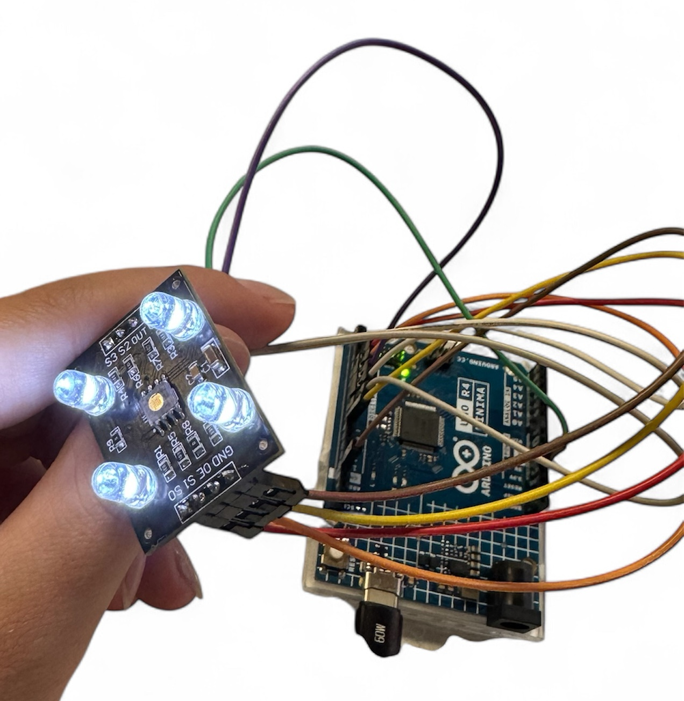
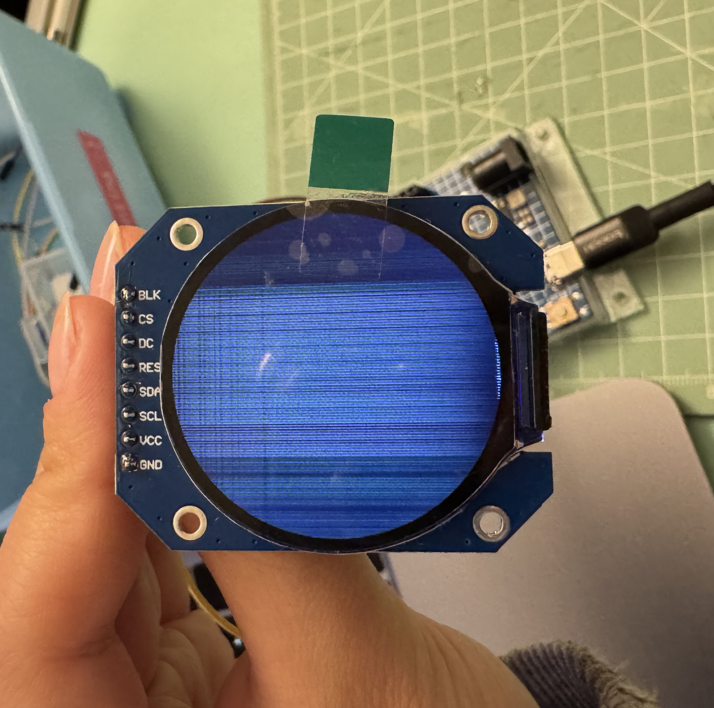
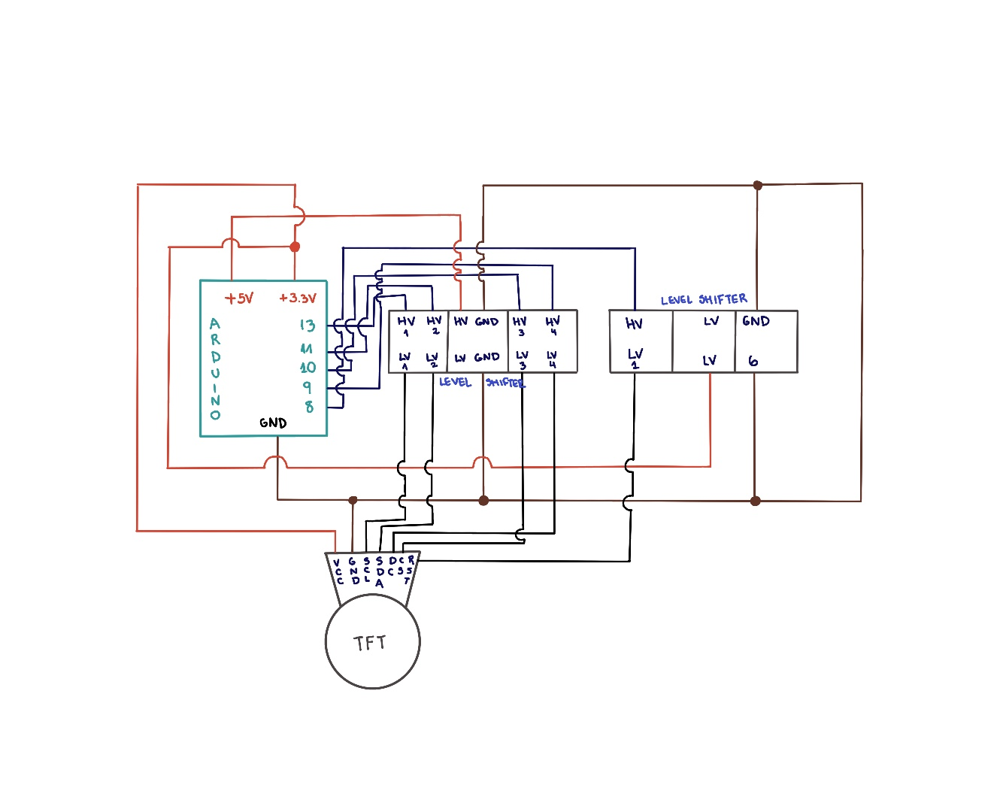
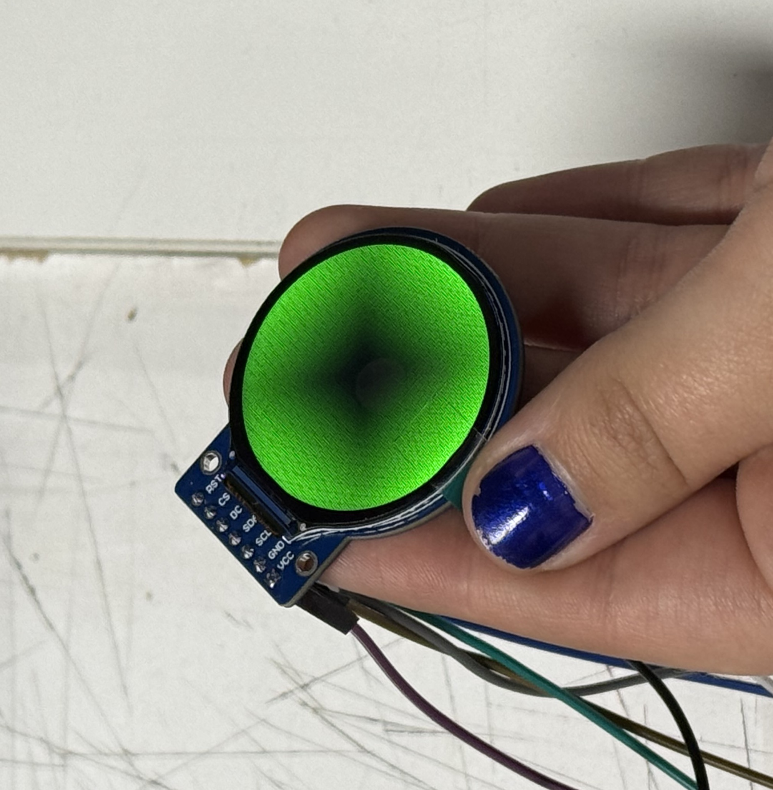
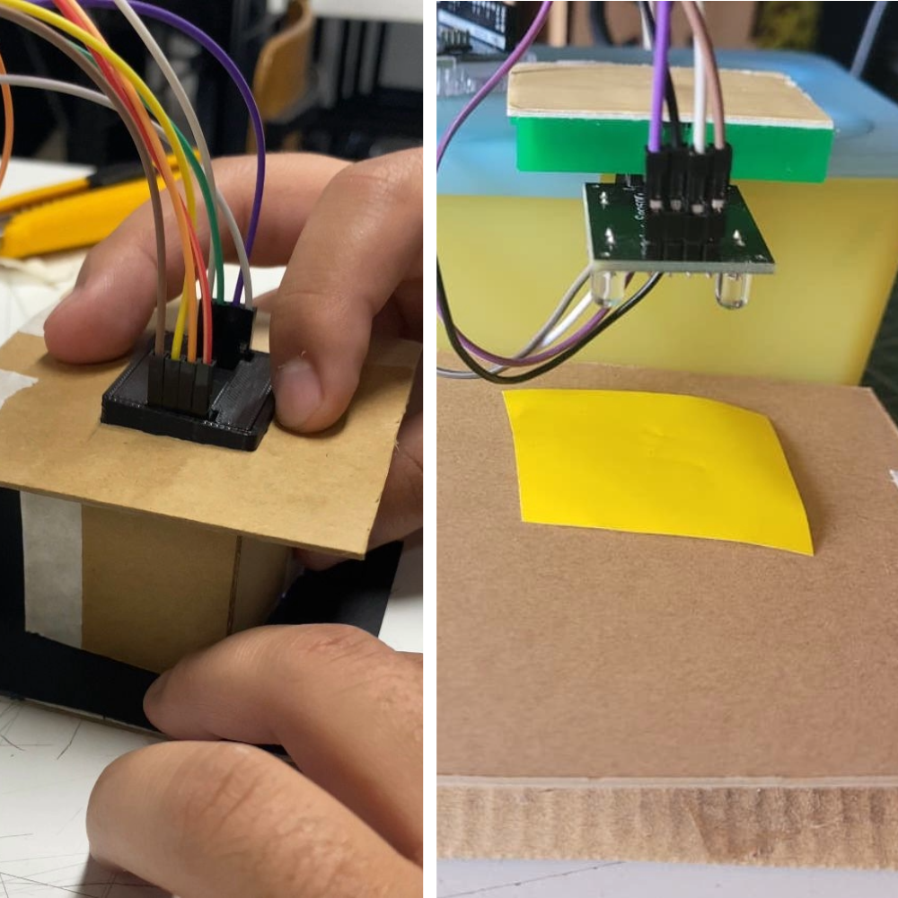
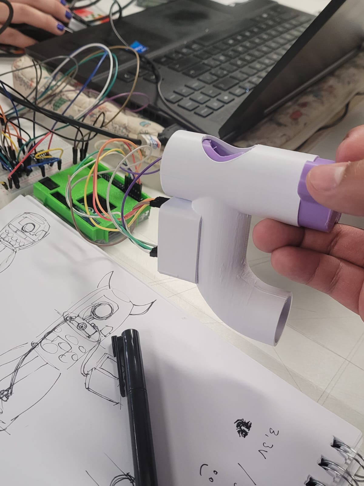
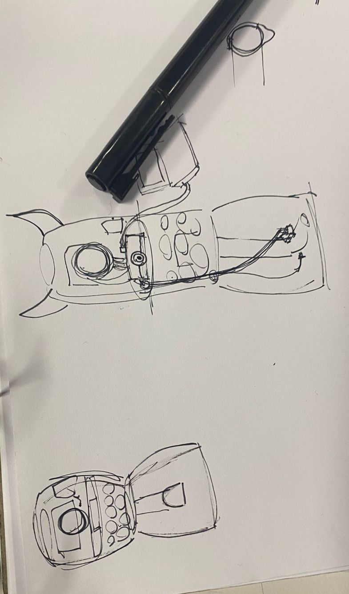
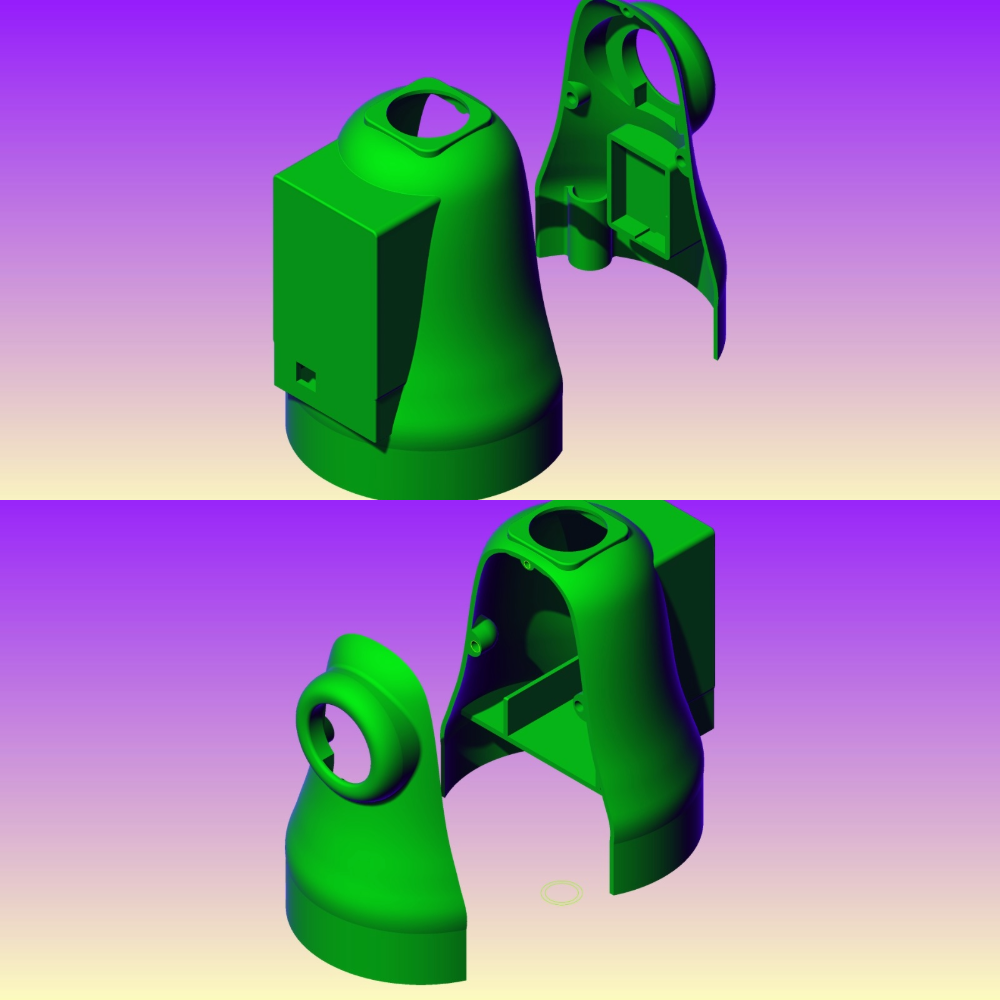
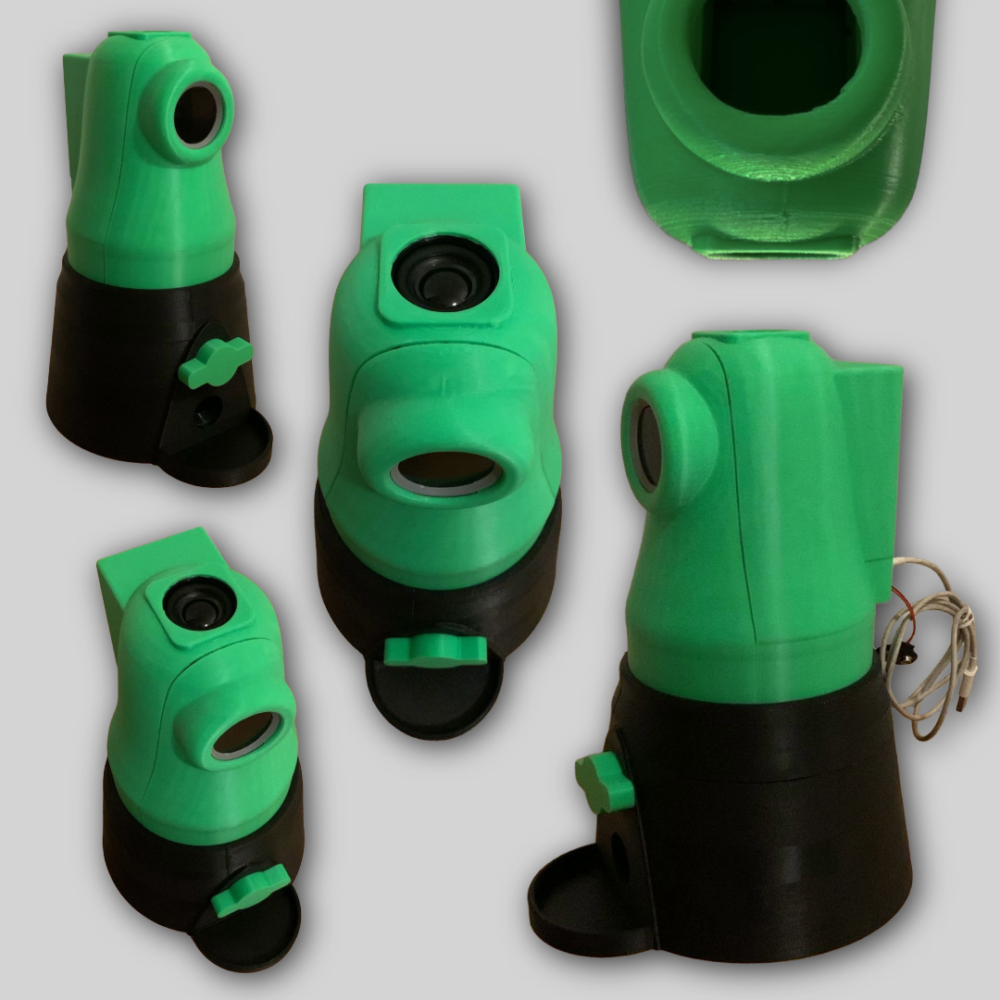
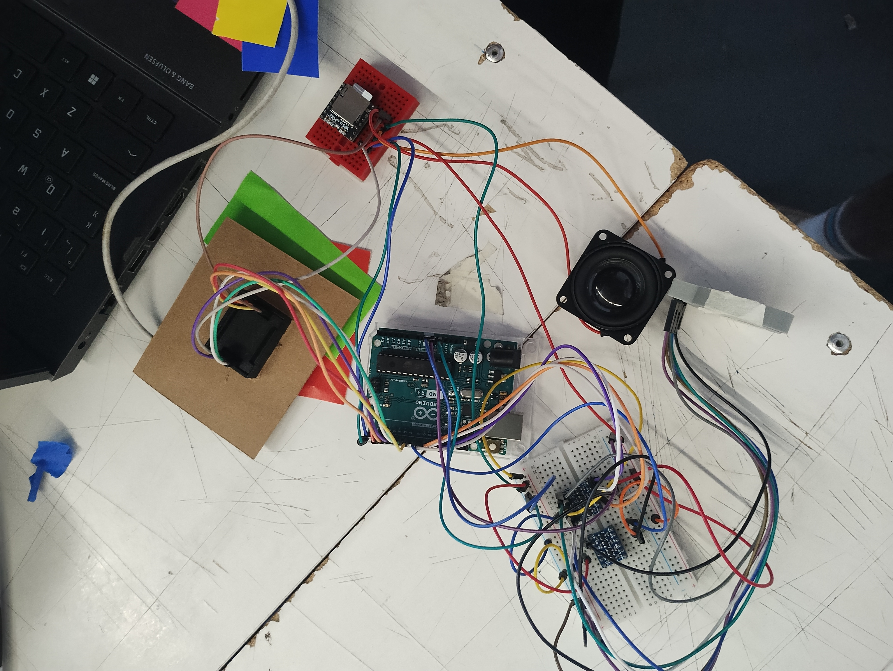

# Proyecto 02: "Máquina saludadora"

Viernes 17 de Octube de 2025

## 👥 Nombres del equipo

- Catalina Catalán
- Valentina Chávez
- Camila Delgado
- Nicolás Miranda
- Miguel Vera

### 🛠️ Roles del equipo

- Catalina Catalán ➜ animaciones y funcionamiento de la pantalla.
- Valentina Chávez ➜ funcionamiento de la pantalla.
- Camila Delgado ➜ prototipos e impresiones 3D.
- Nicolás Miranda ➜ funcionamiento del sensor de color.
- Miguel Vera ➜ creación de audios y funcionamiento módulo MP3 y salida de audio.

## 👀 Nombre del proyecto: Gustavo Lita

## 🔮 Explicación del proyecto

Es un dispensador interactivo en forma de monstruo de color verde que reacciona emocionalmente según el color del chicle detectado. Como cada color significa una emoción, al momento de girar la manilla para obtener tu chicle, el monstruo te saludará súper feliz si el chicle salió verde, acompañado de una animación y un audio correspondiente a la emoción.

## 📌 Objetivo del Proyecto

- Crear una experiencia lúdica e interactiva que vincule colores, emociones y tecnología.
- Mostrar cómo los sensores y actuadores pueden combinarse para generar una **respuesta audiovisual emocional**.

## ⚙️ Descripción general del funcionamiento

Consiste en un dispensador de chicles con cuatro colores:

| Colores | Significado |
|---------|-------------|
| 🔴 Rojo | Enojado     |
| 🟠 Naranjo | Loco     |
| 🟢 Verde | Feliz      |
| 🔵 Azul  | Triste     |

- Cada vez que cae un chicle, el sensor identifica su tono.
- El monstruo reacciona mostrando una animación del ojo en una pantalla circular y reproduciendo un audio a la emoción detectada.

## 🕹️ La interacción

1. El usuario gira la manilla para que caiga un chicle.
2. El chicle pasa por el sensor de color.
3. El sensor detecta el color dominante.
4. El sistema identifica la emoción asociada.
5. El ojo del monstruo cambia su animación según la emoción.
6. Se reproduce el sonido correspondiente desde el módulo MP3.
7. El proceso se repite con cada chicle.

### ✏️ Mapa de flujo
```mermaid
flowchart TD
    n1(["Inicio"]) --> n2["El usuario gira la manilla para que caiga un chicle"]
    n2 --> n3["El chicle pasa por el sensor de color"]
    n3 --> n4["El sensor detecta el color dominante"]
    n4 --> n5["Azul"] & n6["Verde"] & n7["Rojo"] & n8["Naranjo"]
    n5 --> n9["Tristeza"]
    n6 --> n10["Feliz"]
    n7 --> n11["Enojo"]
    n8 --> n12["Locura"]
    n9 --> n13["Se reproduce un audio correspondiente a la emoción"]
    n10 --> n13
    n11 --> n13
    n12 --> n13
    n13 --> n14["Se visualiza una pantalla (el ojo de Gustavo Lita) una animación"]
    n14 --> n15["El proceso se repite cada vez que se gira la manilla"]
    n15 --> n1

    style n1 stroke:#FFD600,fill:#FFF9C4
    style n5 fill:#BBDEFB
    style n6 fill:#C8E6C9
    style n7 fill:#FFCDD2
    style n8 fill:#FFE0B2
    style n9 stroke:#2962FF
    style n10 stroke:#00C853
    style n11 stroke:#D50000
    style n12 stroke:#FF6D00
```

## 🔌 Componentes utilizados

- Arduino Uno R3.
- Sensor de Color TCS3200 / TCS230.
- Pantalla TFT Circular 1.24 pulgadas.
- Módulo MP3.
- Conversor Lógico de Voltaje.
- Memoria MicroSD.
- Altavoz mini speaker.
- Cables.
- Protoboard.
- Fuente de alimentación.

## ⚡️ Conexiones y esquemas

Se detallan y se muestra cómo son las conexiones entre el Arduino, sensor de color, módulo MP3 y el altavoz.

### 🚥 Conexión del sensor de color

- Detecta los colores mediante frecuencias en RGB.
- Se verificó el reconociemiento de colores bajo distintas iluminaciones, los mejores resultados se daban cuando el sensor de color se encontraba en completa oscuridad.
- Se calibraron los rangos de RGB para cada color del chicle y así obtener los valores para rojo, azul, naranjo y verde.

| Arduino | Sensor de color TCS3200 / TCS230 | Función          |
|---------|----------------------------------|------------------|
| 5V      |  VCC                             | Alimenta el sensor |
| GND     | GND                              | Tierra           |
| D4      | S0                               | Selecciona la escala de frecuencia junto S1 |
| D5      | S1                               | Selecciona la escala de frecuencia junto S0 |
| D6      | S2                               | Selecciona el tipo de fotodiodo (color) junto con S3 |
| D7      | S3                               | Selecciona el tipo de fotodiodo (color) junto con S2 |
| D8      | OUT                              | Envía la señal de frecuencia correspondiente al color detectado |
| GND     | OE                               | Habilita la salida (activo en LOW) |




### ⚡️ Conexión de la pantalla TFT circular 

☞ Valentina y Catalina encargaron de ver cómo funcionaba la pantalla, qué era lo que se necesitaba y su funcionamiento. Y el primer problema que vimos fue que la pantalla TFT circular funciona con 3.3V y el arduino funciona con una lógica de 5V, se tuvo que utilizar un **Level Shifter** o **Conversor lógico de voltaje**, que sirve para interconectar de forma segura dispositivos que operan con diferentes niveles de voltaje, y así evitar que se queme la pantalla. 

☞ Nosotras la estábamos conectando directamente al arduino, pero siempre se iba a ver así:



☞ **Otro problema** que tuvimos fue que **para mostrar una imagen a todo color en esta pantalla se necesita un «buffer» o espacio en memoria**. Un buffer completo para 240×240 píxeles con colores de 16 bits (2 bytes por píxel) **requeriría 240 * 240 * 2 = 115,200 bytes (112.5 KB)**. Un **Arduino UNO solo tiene 2KB de RAM**, lo que hace imposible almacenar la imagen completa en memoria. **Librerías como TFT_eSPI** están optimizadas para dibujar directamente en la pantalla sin un buffer completo, pero para aplicaciones gráficas complejas, se **recomienda encarecidamente usar un microcontrolador con más RAM, como un ESP32, que es la pareja ideal para esta pantalla.**


☞ Misa nos hizo una **clase magistral sobre la teoría de la electricidad**, cómo soldar los level shifter, la conexion de la pantalla al arduino y cómo iba a funcionar todo esto, explicado en diagrama de abajo.




Como vimos que la pantalla funcionaba con 3.3V, tuvimos que cambiar de arduino a uno que en sus pines no tuviera 5V, es por eso que decidimos hacer la conexión con un Arduino Uno R3, con los level shifter y sus conexiones correspondientes, para evitar que se quemara la pantalla y que las animaciones pudieran verse sin problemas.


Prueba de la pantalla en funcionamiento




### 🔊 Conexión del parlante con el reproductor MP3

Para la reproducción de los audios, se crearon mediante inteligencia artificial, que reaccionan según el color de cada chicle y a la emoción correspondiente.

- 🔴 Enojado ➜ ¡Patético terrícola! TOma tu esfera de azúcar y andate a trabajar. ¡Rápido!
- 🟠 Loco ➜ ¡Oh! ¡Un terrícola! Dale, tómale. Qué es lo peor que podría pasar.
- 🟢 Feliz ➜ ¡Saludos terrícola! Toma, un premio azucarado. Disfrútalo y ten un buen día.
- 🔵 Triste ➜ ¡Ah! ¡Hola! jSí, somos insignificantes en el vasto espacio y tiempo pero tu dale, ten tu chicle y sigue tu camino.

| Arduino                           | Reproductor MP3  | Función                                                         |
|-----------------------------------|------------------|-----------------------------------------------------------------|
| 5V                                |  VCC             | Alimentación del módulo                                         |
| GND                               | GND              | Tierra                                                          |
| Pin 10                            | TX               | Comunicación serial desde DFPlayer hacia Arduino                |
| Pin 11                            | RX               | Comunicación serial desde Arduino hacia DFPlayer                |
| Cable rojo del parlante           | SPK_1            | Salida de audio (+)                                             |
| Cable negro del parlante          | SPK_2            | Salida de audio (-)                                             |
| Insertar tarjeta con archivos     | MicroSD          | Almacenamiento de audio                                         |


## 🛠️ Explicación del código

A continuación se explica el código que se desarrolló para cada sensor/actuador, mostrado con imágenes:

### Calibración y estabilidad del sensor de color
➜ Durante las primeras pruebas, los valores de frecuencia entregados por el sensor eran muy altos y variaban según la luz ambiental, lo que hacía que el sistema fuera demasiado sensible e inestable.

Para solucionar este problema:
- Se diseñó un **protector impreso en 3D** (https://cults3d.com/es/modelo-3d/artilugios/color-sensor-for-smars) que cubre el sensor y evita la entrada de la luz externa.
- Luego se realizaron pruebas en un espacio oscuro, lo que permitió obtener lecturas más estables y precisas.



➜ Durante las pruebas, notamos que los valores de frecuencia del sensor eran muy altos y resultaba difícil diferenciar los colores. Para solucionarlo, decidimos limitar el valor máximo mediante una función.

```cpp
// Función de normalización
// Convierte el valor leído en un rango de 0 a 300
int normalizar(int valor, int maximoEntrada) {
  if (valor > maximoEntrada) valor = maximoEntrada;   // limitar al máximo
  return (valor * 300) / maximoEntrada;               // escalar proporcionalmente

```

➜ Con la configuración anterior, los colores amarillo y verde daban valores casi iguales, lo que dificultaba su diferenciación. Por eso, decidimos reducir aún más el valor máximo a 10, logrando así obtener mediciones mucho más estables.

```cpp
// Función de normalización
// Convierte el valor leído en un rango de 0 a 300
int normalizar(int valor, int maximoEntrada) {
  if (valor > maximoEntrada) valor = maximoEntrada;   // limitar al máximo
  return (valor * 10) / maximoEntrada;               // escalar proporcionalmente
```
☞ Ordenamos el código para que fuera más fácil de entender

```cpp
// Pines del sensor
#define S0 2
#define S1 3
#define S2 4
#define S3 5
#define salidaSensorOut 6
#define OE 7   // Pin para activar/desactivar el sensor

// Variables para medir el ancho de pulso (valores de colores)
int rojoPW = 0;
int verdePW = 0;
int azulPW = 0;

// Función de normalización
// Convierte el valor leído en un rango de 0 a 10
int normalizar(int valor, int maximoEntrada) {
  if (valor > maximoEntrada) valor = maximoEntrada;   // limitar al máximo
  return (valor * 10) / maximoEntrada;               // escalar proporcionalmente
}

void setup() {
  pinMode(S0, OUTPUT);
  pinMode(S1, OUTPUT);
  pinMode(S2, OUTPUT);
  pinMode(S3, OUTPUT);
  pinMode(OE, OUTPUT);

  // Escala de frecuencia al 20%
  digitalWrite(S0, HIGH);
  digitalWrite(S1, LOW);

  // Activar el sensor
  digitalWrite(OE, LOW);

  pinMode(salidaSensorOut, INPUT);

  Serial.begin(9600);
}

void loop() {
  // Leer valores de cada color (normalizados)
  rojoPW = leerRojo();
  delay(100);

  verdePW = leerVerde();
  delay(100);

  azulPW = leerAzul();
  delay(100);

  // Mostrar lecturas
  Serial.print("Rojo = ");
  Serial.print(rojoPW);
  Serial.print("  Verde = ");
  Serial.print(verdePW);
  Serial.print("  Azul = ");
  Serial.println(azulPW);

  // DETECCIÓN DE COLORES
  if (cercaDe(rojoPW, 3) && cercaDe(verdePW, 1) && cercaDe(azulPW, 2)) {
    Serial.println("Detecté VERDE");
  }
  else if (cercaDe(rojoPW, 2) && cercaDe(verdePW, 1) && cercaDe(azulPW, 1)) {
    Serial.println("Detecté AMARILLO");
  }
  else if (cercaDe(rojoPW, 4) && cercaDe(verdePW, 3) && cercaDe(azulPW, 2)) {
    Serial.println("Detecté ROJO");
  }
  else if (cercaDe(rojoPW, 2) && cercaDe(verdePW, 3) && cercaDe(azulPW, 1)) {
    Serial.println("Detecté AZUL");
  }
  else {
    Serial.println("No detecto nada");
  }

  delay(200);
}

// Funciones de lectura con normalización
int leerRojo() {
  digitalWrite(S2, LOW);
  digitalWrite(S3, LOW);
  int valor = pulseIn(salidaSensorOut, LOW);
  return normalizar(valor, 2000);  // Ajusta 2000 al máximo real de tu sensor
}

int leerVerde() {
  digitalWrite(S2, HIGH);
  digitalWrite(S3, HIGH);
  int valor = pulseIn(salidaSensorOut, LOW);
  return normalizar(valor, 2000);
}

int leerAzul() {
  digitalWrite(S2, LOW);
  digitalWrite(S3, HIGH);
  int valor = pulseIn(salidaSensorOut, LOW);
  return normalizar(valor, 2000);
}

// Función auxiliar para comparación aproximada
bool cercaDe(int valor, int objetivo) {
  return abs(valor - objetivo) <= 1;
}
```
☞ Para identificar el color se utiliza este código:

```cpp
// DETECCIÓN DE COLORES
  if (cercaDe(rojoPW, 3) && cercaDe(verdePW, 1) && cercaDe(azulPW, 2)) {
    Serial.println("Detecté VERDE");
  }
  else if (cercaDe(rojoPW, 2) && cercaDe(verdePW, 1) && cercaDe(azulPW, 1)) {
    Serial.println("Detecté AMARILLO");
  }
  else if (cercaDe(rojoPW, 4) && cercaDe(verdePW, 3) && cercaDe(azulPW, 2)) {
    Serial.println("Detecté ROJO");
  }
  else if (cercaDe(rojoPW, 2) && cercaDe(verdePW, 3) && cercaDe(azulPW, 1)) {
    Serial.println("Detecté AZUL");
  }
  else {
    Serial.println("No detecto nada");
  }
```

Esta parte del código **funciona mediante la utilización de una serie de condiciones if que comparan los valores de frecuencia** (ancho de pulso) obtenidos por cada canal: **rojo**, **verde** y **azul**. Cada color tiene una combinación característica de frecuencias, y al aproximarse a esos valores, el sistema identifica de qué color se trata.
- rojoPW, verdePW, azulPW - Son los valores de frecuencia medidos por el sensor de color en cada canal (Red, Green, Blue - RGB).
- cercaDe(valor, referencia) - Es una función auxiliar que compara si el valor leído está dentro de un rango aceptable respecto a una referencia.
- Cada bloque if representa una combinación aproximada de frecuencias que corresponde a un color detectado.
- Si ninguna condición se cumple, el programa imprime "No detecto nada", indicando que no se reconoció ningún color válido.

Al igual que la otra parte los datos númericos deberán ir siendo modificado en base a los parametros RGB que se detecten en el funcionamiento del momento ya que son variables que cambian según al ambiente específico donde se este utilizando el sensor.

### Pruebas 
Se realizó una prueba, pero no fue posible obtener una lectura correcta, ya que el chicle pasaba demasiado rápido y el sensor de color no alcanzaba a detectarlo.
Además, el color de la impresión era blanca, lo que dificultó la detección de frecuencias de color por falta de contraste.



### 🚥 Código final del sensor de color
```cpp
// Pines del sensor
#define S0 2
#define S1 3
#define S2 4
#define S3 5
#define salidaSensorOut 6
#define OE 7   // Pin para activar/desactivar el sensor

// Variables para medir el ancho de pulso (valores de colores)
int rojoPW = 0;
int verdePW = 0;
int azulPW = 0;

// Función de normalización
// Convierte el valor leído en un rango de 0 a 10
int normalizar(int valor, int maximoEntrada) {
  if (valor > maximoEntrada) valor = maximoEntrada;   // limitar al máximo
  return (valor * 10) / maximoEntrada;               // escalar proporcionalmente
}

void setup() {
  pinMode(S0, OUTPUT);
  pinMode(S1, OUTPUT);
  pinMode(S2, OUTPUT);
  pinMode(S3, OUTPUT);
  pinMode(OE, OUTPUT);

  // Escala de frecuencia al 20%
  digitalWrite(S0, HIGH);
  digitalWrite(S1, LOW);

  // Activar el sensor
  digitalWrite(OE, LOW);

  pinMode(salidaSensorOut, INPUT);

  Serial.begin(9600);
}

void loop() {
  // Leer valores de cada color (normalizados)
  rojoPW = leerRojo();
  delay(100);

  verdePW = leerVerde();
  delay(100);

  azulPW = leerAzul();
  delay(100);

  // Mostrar lecturas
  Serial.print("Rojo = ");
  Serial.print(rojoPW);
  Serial.print("  Verde = ");
  Serial.print(verdePW);
  Serial.print("  Azul = ");
  Serial.println(azulPW);

  // DETECCIÓN DE COLORES
  if (cercaDe(rojoPW, 3) && cercaDe(verdePW, 1) && cercaDe(azulPW, 2)) {
    Serial.println("Detecté VERDE");
  }
  else if (cercaDe(rojoPW, 2) && cercaDe(verdePW, 1) && cercaDe(azulPW, 1)) {
    Serial.println("Detecté AMARILLO");
  }
  else if (cercaDe(rojoPW, 4) && cercaDe(verdePW, 3) && cercaDe(azulPW, 2)) {
    Serial.println("Detecté ROJO");
  }
  else if (cercaDe(rojoPW, 2) && cercaDe(verdePW, 3) && cercaDe(azulPW, 1)) {
    Serial.println("Detecté AZUL");
  }
  else {
    Serial.println("No detecto nada");
  }

  delay(200);
}

// Funciones de lectura con normalización
int leerRojo() {
  digitalWrite(S2, LOW);
  digitalWrite(S3, LOW);
  int valor = pulseIn(salidaSensorOut, LOW);
  return normalizar(valor, 2000);  // Ajusta 2000 al máximo real de tu sensor
}

int leerVerde() {
  digitalWrite(S2, HIGH);
  digitalWrite(S3, HIGH);
  int valor = pulseIn(salidaSensorOut, LOW);
  return normalizar(valor, 2000);
}

int leerAzul() {
  digitalWrite(S2, LOW);
  digitalWrite(S3, HIGH);
  int valor = pulseIn(salidaSensorOut, LOW);
  return normalizar(valor, 2000);
}

// Función auxiliar para comparación aproximada
bool cercaDe(int valor, int objetivo) {
  return abs(valor - objetivo) <= 1;
}
```

## 🔊 Código para reproducción del audio
➜ Primero una aproximación del pseudocódigo y qué es lo que se quiere lograr.

```cpp
void configurarSensoresActuadores(){
configurarSD();
//definir funciones para manejar contenido
//ligar contenido a clases correspondientes 

configurarMp3();
//debe recibir los datos del sensor de color
//asociarlos a una de las clases
//decirle al parlante que reproduzca un audio específico de la tarjeta SD
//aunque ya es suficiente asociarlo a la clase ya que ahí esta asociado cada audio

configurarParlante();
//recibir el audio de la tarjeta SD
//ligar archivos de audio al parlante
//definir repetición y volumen
//de nuevo por medio de las clases
//reproducir un audio específico
}
```
➜ Se usará **una clase por color** y le atribuiremos cada consecuencia que traerá al detectar el color específico.

```cpp
 void configurarSensorDeColor(){
  //conectar a protoboard
  //definir parámetros de RGB para cada color
  //hacer 4 clases con distintos parámetros
 }
```
En (https://projecthub.arduino.cc/SurtrTech/color-detection-using-tcs3200230-a1e463), Miguel encontró un **tutorial de cómo configurar el sensor de colores** de manera que sus valores se muestren en el monitor serial. Este código sirve como cimiento para después agregar los actuadores necesarios. Queremos que se detecten 4 colores con el sensor asi que hay que agregar 1 valor para el color amarillo. De todas maneras todos los valores son referenciales y **deben ser medidos con nuestros implementos para que sean precisos**.

```cpp
#define s0 8        //Module pins wiring
#define s1 9
#define s2 10
#define  s3 11
#define out 12

#define LED_R 3   //LED pins, don't forget "pwm"
#define  LED_G 5
#define LED_B 6

int Red=0, Blue=0, Green=0;

void setup()  
{
   pinMode(LED_R,OUTPUT);     //pin modes
   pinMode(LED_G,OUTPUT);
   pinMode(LED_B,OUTPUT);
   
   pinMode(s0,OUTPUT);    
   pinMode(s1,OUTPUT);
   pinMode(s2,OUTPUT);
   pinMode(s3,OUTPUT);
   pinMode(out,INPUT);

   Serial.begin(9600);   //intialize the serial monitor baud rate
   
   digitalWrite(s0,HIGH);  //Putting S0/S1 on HIGH/HIGH levels means the output frequency scalling is at 100%  (recommended)
   digitalWrite(s1,HIGH); //LOW/LOW is off HIGH/LOW is 20% and  LOW/HIGH is  2%
   
}

void loop()
{
  GetColors();                                    //Execute  the GetColors function
  
  analogWrite(LED_R,map(Red,15,60,255,0));      //analogWrite  generates a PWM signal with 0-255 value (0 is 0V and 255 is 5V), LED_R is the pin  where we are generating the signal, 15/60 are the min/max of the "Red" value,  try measuring your own ones
                                               //e.g:  if the "Red" value given by the sensor is 15 -> it will generate a pwm signal  with 255 value on the LED_R pin same for 60->0, because the lower the value given  by the sensor the higher is that color
  analogWrite(LED_G,map(Green,30,55,255,0));    
  analogWrite(LED_B,map(Blue,13,45,255,0));

}

void GetColors()  
{    
  digitalWrite(s2, LOW);                                           //S2/S3  levels define which set of photodiodes we are using LOW/LOW is for RED LOW/HIGH  is for Blue and HIGH/HIGH is for green 
  digitalWrite(s3, LOW);                                           
  Red = pulseIn(out, digitalRead(out) == HIGH ? LOW : HIGH);       //here we wait  until "out" go LOW, we start measuring the duration and stops when "out" is  HIGH again, if you have trouble with this expression check the bottom of the code
  delay(20);  
  digitalWrite(s3, HIGH);                                         //Here  we select the other color (set of photodiodes) and measure the other colors value  using the same techinque
  Blue = pulseIn(out, digitalRead(out) == HIGH ? LOW  : HIGH);
  delay(20);  
  digitalWrite(s2, HIGH);  
  Green = pulseIn(out,  digitalRead(out) == HIGH ? LOW : HIGH);
  delay(20);  
}
```

## 🔊 Reproductor MP3 DF Player Mini

 

Después de hacer que el MP3 funcionara correctamente y reproduciera audio de la tarjeta SD es momento de ajustarlo a lo que necesitamos:

- Habrán 4 escenarios posibles de color de dulce y cada uno tiene un saludo asociado.
- Mediante *if* y *else if* podemos cubrir cada uno y asociarlo a un archivo de audio numerado. Descubrimos que los audios de la tarjeta se clasifican en función al orden y se pueden reproducir en suceción o de manera aislada.
- Descubrimos que los audios de la tarjeta se clasifican en función al orden y se pueden reproducir en sucesión o de manera aislada.

El código que utilizamos para que funcionara es el siguiente: (https://projecthub.arduino.cc/munir03125344286/play-audio-in-arduino-d64363). Que reproduce una cantidad determinada de cada archivo de audio y pasa al siguiente en orden. A parte de aportar líneas de código esenciales y complicadas para que funcione, este referente ayudó a que entendieramos los controladores y la lógica del reproductor. También ofrece una función adicional que comunica los problemas y el estado de la pieza en el monitor serial que podríamos añadir al nuestro pero de manera reducida pues no es esencial.

### Un audio por color 

- 🔴 Enojado ➜ ¡Patético terrícola! TOma tu esfera de azúcar y andate a trabajar. ¡Rápido!
- 🟠 Loco ➜ ¡Oh! ¡Un terrícola! Dale, tómale. Qué es lo peor que podría pasar.
- 🟢 Feliz ➜ ¡Saludos terrícola! Toma, un premio azucarado. Disfrútalo y ten un buen día.
- 🔵 Triste ➜ ¡Ah! ¡Hola! jSí, somos insignificantes en el vasto espacio y tiempo pero tu dale, ten tu chicle y sigue tu camino.

☞ Encontramos un referente que hace esencialmente lo mismo que nosotros y junto a correcciones y ajustes con chatgpt conseguimos una iteración del referente que podemos entender y es fácil de manipular usando las clases: (https://www.hackster.io/mertarduino/talking-color-detect-system-arduino-dfplayer-gy-31-tcs-315423).

- En este archivo se intentó configurar el mp3 usando la fórmula que ya funcionó anteriormente, la lista de comandos de DFPlayer mini y correcciones puntuales de chatgpt.
- Para separar cada caso con sus condiciones correspondientes se usó un *int* provisional que reemplaza la información del sensor de color, ligado con *if* y *else if* los 4 audios.

Al intentar subirlo al arduino, el error 74 no permitió incluso después de probar y reiniciarlo muchas veces.

```cpp
void loop(){
static bool reproduciendo = false;
//evita que se repita
colorDetectado = 3;
if (reproduciendo = false){
//si no se está reproduciendo nada  
  if (colorDetectado = 1){
  myDFPlayer.play(1);
//elige el archivo 1 en la tarjeta SD
reproduciendo = true;
//se reproduce
}
else if (colorDetectado = 2){
  myDFPlayer.play(2);
  reproduciendo = true;
}
else if (colorDetectado = 3){
  myDFPlayer.play(3);
  reproduciendo = true;
}
else if (colorDetectado = 4){
  myDFPlayer.play(4);
  reproduciendo = true;
}
}
}
```
### El siguiente paso es configurar el sensor de color según los parámetros RGB que nos dé cada dulce, sumarlos a la función y asignarles un número.
```cpp
int colorDetectado;
```
### 🚥 Código según color para el audio
```cpp
#include "Arduino.h"
#include "DFRobotDFPlayerMini.h"
//bibliotecas
DFRobotDFPlayerMini myDFPlayer;
//renombrar a myDFPlayer
#if (defined(ARDUINO_AVR_UNO) || defined(ESP8266))   // Using a soft serial port
#include <SoftwareSerial.h>
SoftwareSerial softSerial(/*rx =*/4, /*tx =*/5);
#define FPSerial softSerial
#else
#define FPSerial Serial1
#endif

int colorDetectado;


void setup(){
#if (defined ESP32)
  FPSerial.begin(9600, SERIAL_8N1, /*rx =*/A3, /*tx =*/A2);
#else
  FPSerial.begin(9600);
#endif

  Serial.begin(115200);
  myDFPlayer.volume(30);  //Set volume value. From 0 to 30
  //myDFPlayer.play(1);  //Play the first mp3
}
void loop(){
static bool reproduciendo = false;
//evita que se repita
colorDetectado = 3;
if (reproduciendo = false){
  
  if (colorDetectado = 1){
  myDFPlayer.play(1);
  reproduciendo = true;
}
else if (colorDetectado = 2){
  myDFPlayer.play(2);
  reproduciendo = true;
}
else if (colorDetectado = 3){
  myDFPlayer.play(3);
  reproduciendo = true;
}
else if (colorDetectado = 4){
  myDFPlayer.play(4);
  reproduciendo = true;
}
}
}

```

## Resolviendo el problema del MP3

- Con la ayuda de Aarón y Janis, comparamos directamente el código relacionado al sensor de color con el código ya existente que aseguraba la reproducción de audio.
- El código original contaba con funciones flexibles que permiten que corra en distintos sistemas pero nos terminó confundiendo al buscar el setting adecuado para este caso.
- Al ir paso a paso y línea por linea, manteniendo lo necesario y depurando el resto llegamos al punto mínimo de elementos que permiten que se reproduzca audio.

☞ Es **necesario decirle a arduino cuándo debe detener la reproducción del audio**. Viendo el referente de *hackster* usan un *int color* que recibe la info del sensor de color en forma de números. Para que se detenga, se asigna un *if* más, a parte de cada color (0) que no hace nada y le dice a loop que tras detectar y reproducir el color correspondiente color = 0.

### ⁉️ El problema...
Se logró que el DFPlayer reproduzca la pista que "queremos" y se detenga, pero esto dio paso a otros problemas. Por alguna razón llamar a cierto audio por número, sale cruzado sin una logica clara como se muestra a continuación:

- Número 0001 es llamado por 4.
- Número 0002 es llamado por 3.
- Número 0003 es llamado por 2.
- Número 0004 es llamado por 1.

Si bien, podemos trabajar con esto, lo ideal sería ordenarlo para así evitar confusiones. Para poder solucionar esto sería llamar de manera más precisa usando carpetas.

```cpp
myDFPlayer.playFolder(2, 5); // Reproduce el archivo 005.mp3 dentro de la carpeta /02/

```

### ✅ La solución
Usando el truco anterior, se logró que encontrara el audio específico que queríamos. Por ahora la función es un *int* que se cambia a mano pero esta listo para ser ligado al feedback del sensor de color. Por el momento **reconoce un número (entre 4)**, **reproduce un audio específico por 15 segundos** y se **detiene la reproducción**. Con esto en mente queda abordar las sutilezas y restricciones que trae la función:

1. ¿Todos los audios deben durar 15 segundos? ¿O la misma cantidad de tiempo en su defecto?
   - Se usaron audios de 31 minutos para probar, ya que tenían distintas duraciones. Y los más cortos no vuelven a reproducirse una vez que terminan. Entonces, el tiempo que dure la reproducción debe ser igual al audio más largo (+1 segundo) para que no se corte abruptamente.
  
1. Una vez ocurre todo ¿Se puede reproducir de nuevo?
   - En este punto no se sabía cómo se podía hacer. Es por eso que el plan inicial era tener un escenario *if* a partir del que empieza todo y que cambia una vez recibe datos del sensor. El valor 0 podría ser el inicio y final de la interacción que está atento arecibir datos y se activa tras la reproducción de audio.

1. ¿Cuándo ocurrirá?
   - Escencialmente mientras no detecte nada o detecte algo fuera de los 4 colores, lo ignorará y seguirá a la espera de datos hastá recibir un valor válido. Reproducirá el audio y volverá al valor 0.

1. ¿Qué reproducirá?
   - En este punto del proyecto no teníamos resuelto que iba a contener cada audio, solo que este debía representar las emociones que le aasignamos a cada color.

### 🔊 Código de los audios 

```cpp
#include "Arduino.h"
#include "DFRobotDFPlayerMini.h"
#include "SoftwareSerial.h"

DFRobotDFPlayerMini myDFPlayer;

int readColor = 0;  
// int provisorio pero se debe ligar a sensor de color
int colorDetectado = 0;

bool reproduciendo = false;
//varía para reproducir o no
//empieza en no
unsigned long tiempoInicioReproduccion = 0;
const unsigned long duracionReproduccion = 15000; 
// declara cuanto dura el audio más largo 15 segundos
// pone el 0 como inicio y 15 como final

void setup() {
  Serial1.begin(9600);
  Serial.begin(115200);

  if (!myDFPlayer.begin(Serial1, true, true)) {
    Serial.println("Error al iniciar DFPlayer");
    //avisa si no inicia
  }

  myDFPlayer.volume(12);
  //volumen máximo 30
}

void loop() {
  readColor = obtenerColor();
  //obtenerColor() corresponde a la función del sensor de color

  if (!reproduciendo && readColor != 0 && readColor != colorDetectado) {
    //si no se está reproduciendo y el color leído no es 0 y readColor no es el colorDetectado
    //esencialmente si el sensor no tiene una lectura válida (1 de 4 colores) sigue leyendo el color
    //si detecta un color inicia reproducción
    //inicia el tiempo de reproducción
    colorDetectado = readColor;
    reproduciendo = true;
    tiempoInicioReproduccion = millis();

    // Reproduce audio según el color 
    if (colorDetectado == 1) {
      myDFPlayer.playFolder(1, 1);  
      // Rojo en carpeta 01, archivo 001
      Serial.println("Rojo ");
    } else if (colorDetectado == 2) {
      myDFPlayer.playFolder(2, 2);  
      // Azul en carpeta 02, archivo 002
      Serial.println("Azul");
    } else if (colorDetectado == 3) {
      myDFPlayer.playFolder(3, 3);  
      // Amarillo en carpeta 03, archivo 003
      Serial.println("Amarillo");
    } else if (colorDetectado == 4) {
      myDFPlayer.playFolder(4, 4);  
      // Verde en carpeta 04, archivo 004
      Serial.println("Verde");
    }
  }

  // Detener reproducción después de cierto tiempo
  if (reproduciendo && (millis() - tiempoInicioReproduccion > duracionReproduccion)) {
    myDFPlayer.stop();
    Serial.println("Audio detenido por tiempo");
    //esta opción ocurre como plan B a la siguiente
    //hay 15 segundos de reproducción no importa la duración del audio
    //en esos 15 segundos no detecta otro color
    reproduciendo = false;
    colorDetectado = 0;
  }

  // Opción adicional: detectar si el audio terminó por sí solo
  if (myDFPlayer.available()) {
    //true si se ocurrió algo con el reproductor
    uint8_t tipo = myDFPlayer.readType();
    //dato entero y positivo equivalente a byte (0-255)
    //lee el evento del DFPlayer
    int valor = myDFPlayer.read();
    //dice que audio fue reproducido

    if (tipo == DFPlayerPlayFinished) {
      //si el evento fue que terminó de reproducir ocurre lo siguiente
      Serial.println("Audio finalizado por DFPlayer");
      //devuelve texto en monitor serial
      reproduciendo = false;
      //como terminó de reproducir no reproduce más
      //puede recibir color de nuevo
      colorDetectado = 0;
      //Resetea reproductor
    }
  }
}

// Para probar en monitor serial
int obtenerColor() {
  if (Serial.available()) {
    return Serial.parseInt();  
// Escribe un número (1 a 4) en el monitor serial
  }
  return 0;
}
```
## Conectando el sensor de color y el DFPlayer 

Miguel con Nicolás conectaron el **sensor de color** y el **DFPlayer** en **un mismo Arduino utilizando la protoboard.


Lograron realizar la conexión correctamente, pero en el código tuvieron problemas para sincronizar la detección de colores con la reproducción de los audios.

Finalmente, lo solucionamos declarando la variable _colorDetectado = readColor_;, lo que permitió vincular correctamente la lectura del color con el audio correspondiente.

```cpp
colorDetectado = readColor;

if (colorDetectado == 1) {
  myDFPlayer.playFolder(1, 1);
  Serial.print("Rojo detectado");
  // Rojo
} else if (colorDetectado == 2) {
  myDFPlayer.playFolder(2, 2);
  Serial.print("Azul detectado");
  // Azul
} else if (colorDetectado == 3) {
  myDFPlayer.playFolder(3, 3);
  Serial.print("Amarillo detectado");
  // Amarillo
} else if (colorDetectado == 4) {
  myDFPlayer.playFolder(4, 4);
  Serial.print("Verde detectado");
  // Verde
}

Clase 9a: 07/10 MÁQUINAS COMPUTACIONALES

Nota: iniciamos Viendo un ejemplo en arduino de nuestro grupo y como pasarlo a c++ ( Tomaron el ejemplo de Vania Paredes integrante de nuestro grupo para mostrar como deberia ordenarse el código.

## Trabajo en clases

Lo primero que hicimos fue ver en qué íbamos hasta ahora: una recopilación de logros y fracasos, para así buscar soluciones juntas. Millaray nos mostró el primer prototipo de nuestro "robot contador de datos curiosos", el cual nos pareció muy tierno. Pasamos el código que teníamos para hacer funcionar el módulo reproductor junto con el servo motor al computador de Vania. Ordenamos los códigos antes de pasarlos, quitando cosas que no eran necesarias y poniéndoles una descripción a cada acción. Así, prueba tras prueba, mis compañeras lograron encontrar la forma de unir parte del código para que pudiera generar la acción.

En paralelo, fuimos resolviendo ciertas cosas del prototipo físico, como qué cosas queríamos añadirle, qué no nos convencía, cómo solucionábamos que la bocina tuviera un lugar dentro del robot y cómo hacíamos funcionar el motor DC para que este vibrara (como nos lo habíamos planteado anteriormente). Entonces sacamos papel y lápiz y manos a la obra: dibujamos posibles ejemplos de cómo debería ir incorporado.

Buscamos cuánto resistía el motor, lo cual, según AFEL y sus especificaciones, podía llegar a resistir de 3V a 6V, por lo cual determinamos que tal vez sería necesario que la carcasa del robot no tuviera tanto peso. Teniendo en cuenta lo que queríamos lograr, planteamos que la vibración se generara en la plataforma, mediante una estructura base que subiera y bajara a diferentes velocidades para dar el efecto deseado.

Luego pasamos a considerar que el cuerpo del robot podía llegar a ser muy pequeño, y aún nos faltaba incorporar la bocina y el motor DC. Nos dimos cuenta de que dentro del prototipo faltaría un espacio que podría ser un sacado para que el motor quedara fijo y no se moviera, porque eso podía cambiar la dirección del brazo, lo cual no queríamos que se interpretara de una forma rara.

A la base le pondremos el codo pegado al cuerpo para que solo se mueva el antebrazo, por la misma razón anterior. Valentina nos comentó que también tenía el vibrador del joystick, que tal vez podríamos usar en vez del motor DC, así que decidimos que íbamos a probar ambas opciones y ver qué sucedía. Sin embargo, según los parámetros, no nos convencía, así que decidimos probar otro y aumentar la distancia, ya que esta podía influir mucho en el resultado.
```


### Código para animaciones de la pantalla TFT circular 

Las **pantallas TFT LCD funcionan mediante el control de píxeles individuales para crear imágenes detalladas y de alta calidad**. Utilizan un controlador como el **GC9A01** para gestionar la información que se muestra en la pantalla. La interfaz SPI permite una comunicación rápida y eficiente con microcontroladores, lo que facilita la integración en proyectos.

### Código base para su funcionamiento
```cpp
#include <Arduino_GFX_Library.h>
#include <Adafruit_GFX.>
#define TFT_RST -1 // o 4
#define TFT_CS D8 // o 15
#define TFT_DC D2 // o 4

Arduino_DataBus *bus = new Arduino_HWSPI(TFT_DC, TFT_CS);
Arduino_GC9A01 *gfx = new Arduino_GC9A01(bus, TFT_RST, 0 /* rotation */, true /* IPS */);


void setup() {
 gfx->begin();  

  gfx->setTextSize(3);   
  gfx->fillScreen(BLACK); 
  gfx->setTextColor(RED); 
  gfx->setCursor(30, 60);
  gfx->print("GC9A01");   
  gfx->setTextSize(2);
  gfx->setCursor(30, 100);
  gfx->setTextColor(WHITE);
  gfx->print("Hello World !");
  gfx->setCursor(30, 140);
  gfx->setTextColor(YELLOW);
  gfx->print("LAB1 Tech");
  gfx->setCursor(20, 160);
  gfx->setTextColor(BLUE);
  gfx->print("www.lab1.tech");}

void loop() {

}
```
```cpp
#include <Adafruit_GFX.h>
#include <Adafruit_GC9A01A.h>

#define TFT_CS 10
#define TFT_DC 9
#define TFT_RST 8

Adafruit_GC9A01A tft(TFT_CS, TFT_DC, TFT_RST);

void setup() {
  tft.begin();
  tft.fillScreen(GC9A01A_BLACK);
  tft.setCursor(40, 100);
  tft.setTextColor(GC9A01A_WHITE);
  tft.setTextSize(2);
  tft.println("¡Hola Mundo!");
}

void loop() {}
```
### 👁️ Referentes para la animación del ojo
Gustavo Lita esta basado en distintos personajes ya existentes como los Sirulios de 31 minutos, Kang y Kodos de Los Simpson, los Minions, entre otros.

La idea es que el personaje solo tenga un ojo (la pantalla circular es el ojo) para eso tenemos también de referentes a personajes como Mike Wazowski de Monster Inc, Plankton de Bob esponja, B.O.B de Monstruos v/s aliens y algunos minions, Leela de Futurama . Con estos personajes podemos ver bien como expresar ciertas emociones sin la necesidad de que tenga cejas y teniendo un solo ojo con espacio limitado para desarrollar la expresión que se quiera dar.


### 👁️ Ilustraciones de los ojos que queríamos que tuviera Gustavo Lita


## 🔍 Pruebas y resultados

### ✏️ Diseño y bocetos del prototipo



### 🧩 Piezas impresas del prototipo
Camila se encargó de ver los prototipos impresos en 3D. Hubieron muchas pruebas y error, hasta que finalmente llegamos con el diseño que se quería.




### Carcasa para la pantalla


### Primeros Prototipos


### Se incluye la pantalla


### 🧩 Diseño final de Gustavo Lita



## ⚡️ Problemas al fusionar

Para unir sensor de color, reproductor mp3 DFPlayer y pantalla GC9A01A tuvimos que pasar todo al Arduino R3. No lo pasamos al R4 porque hay una biblioteca crucial para el funcionamiento de la pantalla que no corre en la versión más nueva. Al pasar a R3 nos encontramos con inconvenientes no previstos:

-R3 no admite Serial1.begin y requiere iniciar el reproductor de manera manual.

-Por el tipo de cable que usa este arduino no se pueden poner los pines RX y TX en 00 y 01. Esto nos obligó a cambiar el resto de los pines para hacerle un espacio a los del reproductor. Después de varios cambios RX quedó en 12 y TX en 7.


**Separados**


**Juntos**



## 📖 Bibliografía 
- EazyTronic. (s.f.). How to use GC9A01 display with Arduino. EazyTronic. (https://eazytronic.com/gc9a01-with-arduino/)
- Mert Arduino. (2019, marzo 11). Talking color detect system Arduino DFPlayer GY-31 TCS. Hackster.io. (https://www.hackster.io/mertarduino/talking-color-detect-system-arduino-dfplayer-gy-31-tcs-315423)
- Munir. (2019, marzo 10). Play audio in Arduino. Arduino Project Hub. (https://projecthub.arduino.cc/munir03125344286/play-audio-in-arduino-d64363)
- SurtrTech. (2018, diciembre 15). Color detection using TCS3200/230. Arduino Project Hub. (https://projecthub.arduino.cc/SurtrTech/color-detection-using-tcs3200230-a1e463)
- Mechatronic Store. (s.f.). Pantalla TFT LCD redonda de 1.28”. Mechatronic Store. )https://www.mechatronicstore.cl/pantalla-tft-lcd-redonda-de-1-28/)
- TechToTinker. (2021, enero 24). GC9A01 round LCD display module using Arduino [Video]. YouTube. (https://www.youtube.com/watch?v=pmCc7z_Mi8I&t=291s)
- Programming Electronics Academy. (2018, diciembre 27). How to use the DFPlayer Mini MP3 module with Arduino [Video]. YouTube.
  (https://www.youtube.com/watch?v=XGBhlo3DI4E)


