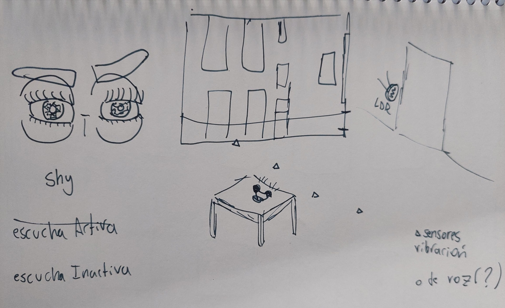
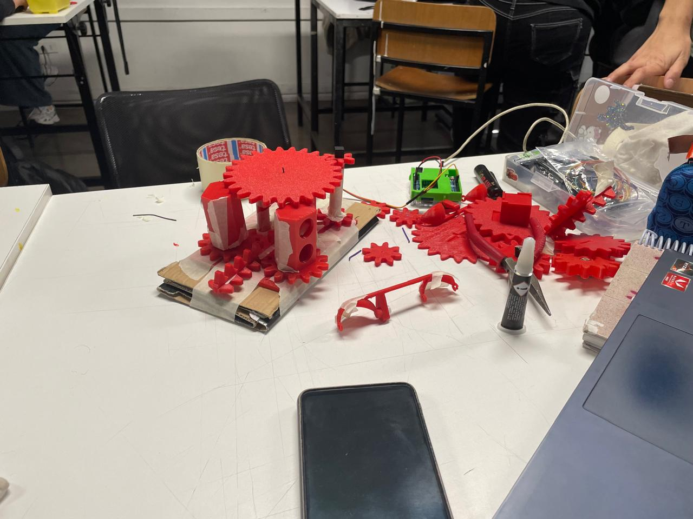
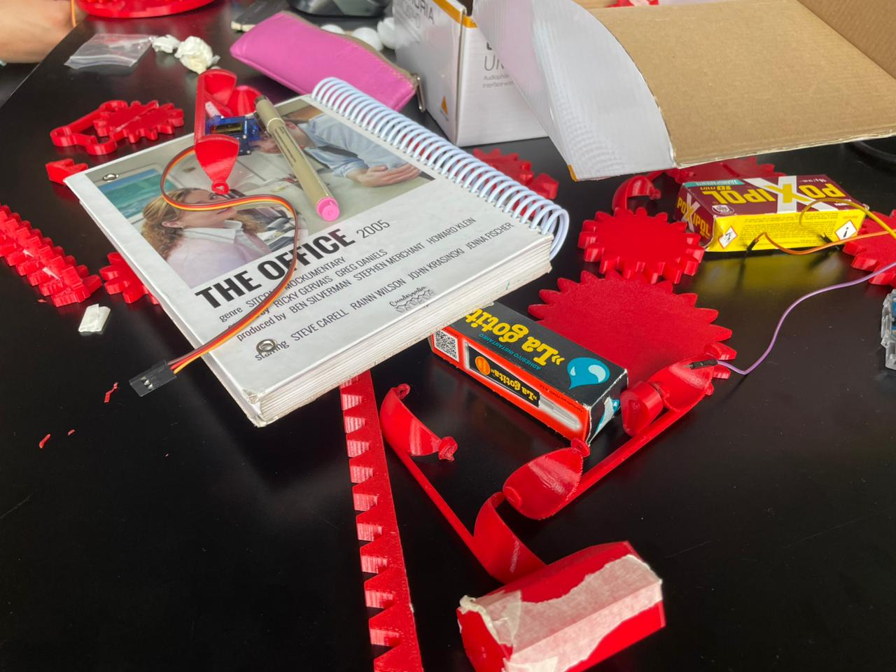
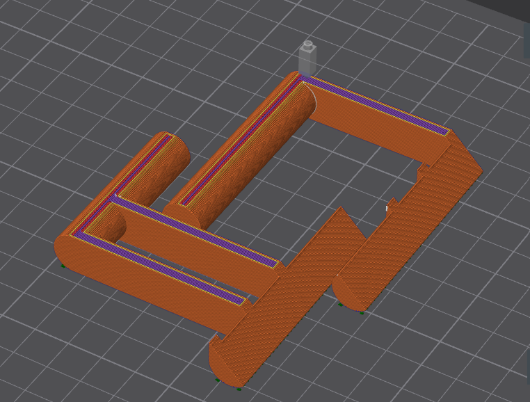
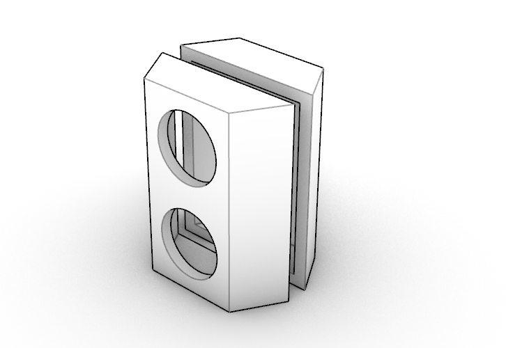
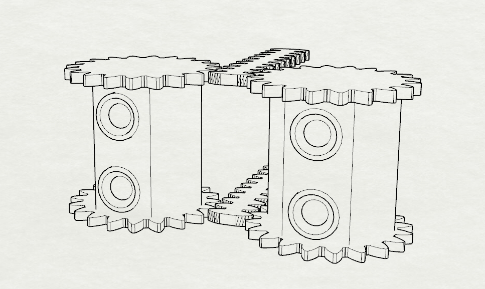

# Proyecto 02
- Grupo: 06
- Nombre de grupo: Hijos de la Tierra
- Integrantes:
 - Antonia Fuentealba Pessot / [AntFuentealba](https://github.com/AntFuentealba) (código, documentación)
 - Santiago Gaete Fernández / [santiagoClifford](https://github.com/santiagoClifford) (modelado 3D, código)
 - Sofía Pérez Muñoz / [sofia-perezm](https://github.com/sofia-perezm) (código, documentación)
 - Félix Rodríguez Guevara / [felix-rg416](https://github.com/felix-rg416) (modelado 3D, código)

## Presentación textual
### Lil Brother
Nuestro proyecto es una máquina con ojos que reacciona ante la presencia de una persona. En su estado normal, la base en donde están los ojos se mueven constantemente de un lado a otro y pestañean en un ciclo continuo, como si estuvieran explorando el entorno.
Cuando el sensor ultrasónico detecta a alguien cerca, la máquina se detiene y queda “mirando” fijamente, dejando de pestañear, como si reconociera la presencia.
Al momento en que la persona se aleja, el sistema entra en un estado de alivio y vuelve a su comportamiento inicial, retomando el movimiento y el parpadeo en bucle.

## Inputs y outputs

Componentes a utilizar:

- Sensores ultrasónicos (2), sensor de proximidad HC-SR04
- Servomotores (3)

### Input

Mediante los sensores ultrasónicos, la máquina detecta si existe o no presencia de unx sujetx u objeto. Esto mediante el movimiento de los sensores a través de servomotores, además la estructura tiene unos ojos que parpadean constantemente mientras está buscando que detectar.

### Output

Al detectar cualquier tipo de presencia, se queda mirando fijamente a la dirección en donde se haya sensado, y el pestañeo se detiene.

## Bocetos y acercamientos

En la primera etapa teniamos pensado como grupo el usar dos micrófonos MAX4466, y que através de estos se pudiera detectar sonido y esto activara el movimiento de servomotores para mover los ojos. Sin embargo esta primera idea fue desechada por complicaciones en el funcionamiento de los micrófonos.



Croquis inicial explorando el mecanismo y el movimiento deseado del sistema interactivo.


Segunda iteración del croquis, afinando proporciones y ubicación del sensor y el servo.


## Etapas del código
- Etapa 1: Inclusión de bibliotecas
```cpp
#include "constantes.h"
#include "SensorProx.h"
#include "Cuello.h"
#include "Parpados.h"
#include "ServoSensores.h"
#include <Servo.h>
#include <Arduino.h>
```
- Etapa 2: Creación de objetos
```cpp

```
- Etapa 3: Variables de control
```cpp

```
- Etapa 4: setup () - Configuración inicial
```cpp

```
- Etapa 5: loop () - Ejecución inicial
```cpp

```
- Etapa 6: Funciones auxiliares
```cpp

```
Nuestro compañero Sebastián Saez / [SebastianSaez1003](https://github.com/SebastianSaez1003) nos ayudó a armar el código y además nos dio instrucciones y pasos a seguir. A continuación, se muestra un extracto del código en el que nos ayudó:
```cpp
// Mostrar ángulo actual del servo de sensores
     int anguloActual = sensores.getAnguloActual();
     Serial.print("ServoSensores en ángulo: ");
     Serial.println(anguloActual);

     delay(500);
   } else {
     unsigned long ahora = millis();
```


## Documentación y procesos

### Prototipado y mecanismos


Diseño preliminar del engranaje que transmite el movimiento del servo al mecanismo.


Prueba del sistema en protoboard con conexión del servo y sensor ultrasónico


Vista del archivo en el slicer antes de imprimir las piezas 3D de los engranajes.

### Pruebas de movimiento


Ensayo inicial del engranaje con el sensor ultrasónico montado.


Versión mejorada con ajustes en el eje y velocidad de rotación.


Iteración final mostrando un movimiento fluido y sincronizado del mecanismo completo.


Probando el sensor de proximidad
### Modelado 3D y renderizado


Render final del mecanismo ensamblado con sensor y estructura.


Serie de capturas del proceso de modelado 3D, mostrando las distintas etapas de diseño, ajustes y refinamiento del sistema.







### Estructura y componentes


Diseño de la pieza estructural donde se monta el sistema mecánico.



Carcasa del sensor ultrasónico diseñada para proteger y alinear la lectura.



Detalle del acoplamiento entre el sensor y la línea de engranajes.

## Referentes estéticos
- [1984 de George Orwell]
- [Around the world - Daft Punk ](https://www.youtube.com/watch?v=K0HSD_i2DvA)

### Musicales

El concepto de la paranoia ha sido trabajado múltiples veces por grandes exponentes de la música. Cada uno de ellxs dando su punto de vista de cómo es afectadx por la paranoia, y como ésta se manifiesta en sus vidas.

- [Paranoid Android - Radiohead](https://youtu.be/Lt8AfIeJOxw)
- [CHROMAKOPIA - Tyler, The Creator](https://youtu.be/hCcwCv3G1FQ)
- [Paranoid - Black Sabbath](https://youtu.be/fWvKvOViM3g)
- [Paranoid Eyes - Pink Floyd](https://youtu.be/ALuor5QREgw)
- [Imogen Heap - Headlock](https://youtu.be/roPiy2JydwA)

## Bibliografía

## Reflexión

AntFuentealba:

Este proyecto fue un desafío complejo para mí, marcado tanto por momentos de satisfacción como por altos niveles de frustración. Uno de los principales retos fue la parte del código; desde el inicio, la integración de los servomotores y los sensores ultrasónicos generó mucha confusión. Hubo instantes en que sentí que el proyecto se me escapaba de las manos, especialmente cuando los sensores no respondían como esperábamos o los servos se movían de manera inesperada. Aprender a manejar estas dificultades me obligó a ser paciente, investigar más a fondo, y confiar en la colaboración con mis compañerxs y con Sebastián Saez, quien nos guió y nos entregó instrucciones clave para avanzar.

Por otro lado, trabajar en la documentación, los bocetos y el seguimiento del prototipo me permitió sentir que cada avance, por pequeño que fuera, nos acercaba a nuestro objetivo. Ver cómo el mecanismo finalmente se movía de manera fluida, y cómo los ojos reaccionaban ante la presencia de una persona, fue tremendamente gratificante.

En resumen, aunque fue un proceso desafiante y muchas veces complejo, especialmente en la parte del código, este proyecto me enseñó la importancia de la paciencia, la colaboración y la iteración constante. Los errores y confusiones se convirtieron en oportunidades de aprendizaje, y el resultado final reflejó el esfuerzo colectivo y la perseverancia de todo el grupo.


