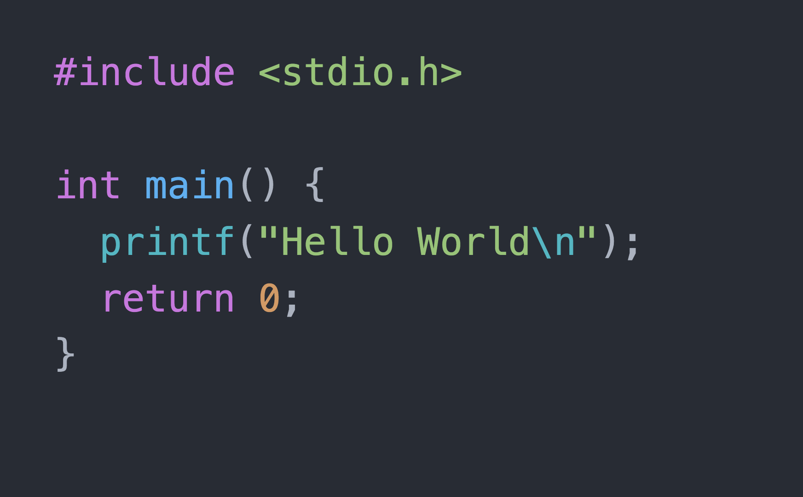

# sesion-06a

lint:
 - Código = el proceso automatizado de analizar el código fuente para identificar errores de programación, garantizar la coherencia del estilo y detectar posibles problemas en el código que podrían generar inconvenientes en el futuro.

 - lavandería = pelusa 

YAML = formato de serialización de datos legible por humanos inspirado en lenguajes como XML, C, Python, Perl, así como en el formato de los correos electrónicos. Fue propuesto por Clark Evans en 2001, quien lo diseñó junto a Ingy döt Net y Oren Ben-Kiki.

## hola :-)

- [x] Activar "actions".

Próximo encargo/proyecto se descuentan 3 puntos si no se activa "actions" y un mayor descuento si se presenta con errores de linting.

## Proyecto 02 

Grupos de entre cuatro y cinco personas, el grupo no pude ser comformado como el grupo anterior (se puede con solo una persona del grupo pasado).

El proyecto va a ser una maquina saludadora, inspirada en el programa de enseñanza de programación "Hello World" 

## investigación sensor 

### Nombre sensor

Módulo KY-040 o rotary encoder

### ¿Qué es?

Es un codificador incremental con dos salidas levemente desfasadas, gracias a esto, veremos que se puede saber en qué dirección estamos girando el eje.

Un encoder rotativo tiene un número fijo de posiciones por revolución. El KY-40 tiene treinta, estas posiciones son marcadas por clicks conforme se va girando el encoder. Además, posee un pulsador interno.

### ¿Cómo funciona?

El módulo genera señales digitales sobre los pines A y B. Señales que estarán en nivel alto y que conforme vayamos girando el eje,y en función de hacia qué lado lo giremos, una de esas señales cambiará de estado antes que la otra. Arduino es capaz de detectar estas señales.

### Como se puede usar / Ejemplos de uso

[ejemplo de como hacerlo funcionar en arduino](https://wokwi.com/projects/405602657354813441)

[menu con una pantalla y el módulo](https://youtu.be/4emCK6c2Qdg?si=YusOB8WR9r9K2_rv)

