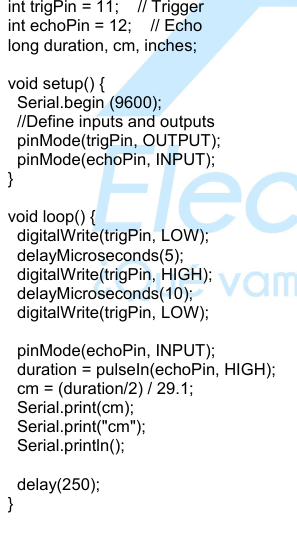

# sesion-06a 09/09

## Apuntes clase

[Scratch](https://scratch.mit.edu/): Es un software de programación. Estrategia de programar con bloques. Fue desarrolldo por MIT Media Lab.

[Pure data](https://puredata.info/): Es un software para programar audios. Está programado en C++.
  
- Miller Puckette: Es un matemático, programador y profesor de música estadounidense, director asociado del CRSA, así como miembro del claustro de la facultad de la UC University of California en San Diego donde trabaja desde 1994. Cycling 74 esta empresa vende un software llamado `Max map`.
  
Hizo nueva versión.

- **Max**: Gráficas para hacer audios
- **dac**: De digital a análogo.
- las cajitas que están arriba son entradas y las de abajo son salidas. input/output.
- la `~` es la salida del sonido.
- si creo un `pd` se hace un subpach.
- Lint: Proceso de automatización para corregir errores, por ejemplo, sacar las pelusas de la ropa.
- YAML: Es un formato de serialización de datos legible por humanos que se utiliza principalmente para archivos de configuración y para transmitir datos ente sistemas, gracias a su facil lectura y escritura. Pueden variar los inputs y output.
  
---

- programación en estado de objetos
- [lauren lee mccarthy tools for improved social interacting](https://get-lauren.net/Tools-for-Improved-Social-Interacting)
- [renata gaui hysterical wearable](https://vimeo.com/215600031?fl=pl&fe=sh)
- [Touchdesigner](https://derivative.ca/)
- [Isadora software](https://en.wikipedia.org/wiki/Isadora_(software))

---

### Ejemplo:

on

 Hay un espacio antes 

- En c++ son los murciélagos {}.
- Arduino controlled namaste gratin robot.
  
### Sensores y Actuadores

**Sensor**: entrada a nuestra caja negra.

**Actuador:** salida.

- obs
- Ultrasonico : emitir un pulso y detecta el ultrasonido y cuenta en cuanto se demora en devolverse.
- Sensor de temperatura y humedad:  atmosféricarica.
- Sensor de gas.
  
  Potenciometro 5 patas encoder rotatorio, no tiene límite.
  
- Sensores de humedad
- Sensor de lluvia, resistencia experimental -> Sensores pasivos. (Hay otro y se ocupa para el nivel del agua).

- Joistik

- Sensor de luz
  
Fotodiodo 

- Sensores de sonido
  
Tienen mic

## Encargo

Investigar sensor elegido en clases y buscar tres ideas de cómo utilizarlo.

### Sensor de proximidad HC­-SR04

- Capazdedetectar objetos y calcular ladistanciaalaque se encuentra en un rangode 2 a 450cm.

- El sensor posee dos transductores, un emisor y un receptor, piezoeléctricos.
  
- El funcionamiento de este es porque el emisor, piezoeléctrico, emite 8 pulsos de ultrasonido.
Luego, de recibir la orden en el pin TRIG, las ondas de sonido viajan en el aire y rebotan al encontrar un objeto, el sonido de rebote es detectado por el receptor piezoeléctrico.
Después,el pin ECHO cambia a Alto por un tiempo igual al que demoró la onda, desde que fue emitida hasta que fuedetectada.

---

- VCC -> +5V DC
- TRIG -> Disparo del ultrasonido
- ECHO -> Recepción del ultrasonido
- GND -> 0V

---

- En el pdf de "**ULTRASONIC-HC-SR04** sensor de distancia ULTRASONICOHC-SR04" sale un ejemplo de cómo conectarlo al arduino y programarlo.

### Referentes

- <https://www.alldatasheet.com/view.jsp?Searchword=Hcsr04&gad_source=1&gad_campaignid=1434060638&gbraid=0AAAAADcdDU_3WQz4u0DzpZeXNn-3MtZrJ&gclid=Cj0KCQjww4TGBhCKARIsAFLXndTs1R1fS00TREmq_0RvPVZ1qDk8mfWRS0penD4mX2Y5jNh88lqOTgaAmVzEALw_wcB>
- <https://agelectronica.lat/pdfs/textos/U/ULTRASONIC-HC-SR04.PDF>
- <https://proyectosinteresantes.com/10-proyectos-de-arduino-con-el-sensor-ultrasonico-hc-sr04/>

### Ideas de cómo utilizarlo

1. Al acercarse a distintas distancias haga sonidos distintos mediante un parlante, así poder jugar/crear distintas melodías.
2. Al detectar a alguien cerca se activa un motor y abre algo.
3. Que detecte a una persona en algun espacio y si no tiene presencia de nadie que se apaguen las luces.
