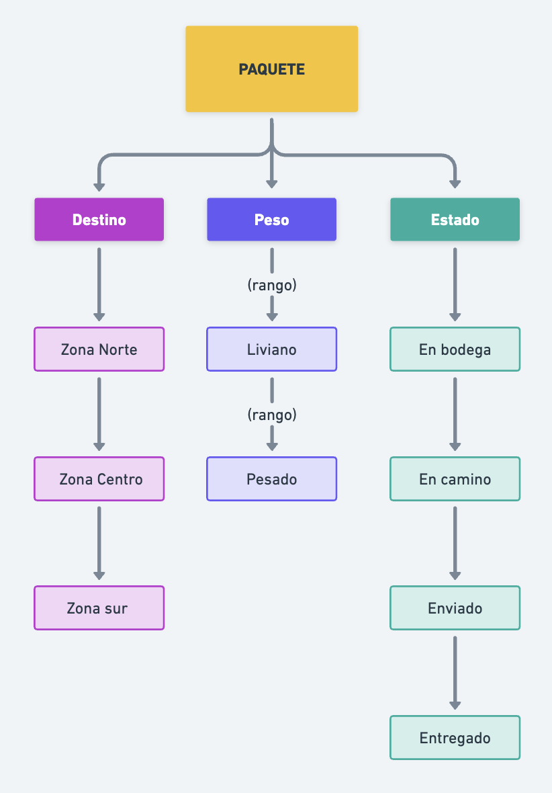

# sesion-05b

Viernes 5 de septiembre de 2025

## Sintáxis

Variables vistas la clase anterior

- <> : significa en donde esté ese archivo en el computador.
- .h: "prometo".
- .cpp: "me hago cargo".
- include: incluye tal archivo o tal biblioteca.
- define
- indefine
- endif: para cerrar el código .h
- constructores
- Inheritance
- (dentro de una clase) atributos: variables.
- (dentro de una clase) métodos: funciones.
- boolean: son dos valores true/false

### Clases

- Primero se escribe un .h, luego el .cpp y todo esto se incluye en el .ino (arduino).
- Si yo creo una clase, debe estar icluida en el archivo .h
- Tipo de clase -- nombre de la variable, ejemplo: Tipo (clase) tipografía (variable).

## Ejercicio clase

Dibujar y escribir clases y subclases.

## Ejemplo de Aarón

```cpp
#include "Integrante.h"

class Banda {

Integrante [] intgrantes;
agregarIntegrante (Integrante agregado);
quitarIntegrante (Integrante quitado);

};
```

```cpp
#include "Instrumento.h"

class Integrante {

Integrante (String nombre);
String nombre = " ";

Instrumento [] Iinstrumentos;

agregarInstrumento(Instrumento agregado);
};
```

```cpp
class Instrumento {
String nombre;
};
```

```cpp
class Cuerda:public Instrumento {
int numeroCuerdas;
};
```

```cpp
class Guitarra:public Cuerda {
numeroCuerdas = 6;
};
```

## Ejercicio "Paquete"



`**Paquete.h**`

```cpp
#indef PAQUETE_H
#define PAQUETE_H

#include

class Paquete {
public:
 String destino;
 int peso;
 String estado;

 Paquete (String destino, int peso);
 void enviar ();
 void entregar ();
 
};

#endif 
```

Paquete.cpp

```cpp
#include "Paquete.h"
Paquete::Paquete (String destino, int peso) {
destino = d;
peso = p;
estado = "En bodega";
}

void Paquete::enviar(){
estado = "En camino";
}
void Paquete::entregar(){
estado = "Entregado"
}
```

Paquete.ino (falta)

## Otros apuntes

- **Arm** es una arquitectura de procesadores que contiene un conjunto de instrucciones reducidos diseñadas para la eficiencia energética y alto rendimiento. Generalmente la usan los teléfonos, arduinos, etc.
- **W 3 Schools:** tutoriales de c++, sintáxis, variables, etc.
