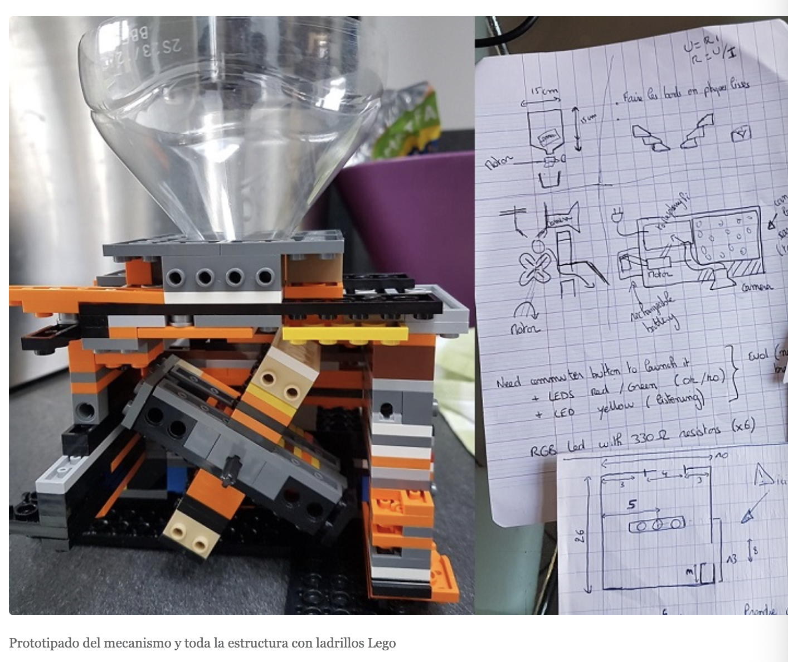
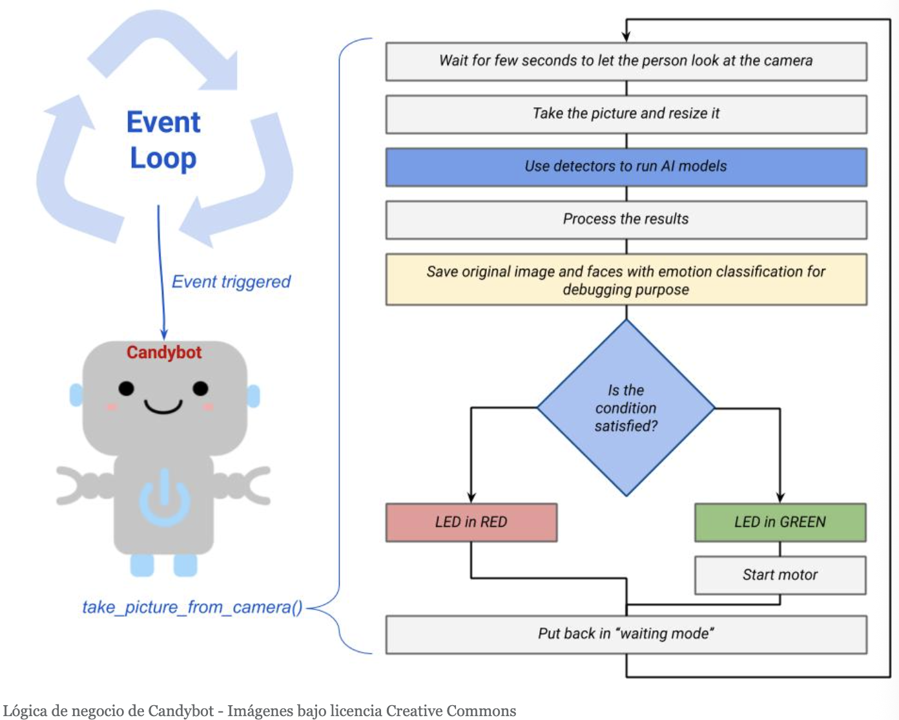
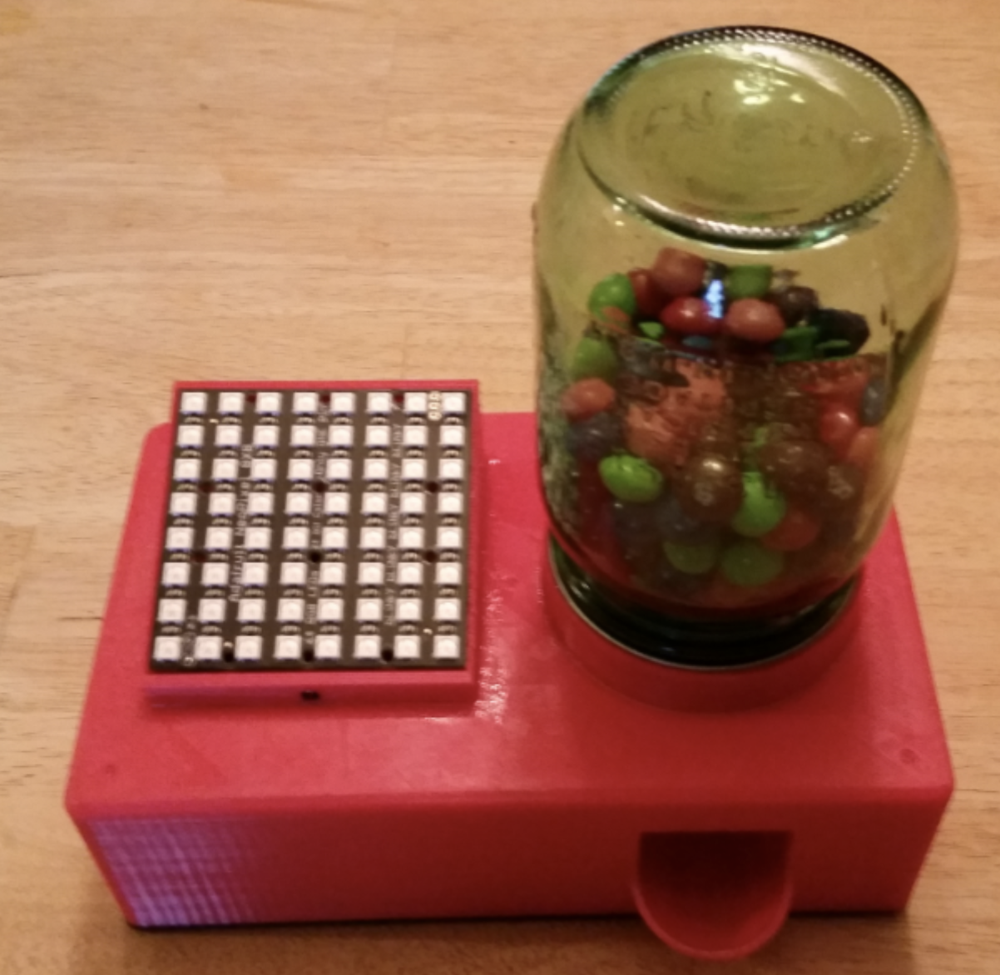

# 🌷 sesion-07a
Martes 23 de Septiembre de 2025

## 🪩 Apuntes de la clase
- Toda la Teoría del Universo: colectivo de personas que impulsan encuentros entre las artes, las tecnologías, las ciencias y los saberes comunitarios para pensar y hacer en común. (https://todalateoriadeluniverso.org/).
- Bienal de Artes Mediales.
- **Cosmotécnica y Tecnodiversidad**: es un concepto acuñado por el filósofo chino Yuk Hui que describe la unificación del orden loral y el orden cósmicoa través de actividades técnicas. Es la forma que se en la que se integra visión de mundo de una cultura para darle sentido a la vida.
- Beginning NFC (Near-Field Communication): comunicación NFC con Arduino. (https://books.google.cl/books?id=ScuYAgAAQBAJ&printsec=copyright&redir_esc=y#v=onepage&q&f=false).
- nic.cl para saber quien es dueño de los dominios chilenos.
- sensor rtc (real time clock): para ver la hora en tiempo real.
- (https://cwandt.com/) ➜ sensores como referentes de diseño.
- Hackaday: (https://hackaday.com/) para revisar proyectos.
- Nixie Tubes.
- Módulo grabación-reproducción.
- Demasled: para cintas led.
- MAtriz led, son neo pixeles que sirven para hacer animaciones mediante una pantalla de leds.
- rotation led display: luces que mediante un motor rotstivo se crea una imagen o texto.
- **openscad** modelado 3D con código (https://openscad.org/).
### 4 tipo de motores: 
1. Tipo dc ➜ alta velocidad, corriente directa es rápido y no sabe donde esta. Se usan en drones, ventiladores, en  el vibrador del teélfono, etc.
1. Paso a Paso ➜ lento, preciso y sabe cuanto se puede mover.
1. Servomotor ➜ es preciso para hacer movimientos en ciertos ángulos.

## 🛠️ ENCARGO: 17 de octubre se entrega.
- 26/09: clases y parámetros aplicadas a sensores.
- 30/09: módulo daralogger y módulo de sonido.
- 7/10 - 14/10: trabajo en proyecto 2.

### Proximo viernes ➜ traer 10 proyectos de internet que sean parecidos a lo que quiero hacer.
Citar bibliografía. 

## 🖲️ 10 Heurísticas de Usabilidad para el Diseño de Interfaces de Usuario, Jacob Nielsen

1. **Visibilidad del estado del sistema:** el diseño debe mantener siempre informados a los usuarios sobre lo que está sucediendo, mediante una retroalimentación adecuada.
1. **Correspondencia entre el sistema y el mundo real:** el diseño debe ser familiar para el usuario, el lenguaje y la naturalidad. Debe ser de fácil comprensión.
1. **Control y libertad del usuario:** los usuarios suelen realizar acciones por error, es por eso que necesitan una "salida de emergencia" marcada para abandonar la acción no deseada sin tener que pasar por un largo proceso. Admite deshacer y rehacer.
1. **Coherencia y estándares:** los usuarios no deberían tener que preguntarse si diferentes palabras, situaciones o acciones significan lo mismo. Mantener consistencia dentro de un solo producto o de una familia de productos.
1. **Prevención de errores:** los buenos diseños piensan en todos los errores, pero hay que ofrecer a los usuarios una opción de confirmación antes de que realicen la acción.
1. **Reconocimiento en lugar de recuerdo:** el usuario no debería tener que recordar información de una parte a otra parte de la interfaz. La información como etiquetas o elementos del menú deberían ser visibles o fáciles de recordad cuando se necesite.
1. **Flexibilidad y eficiencia de uso:** los accesos directos, ocultos para usuarios principiantes, pueden agilizar la interacción para el usuario experto, de modo que el diseño se adapte para estos dos tipos de usuarios.
1. **Diseño estético y minimalista**: las interfacesno deben contener información irrelevante o rara vez necesaria. El contenido y el diseño visual se centren en lo esencial.
1. **Ayudar a los usuarios a reconocer, diagnosticar y recuperarse de errores:** los mensajes de error deben expresarse en un lenguaje sencillo, indicar con precisión el problemay sugerir de forma constructiva una solución. Además, deben presentarse con tratamientos visuales que ayuden a los usuarios a notarlos y reconocerlos.
1. **Ayuda y documentación:** lo ideal es que el sistema no requiera explicaciones adicionales, sin embargo podría ser necesario proporcionar documentación para ayudar a los usuarios a comprender sus tareas. Ser conciso y enumerar los pasos concretos que deben seguirse.

## 🔮 Máquina saludadora
✦ Ideas: Se resume en una máquina que dispensa dulces y de acuerdo al color del dulce te da un mensaje (sensor de color). Esta máquina, contiene una carcasa en forma de un personaje a definir (monstruo), con un ojo que se mueve con respecto a que si tiene interacción o no. Puede parpadear y te saluda animosamente con un audio que te dice; "Hola Terrícola".

La máquina saludadora, es un dispensador de chicles que contiene diversos colores, cada color contiene un mensaje que al momento de reconocerlo un parlante dice "hola terrícola y la frase que corresponde al color". Este dispensador tiene forma de monstruo, tiene una pantalla circular que muestra su ojo, este puede estar abierto, cerrado, parpadeando, mirando, etc.

✦ Materiales que necesitamos
- Sensor de color Tcs230 - Tcs3200 $5.000 (https://afel.cl/products/sensor-reconocimiento-de-color-tcs230-tcs3200).
- Pantalla TFT Circular 1.24 Pulgadas RGB 240x240 $12.000 (https://afel.cl/products/pantalla-tft-circular-1-24-pulgadas-rgb-240x240).
- Protoboard.
- Cables de conexión.
- Arduino.
- Módulo Grabación/Reproducción de Audio ISD1820 con Micrófono Integrado $3.000 ➜ sirve para un solo sonido, 20 segundos. (https://afel.cl/products/modulo-grabacion-reproduccion-de-audio-isd1820-con-microfono-integrado).
- Modulo Reproductor MP3 DFPlayer Mini $2.990 ➜ para que tenga muchos sonidos y se reproduzcan. (https://afel.cl/products/modulo-reproductor-mp3-dfplayer-mini)
- Mini Parlante Altavoz de 3w $3.000 (https://afel.cl/products/mini-parlante-altavoz-de-3w).
- Chicles de bolita de colores.

## ☞ Encargo 12
Leer las bitacoras de colegas, encontrar similitudes, diferencias, preguntas y aciertos de sus máquinas saludadoras propuestas. Citar correctamente las fuentes.

### ✦ Similitudes generales
- Casi todas las propuestas que se plantean un **estado de reposo (stand by)** que se activa al detectar la presencia de un usuario.
- Se usan sensores como: movimiento, proximidad, joystick o botones.
- El saludo se entiende como algo **lúdico, cercano y amistoso**, muchas veces con toques de humor o parecidos a mascotas virtuales.
- La retroalimentación inmediata es crucial: luces, pantallas, sonidos o movimientos se activan como respuesta al usuario.
- Se reconoce la omportancia de generar una **experiencia memorable**, más allá de la simple detección de la entrada.

### ✦ Diferencias principales 
- **Enfoque de interacción**: algunos proyectos son más **visuales** (pantallas, animaciones), otros más **físicos** (joysticks, servos o botones).
- **Complejidad técnica**: varía desde saludos automáticos muy simples, hasta interacciones conversacionales con preguntas y respuestas.
- **Narrativa**: en ciertas bitácoras, la máquina saludadora se concibe como un **personaje con identidad propia** mientras que otras es un **dispositivos funcional y minimalista**.
- **Escala física y tamaño**: hay propuestas portátiles y compactas y otras como instalaciones fijas en un espacio.
- **Estética y tono**: algunos priorizan lo humorístico, otros lo formal o minimalista.
  
### ✦ Preguntas
- ¿Cómo garantizar que el sensor **sea preciso** y no genere falsos positivos o negativos?
- ¿De qué manera se evita que la interacción se vuelva repetitida con el tiempo? ¿O esa es la inteción?
- ¿Cómo mantener la **atención del usuario** después del saludo inicial?
- ¿Qué pasa si varios usuarios intentan interactuar al mismo tiempo?
- ¿Cómo lograr que la narrativa de la máquina sea clara para todo tipo de usuario?
  
### ✦ Aciertos destacados
- Propuestas que integran **personalidad y humor**, haciendo más atractiva y memorable la experiencia.
- Algunas máquinas incluyen **manuales, instrucciones o leyendas** pata guiar al usuario con los gestos.
- Creatividad en plantear **formas alternativas de saludar** no limitándose al "Hola".
- Varios proyectos logras un **buen equilibrio entre hardware y narrativa interactiva**.
- En ciertos casos, se considera la **escalabilidad** y la posibilidad de **adaptar el saludo** según el contexto.

## ☞ Encargo 13
Buscar 2 referentes asociados a tu proyecto de cada una de estas 4 categorías: 1. lenguaje natural (personas), código, materialidad, documentación. escribir un párrafo por cada uno de los referentes encontrados, citando las fuentes, y explicando por qué lo elegiste, qué te aporta, qué te inspira, o incluso si lo incluyes como antiejemplo

### ✦ Referentes:
1. **Candybot**: dispensador automático de dulces que te da dulces si estás contento y sonríes. (https://nidragedd.github.io/a-candy-dispenser-with-ai-raspberry-and-lego-bricks/)

- Funciona con una cámara que detecta rostros y luego realiza un reconocimiento de emociones faciales.
- Se ejecuta en un dispositivo integrado como Raspberry Pi.
- Se encuentra la manera de controlar el motor del dispensador.

💻 Software:
- aplicación que detecta rostros y reconocimiento de emociones faciales.

💻 Software/ Hardware (con RaspberryPi):
- Código que reaccion al botón que dispensa los dulces.
- Código que encienda las luces rgb.
- Código que hace funcionar el motor para dispensar los dulces.

1. **Automated Candy Dispenser**

(https://www.instructables.com/Automated-Candy-Dispenser-1/)

- Se trata un un dispensador de dulces controlado por Arduino e impresión 3D.
- Para los componentes eléctrónicos se utilizó un Arduino Uno, batería de 9v, sensor IR y control remoto, motor paso a paso y placa controladora, Adafruit NeoPixel NeoMatrix 8x8, resistencia de 10 kohmios, resistencia de 300-500 ohmios, condesador de 1 mF 6,3 V+ y recipiente de cristal con tapa rosca.

🛠️ Circuito de control

El código y las piezas se encuentran en el link que está escrito más arriba.

### 📖 Bibliografía
- (https://www.nngroup.com/articles/ten-usability-heuristics/)
