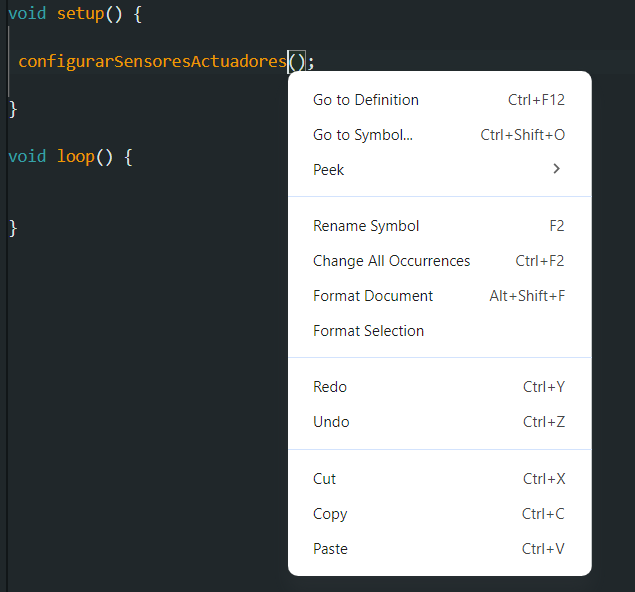

# sesion-07b

## Encargo clase pasada

### Referentes:

#### Codigo
- Arduino-sound-localization (GitHub): Ejemplo práctico que usa Arduino para estimar dirección del sonido mediante tiempos de llegada y lectura rápida de pines.

https://github.com/danielgusland/Arduino-sound-localization


- Sound_source_localization (GitHub — cristinaa211): Proyecto que muestra métodos de procesamiento (incluye versiones en Python/Matlab) para localización con varias micrófonos y ejemplos de adquisición desde Arduino.

  https://github.com/cristinaa211/Sound_source_localization

#### Materialidad

- SparkFun Sound Detector: Módulo de micrófono electret con salida analógica y digital (guía oficial)
En learn.sparkfun.com/tutorials/sound-detector-hookup-guide se explica cómo usar este módulo que combina un micrófono electret con preamplificador y comparador. Proporciona simultáneamente salida analógica (nivel de señal), salida digital (detección de sonido)

https://learn.sparkfun.com/tutorials/sound-detector-hookup-guide/all

- Instructables — 3D Printed / Animatronic Eye Mechanisms: Varios how-to para mecanismos de ojo (mecanismo del globo ocular, montaje de servos y párpados impresos). Hay versiones “on the cheap” y variantes compactas con instrucciones de montaje y tamaños de tornillería

https://www.instructables.com/3D-Printed-Animatronic-Eye-Mechanism-on-the-Cheap/

#### Documentación

- Tutorial: “How to Detect the Direction of Sound Using Arduino” (CircuitDigest / Random Nerds style guides): Tutorial paso a paso sobre detectar dirección con múltiples micrófonos, ejemplos de conexión de módulos y código de muestreo/medición de amplitud. Bueno para prototipado rápido con Arduino. 
circuitdigest.com

https://circuitdigest.com/microcontroller-projects/how-to-detect-the-direction-of-sound-using-arduino

- Paper / estudio reciente (arXiv): Dirección con tres electret microphones (julio 2025): Propuesta técnica que demuestra un método ligero para estimar dirección usando 3 electret mics comparando potencias medias y/o TDOA; incluye validación y limitaciones. 

https://arxiv.org/html/2507.03466v1

## Clase

Dra. Cynthia Shuffer:

Licenciada en Artes Visuales, Universidad de Chile, 2005, Chile Profesora en Artes Visuales, Universidad de Chile, 2009, Chile Doctora en Estudios Americanos especialidad Pensamiento y Cultura, IDEA-USACH, 2019, Chile.


### Pseudocodigo

`Pseudocodigo.ino`

```cpp
void setup() {
  configurarSensoresActuadores();
}

void loop() {
  leerSensores();
  tomarDecisiones();
  actuar();
}

```

`creditos.ino` 

```cpp
// 2025 09 25
// intento de codigo v0
// para grupo millaray y sus secuaces
// parece que necesitan un sensor ultrasonico
```

`cableado.ino` 

```cpp
// el sensor microfono tiene 3 patitas
// la primera va a GND
// la segunda va a una entrada analogica
// la tercera va a VCC, OJO es de 5V

```

`sensorMicrofono.ino` 

```cpp
void configurarSensorMicrofono() {
  // conectar la patita

  // definir la intensidad minima
  // definir la intensidad maxima

}
```

`sensoresActuadores.ino`

```cpp
void configurarSensoresActuadores() {

  configurarSensorMicrofono();

  // configurar mas sensores
  // configurar actuadores
}

void leerSensores() {}

void tomarDecisiones() {}

void actuar() {}
```

Si haces click derecho sobre una función, te lleva directo a esa parte del código para que veas su implementación.




### Investigación 

#### Sensor micrófono: Modulo Micrófono Amplificador MAX4466

https://afel.cl/products/modulo-microfono-amplificador-max4466

Componentes

- Micrófono electret: Captura la presión sonora.
- Chip MAX4466: Amplifica la señal débil del micrófono.
- Potenciometro: Permite al usuario ajustar la ganancia del amplificador.
- Pines: VCC, GND, OUT.

Características

- Voltaje de Operación: 2.4 - 5.5V DC
- Ratio de rechazo de fuente de poder: 112dB
- Salida Riel a riel

#### Actuador servomotor: Micro Servomotor SG90

https://afel.cl/products/micro-servomotor-sg90

Componentes

- Motor DC pequeño: Genera el movimiento giratorio básico.
- Sistema de engranajes: Transfiere el movimiento del motor al eje final.
- Potenciómetro: Permite al circuito interno medir la posición angular real del eje.
- Circuito de control: Circuito con un amplificador operacional, comparadores y lógica para interpretar la señal PWM de control.
- Eje de salida: Eje que termina saliendo del servo, al que se montan las palancas o mecanismos externos.
- Conectores: VCC, GND, Señal PWM. 
- Topes: Impiden que el eje gire más allá del rango permitido.

Características

- Velocidad: 0.10 s/60° - 4.8 V
- Torque: 1.8 Kg·cm - 4.8 V
- Voltaje de funcionamiento: 3.0 – 7.2 V
- Ángulo de rotación: 90°
- Ancho de pulso: 500 – 2400 µs
- Temperatura de operación: -30 °C a 60 °C
- Longitud del cable: 24.5 cm

## Codigo proyecto

Su primera versión

```cpp
int valorMic;
void setup() {
  Serial.begin(9600);
}

void loop() {
  valorMic = constrain(valorMic, 511, 1023);
valorMic = analogRead(A0);
Serial.println(valorMic);
delay(500);
}
```

Observaciones:

- El micrófono no tiene mucha precisión al no estar soldado.
- Capta el sonido cuando ya termino.


