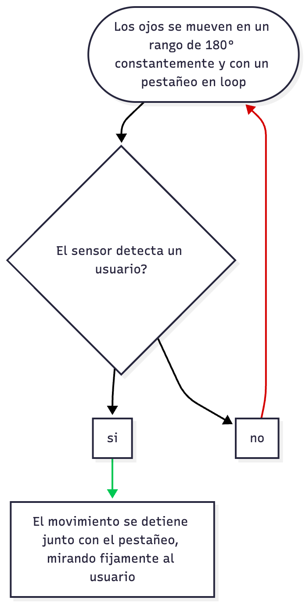

# sesion-09b
10/10

Ese día falte pero esto fue lo que hicieron mis compañeros de grupo.

## Clase

Tuvimos que cambiar el tipo de sensor del proyecto.
Inicialmente intentamos usar un micrófono, pero fue muy complicado hacerlo funcionar correctamente, por lo que Misa nos sugirió utilizar un sensor ultrasónico para detectar la presencia de una persona u objeto.

La nueva idea consiste en una estructura con ojos y un sensor montada sobre un servo.
El servo permitirá que la máquina gire lentamente en el espacio, moviendo los ojos dentro de un rango de 180°, con un parpadeo constante en bucle.

El sensor ultrasónico detectará cualquier alteración a su alrededor (por ejemplo, la presencia de alguien).
Cuando esto ocurre, el movimiento se detiene, los ojos dejan de moverse y quedan fijos mirando directamente al usuario o al objeto detectado, tal como se muestra en el siguiente diagrama:



### Funcionamiento del sensor ultrasónico

El sensor HC-SR04 funciona emitiendo ondas sonoras desde un transmisor; estas rebotan en los objetos y regresan al receptor.
Así se calcula la distancia según el tiempo que tarda el eco en volver.


Conexiones básicas:

```cpp
VCC  --> 5V  
GND  --> GND  
Trig --> pin 9  
Echo --> pin 10
```
Configuración en el código

Para organizar mejor el programa, se creó una clase SensorProx que contiene los métodos necesarios para configurar, leer y determinar la presencia detectada por el sensor.
Así se mantiene el código limpio y modular.

```cpp
class SensorProx {
public:
  SensorProx();
  ~SensorProx();

  void configurar();
  void leer();
  void imprimirEnConsola();
  void determinarPresencia();

  int patitaTrigger = 9;
  int patitaEcho = 10;
  float duracion = 0;
  float distancia = 0;
  bool presencia = false;
};
```

Y su implementación:

```cpp
void SensorProx::configurar() {
  pinMode(patitaEcho, INPUT);
  pinMode(patitaTrigger, OUTPUT);
}

void SensorProx::leer() {
  digitalWrite(patitaTrigger, LOW);
  delayMicroseconds(2);
  digitalWrite(patitaTrigger, HIGH);
  delayMicroseconds(10);
  digitalWrite(patitaTrigger, LOW);

  duracion = pulseIn(patitaEcho, HIGH);
  distancia = (duracion * 0.0343) / 2;
}

void SensorProx::determinarPresencia() {
  presencia = (distancia < 16);
}

void SensorProx::imprimirEnConsola() {
  Serial.print("Distancia: ");
  Serial.println(distancia);
  delay(100);
}
```

Cuando el sensor detecta que algo se encuentra a menos de 16 cm, cambia la variable presencia a true, provocando que el servo se detenga y los ojos fijen su mirada.
