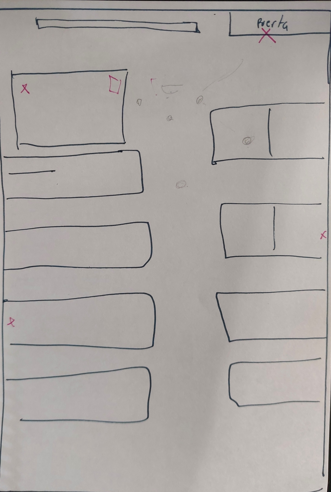
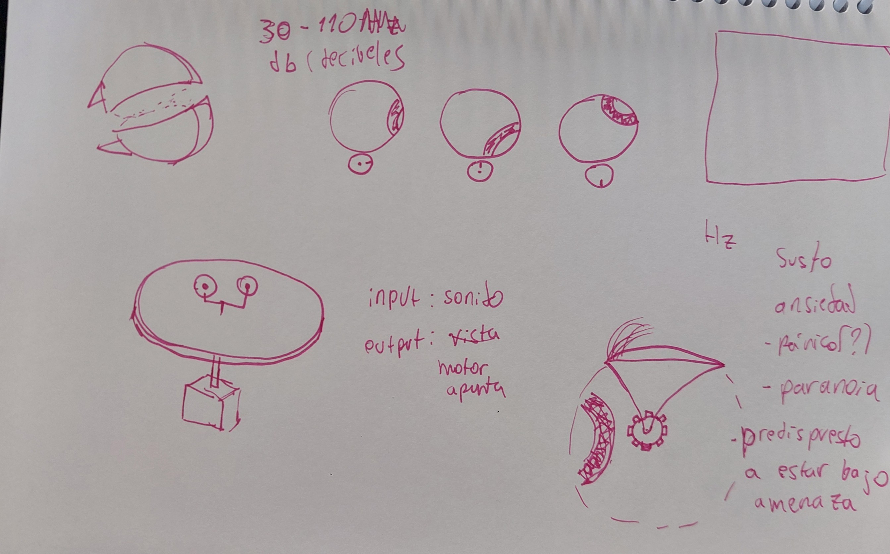

# sesion-07a

## clase 13 - 23-sept

A grandes rasgos exiten 4 tipos de motores: 

1. DC motor (direct current): un motor DC es rápido, no sabe donde está. 
aplicaciones: drones, ventiladores, vibradores, etc.
2. Step motor: lento, preciso, no sabe donde está. Funciona con grados.
aplicaciones: impresoras 3D, etc
3. Servomotor: funciona por grados, si sabe donde está. Se clasifican según cuánto giran(90°, 180°, 270°, 360°)
4. solenoide: movimiento lineal(no giratorio)

- [hackaday](https://hackaday.com)
- [clock that is wrong](https://github.com/dupontgu/clock_that_is_wrong)
- [CW & T](https://cwandt.com)
- [las llamadas que nunca hice](https://www.instagram.com/lasllamadasquenuncahice)
- [Nona Fernández](https://es.wikipedia.org/wiki/Nona_Fernández)
- [Patii Smith](https://es.wikipedia.org/wiki/Patti_Smith)
- [Transductor](https://es.wikipedia.org/wiki/Transducción)
- [Transductor en electrónica](https://es.wikipedia.org/wiki/Transductor)
- [driver](https://es.wikipedia.org/wiki/Controlador_de_dispositivo)
- [eléctrico vs electrónico](https://osakaelectronicsltda.com/blog/biblioteca/cual-es-la-diferencia-entre-un-aparato-electrico-y-electronico)
- [empresa de tiras led](https://www.demasled.cl/)
- [neoPixel](https://www.adafruit.com/category/168)

## grupo proyecto-02

### hijos de la tierra

ojos que te miran.

- [video referente ojos](https://www.youtube.com/watch?v=Ftt9e8xnKE4)

Buscamos crear un robot "creepy", que genere sensación de incomodidad y de "sentirse observado" en los usuarios.

debido a la dificultad que significa la detección de personas, queremos detectar a la gente a través de sonidos. Para esto, serán colocados entre 3-5 micrófonos en puntos estratégicos de la sala. Dependiendo de cuáles micrófonos detecten sonidos, y en qué intensidad, los ojos apuntarán en una dirección determinada.

por ahora, los ojos puede cambiar su dirección en el eje X, no en el eje Y. Los ojos estarán sobre una plataforma, la cual gira en 270° gracias a un motor. 

Los párpados funcionan gracias a un eje de rotación, cuya posición está en el centro de la esfera(visto desde el lateral).

### info

los [párpados](https://es.wikipedia.org/wiki/Párpado)