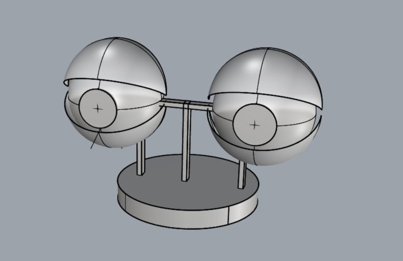
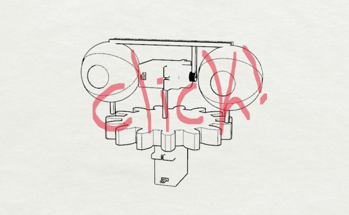

# sesion-08a

las frecuencias mas agudas son más direccionales.

- [MovingAvg](https://docs.arduino.cc/libraries/movingavg)

- [abs()](https://docs.arduino.cc/language-reference/en/functions/math/abs)

- SPL sound pressure level

- [frecuencia](https://es.wikipedia.org/wiki/Frecuencia)
- [amplitud](https://es.wikipedia.org/wiki/Amplitud_(física)#:~:text=En%20física%2C%20la%20amplitud%20(del,o%20cuasiperiódicamente%20en%20el%20tiempo.)

- [trigonometría](https://es.wikipedia.org/wiki/Trigonometría)

## info rescatada

<https://forum.arduino.cc/t/calculating-decibels-spl-from-max4466-microphone-input/1239394>

     Microphone sensitivity is normally referenced to 94dB SPL.
     So with a gain of 75, you should get 0.47VRMS at 94dB. That's your reference (although you can calculate a different reference from that information).
     20 x log(V/0.47) is the dB difference.
     Add that dB calculation to 94dB and you've got your SPL level. (Of course if it's negative you'll be effectively subtracting.)

### qué avanzamos hoy

- prototipamos cómo se conectan los párpados a los motores. 

- mirado desde una vista lateral, el servomotor se encuentra en el centro de la circunferencia del globo ocular.

- ambos parpados están conectados entre sí. A trvés de una pieza larga y anogsta. (aprox 80mm x 4mm).

-  el párpado superior se mueve, con el centro de la circunferencia como el eje de rotación. EL párpado inferior esta fijado en posición.
- calibramos el ángulo en el que se puede mover el párpado superior. Por ahora es desde 30°-70°.

- [libreria servo](https://github.com/arduino-libraries/Servo/blob/master/docs/api.md#attach)

 -[moss-class](https://github.com/Mosswhosmoss/dis8645-2025-02-procesos/blob/main/03-Mosswhosmoss/sesion-08a/codigoRobotFriolento_0_2_1/SensorUltra.cpp)

 <https://forum.arduino.cc/t/calculating-decibels-spl-from-max4466-microphone-input/1239394>

 - [average](https://forum.arduino.cc/t/calculating-average-value/204225)

 ## encargo-16

     "cada persona del grupo debe subir a su README:
     qué llevan hasta el final de esta sesión, qué sí funciona,
     qué funciona casi, qué no funciona. después subir nueva 
     versión del código y de la documentación, del trabajo que
     hagan entre 8a y 9a."

-*redactado el 16 de octubre*-

en el período del 3-6 de octubre generamos avances brígidos(pesnamos que se entregaba el 7 de octubre).

### avance por partes

me encargué de diseñar y modelar en 3D todo el cuerpo, movimeintos y estética del robot.

#### forma y vibe

primero partí con este modelado para entender la posición de los iris y párpados, ya que esto determina  el sentimiento que el robot transmite.

luego, hice este modelo 3D sin pensar en medidas o estructuralidad.                    

