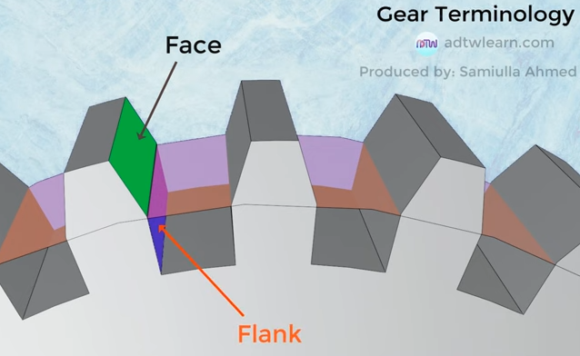
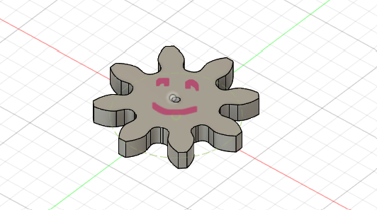
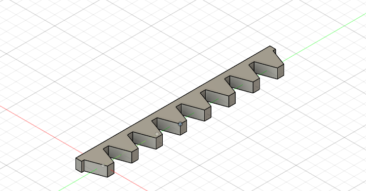
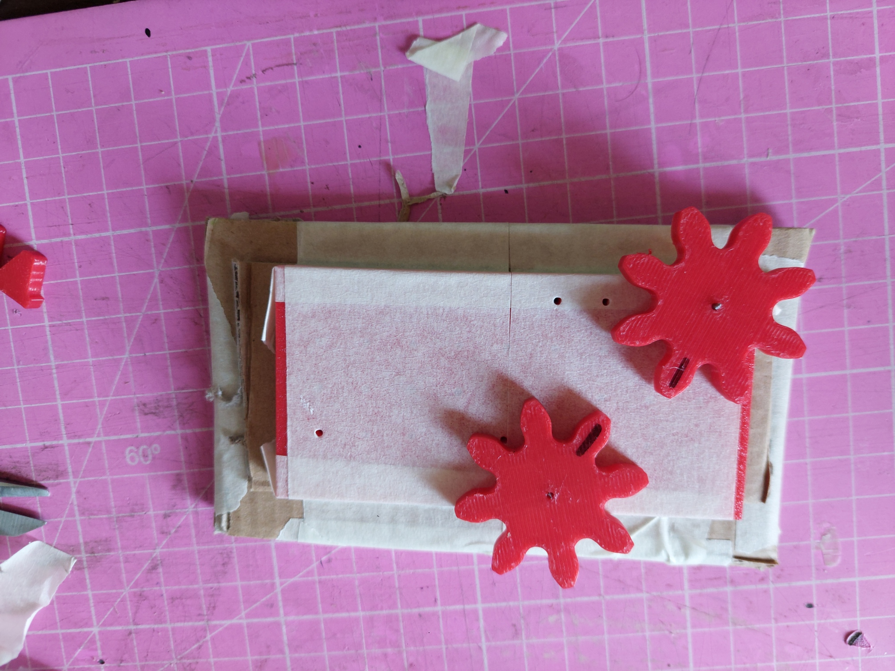
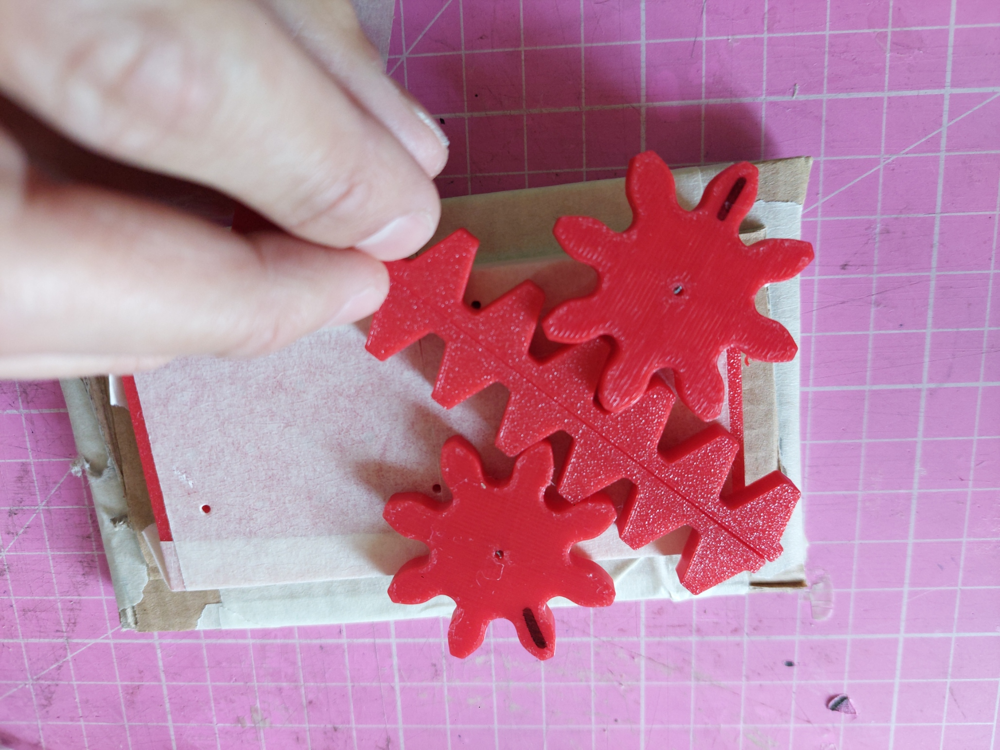
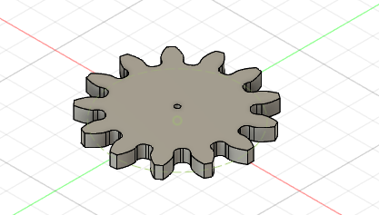

# sesion-09b

## 10-oct-2025

### resuemen propuestas

v1: el estado base del robot es quieto, al sus micrófonos sensar sonido, se activan los servos y le hacen apuntar a la fuente del sonido, y se queda mirandolo hasta que deje de emitir ruido, o se emita otro ruido proveniente desde otra posición

v2: el esta en constanté búsqueda de fuentes de peligros, por loq ue está en un estado perpetuo de mirar de izquierda a derecha y de vuelta, para interrumpitr este estado, debe detectar la presencia de una persona, al detetctarla, se queda mirando a la persona, hasta que deje de detectar su presencia. En ese momento vuelve al estado base del loop del movimiento de "cuello".

### nuevo flujo

```mermaid
graph TB;
A[Robot gira su cabeza en 90°
ida y vuelta. está buscando
posibles amenazas,
mientras pestañea]
A-->B[usuarie es detectade]
A-->C[Usuarie NO es detectade]-->A

B-->D[el giro de su cabeza
se detiene]--> E(abre los párpados y mira
directamente al usuario)

E-->B
E-->C
```

### avance de alta calidad

durante la clase, escribí un código, que moviera el servo paulatinamente, y que se detuviera al sensar proximidad. Tenía dudas de como salir de ciclo for, y después retomarlo, por lo que pedí ayuda a matías, quien me ayudo, sugiriendo crear variables que guarden la posiciónActual, posiciónMax y posiciónMin.

Tras esto, escribí denuevo el código, implementando las mejoras sugeridas, y vine al lab. Aquí, sebastianSaez1003 me ayudó con el código, creando las clases correspondientes para ordenar el código. Dado que, hice el código completo antes de compilarlo, surgieron literlamente decenas de errores, los cuales fuimos revisando 1 por 1 hasta que compiló correctamente.

### avance de alta calidad v2

hoy en mi casa, me puse a pénsar en cómo abordar todo lo que conlleva el sensor ultrasónico tuve esta idea que me pareció genial, dado que complejiza el proyecto, y le da un uso al engranaje que hasta ahora, era solo decorativo.

la idea es que, el servo genera un movimiento linear en el engranaje linear(el del centro), y este provoca que los dos contenedores de los sensores giren, en sentidos opuestos.

con el propósito de poder probar y prototipar el movimiento de los engrasnajes, diseñe una base basada en [este referente](https://youtube.com/shorts/z2B92KWYxI0?si=4a_Tz0l9_7qoeDbT). La idea, es que funciones como un breadboard, para engranajes, que me permita colocar diferentes engranajes, y probar cómo combinan entre ellos y el resultado de sus combinaciones.

estuve probando varias páginas y programas de simulación de engranajes, pero, por distintas razones,  ninguna de ellas me permitía emular al nivel de precisión que yo necesito para este prototipo.

páginas y programas, y porqué  no me sirvieron:

- <https://evolventdesign.com/pages/spur-gear-generator>
- <https://www.stlgears.com>
- <https://geargenerator.com/beta/>
- <https://sites.google.com/site/simgears/español/descarga>

finalmente decidí modelar este movimiento en fusion360, siguiendo [este tutorial](https://youtu.be/B8A_11o7QZ0?si=m-EfV5VHSsalFFco)

fusion incluye un plugin que permite generar engranajes, y para generar los racks, los cuales me permiten transformar el movimiento rotacional en movimiento lineal, instalé el plugin [rack generator](https://apps.autodesk.com/FUSION/en/Detail/Index)

generé estos engranajes y racks, para imprimirlo y prototipar.

una vez impresos, pegué 2 racks para que pudieran afectar 2 engranajes, en sentidos opuestos. Coloqué los engranajes en la tabla de prototipado mencionada anteriormente, y lo puse a prueba.

en este punto temporal, me está costando harto generar los engranajes con las especificacxiones con las lo que lo necesito.

## gears

- [khkgears.net](https://khkgears.net/new/gear_knowledge/abcs_of_gears-b/basic_gear_terminology_calculation.html)
- [youtu.be](https://youtu.be/2aftYe1sAuk?si=3lhF4pmu0fMwxvIr)
- [wikipedia](https://es.wikipedia.org/wiki/Engranaje)

los engranajes son un tipo de mecanismo, que se utiliza para transmitir potencia mecánica. Los engranajes te permiten manipular tanto la dirección como la velocidad.

los sistemas de engranajes se construyen en base a su pitch, que es un círculo imaginario que representa el punto donde los engranajes harían contacto.

los engranjes tienen dientes para tener mejor agarre entre ellos. El círculo que reprersenta el tamaño del engranje es llamdo "dedendum circle", el círculo imaginario [circunscrito](https://es.wikipedia.org/wiki/Circunferencia_circunscrita) en el en engranaje, se llama "addendum circle".

el diente de un engranaje tiene una forma de un trapecio pegado a un cuadrado, la parte donde se unen, es el pitch

```mermaid
graph BT
    B[  <br>  ] --> A[/ <br>  <br>\]
```

Respecto a la parte del diente que entra en contecto con otro engranajes, la parte del trapecio es la "face".
 la parte inferior, es el "flank".

el plugin de fusion [spur generator](https://www.autodesk.com/support/technical/article/caas/sfdcarticles/sfdcarticles/How-to-create-a-spur-Gear-in-Fusion-360.html), pide los siguientes parámetros para genrar un engrnaje:

el [módulo](https://es.yujebearing-machining.com/info/what-is-the-modulus-of-a-gear-67373842.html) es una característica propia de los engranajes. El módulo es útil, ya que para que 2 engranajes sean compátibles entre sí, deben tener el mismo módulo.

### siguiente fase: crear engranajes

teniendo en cuenta la infromación previa, generé este nuevo engranaje, al cual le puse alonso:

estas son las medidas de alonso:

- pressure angle: 20 deg
- module: 4.00
- number of teeth: 8
- backlash: 0.00mm
- root fillet radius: 2.00mm
- gear thickness: 5.00mm
- hole diameter: 2.00mm

esos datos generan un pitch diamter de 32mm

sabiendo la propiedad del módulo, generé el rack gear con el módulo de 4:

el plugin rackGear, me pide estos parámetros:

generé un rack gear, con los isguiente paármetros:

- module: 4.00mm
- pressure angle: 20.0 deg
- number of teeth: 8
- gear thickness: 5.00mm
- root fillet radius: 0.00mm
- backlash: 0.00mm
- base width: 3.00mm

imprimí ambos modelos y los probé en mi gear board

luego monté un sensor ultrasónico a un engranaje para probar la función que busco efectuar.

  
video convertido a gif con [esta página](https://cloudconvert.com/mp4-to-gif)

para pasar a un prototipo de mayor resolución, modelé un case para el ultrasónico.

dado el tamaño de la base de este case, generé otro engranaje, cuyo diamétro de su dedendum circle sea mayor a 39,93mm. Esto también es una mejora, ya que al pasar de un engranaje más pequeño a uno más grande, se puede realentizar el movimiento.

con las piezas anteriores ya impresas, monté este bello mecanismo

convertido a gif con [esta página](https://ezgif.com/video-to-gif/ezgif-848237ef819f28.mp4.html)(la que ocupé antes tiene límite de créditos)

