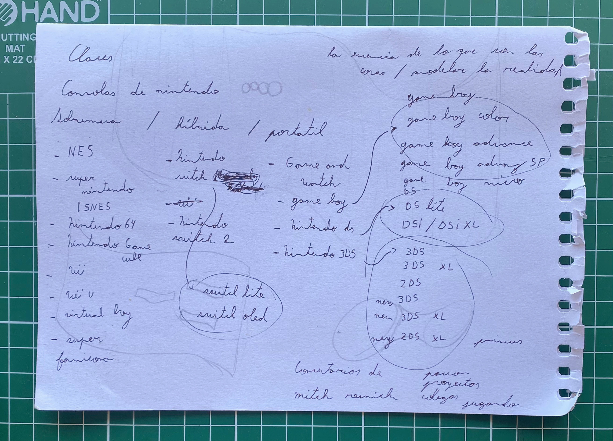
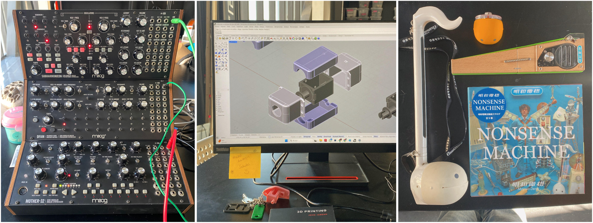

# Sesión-05b

## Trabajo en clase / Viernes 05 de septiembre, 2025

### Cosas que hablamos en la mañana

Hablamos un poco de nuestras solemnes de los ramos teóricos, y revisamos nuestras notas y comentarios del Proyecto-01. 

También hablamos de las notas, de los promedios de las notas y de nuestra manera de percibirlas. La universidad es para errar, aprender y corregir, aunque en definitiva es algo socialmente complejo, en especial en una carrera donde muchas veces los proyectos son súper personales y el ego puede ser algo difícil de gestionar. Pero es algo que se trabaja.

### Clases

En el archivo .h prometo

En el archivo .cpp me hago cargo, responsabilidad afectiva xd

El código tiene que tener comentarios, y la documentación debe estar ordenada para que otra persona pueda entenderlo. Estamos utilizando estándares globales, lo que hacemos acá, también se trabaja en otras partes del mundo.

Adafruit_SSD1306 depende de Adafruit_GFX. La class también es parte de public.

```cpp
class completo_italiano : public completo
```

Las clases se utilizan cuando queremos organizar información en forma de estructuras de datos. Son como una especie de carpeta que contiene tanto los datos como las funciones que permiten manipularlos.

```cpp
class Texto 
{
public;
// constructor
Texto();

// destructor
~Texto();
};
```

A los atributos se les llama variables, y a los métodos se les llama funciones.

### Ejercicio de crear nuestra propia clase

Para entender de manera conceptual lo de las clases, cada uno tuvo que dibujar y organizar su propia clase, a partir de cualquier conjunto de cosas. Casi todos hicimos nuestras clases de acuerdo a nuestras aficiones.

Yo hice el ejercicio de consolas de Nintendo. Primero las clasifiqué en tres grupos nuevos: consolas de sobremesa, consolas híbridas y consolas portátiles. Después distribuí todas las consolas de Nintendo de acuerdo a su clasificación, y finalmente subdividí las consolas que tenían otro tipo de ediciones, como por ejemplo la versión Pocket, Light, Color, Advance, SP, Micro, de la Nintendo Game Boy.



Mientras trabajábamos en esta sección, nos dividimos en dos grupos: uno se quedó trabajando en la sala, y el otro fue al Laboratorio de Interacción Digital (LID). Este momento sirvió para conocer ese espacio y apropiarse de él. Yo me quedé en la sala porque ya conozco el LID. Creo que es un espacio muy genial; me siento súper cómoda y acompañada trabajando ahí.



### Palabras importantes

Clases

Atributos

Métodos

### Referentes

## Encargo-09: Primus
          
Escuchar y comentar uno de los tres primeros discos de la banda Primus

Albúm primus desaturating seven

## Encargo-10: Mitch Resnick

Me leí el artículo [“Sembrando las semillas para una sociedad más creativa”](https://eduteka.icesi.edu.co/articulos/ScratchResnickCreativida) de Mitch Resnick, el cual fue traducido por Eduteka. 

El conocimiento no es suficiente, todo se basa ahora en pensar y actuar creativamente. En las escuelas, hasta los mejores alumnos no saben cómo enfrentarse a los problemas. Las nuevas tecnologías han provocado que las cosas cambien muy rápido, pero también pueden utilizarse para desarrollar la creatividad en esta nueva sociedad.

En conjunto con un grupo de investigación del Laboratorio de Medios del Instituto Tecnológico de Massachusetts (MIT Media Lab), se crearon dos tecnologías: Crickets y Scratch, diseñadas específicamente para promover lo que llaman la espiral del pensamiento creativo.

El espiral del pensamiento creativo consiste en imaginar lo que se quiere hacer, crear un proyecto basado en ideas y motivaciones personales, jugar con esas ideas y creaciones, compartirlas con los compañeros y reflexionar sobre los resultados y experiencias. Según Mitch Resnick, este proceso promueve volver a imaginar y repetir el espiral.

Un Cricket es como un bloque programable diseñado para que los niños puedan entender cómo funcionan los sistemas electrónicos. Mitchel Resnick, su creador, sostiene que vivimos en una era donde existen muchos objetos sensibles que actúan de forma autónoma, pero sin que sepamos realmente cómo lo hacen. Para resolver esta desconexión, desarrolló estos bloques programables, diseñados para que los niños conecten sensores y motores, experimenten con sus propias creaciones y comprendan el funcionamiento interno de la tecnología que los rodea.
a diferencia de los legos Mindstorms que estan hechos para crear robots, los Crickets estan hechos para realizar creaciones artisticas con intencion, utilizando luces, sonido y movimiento. ademas los kids vienen diversos materiales para estimular la imaginación.

Scratch está diseñado para crear y controlar proyectos en línea mediante programación creativa. Permite desarrollar videojuegos, animaciones o presentaciones dinámicas, entre muchas otras posibilidades. También se ha incorporado en algunas escuelas, donde los estudiantes murmuran entre ellos, se plantean objetivos y colaboran activamente: proponen ideas para resolver fallos en sus diseños y comparten sus resultados.

En Scratch, los estudiantes programan utilizando bloques gráficos en lugar de lenguajes complejos de programación, lo que hace que la interfaz sea mucho más amena y accesible. Aprenden conceptos matemáticos básicos en un entorno estimulante.

Se comenta que un estudiante le preguntó a su profesor de álgebra de octavo grado cómo podía crear el puntaje final para un juego que estaba desarrollando, y el profesor lo ayudó enseñándole el concepto de variables. El estudiante se mostró muy entusiasmado, lo cual evidencia que la enseñanza está cambiando: se vuelve más dinámica y conectada con los intereses reales de los alumnos. El profesor incluso señaló que rara vez había visto a un estudiante tan motivado por aprender sobre variables.

Citando a Mitch Resnick "Para tener éxito en la actual sociedad de la Creatividad, deben aprender a pensar de manera creativa, planear sistemáticamente, analizar críticamente, trabajar colaborativamente, comunicarse claramente, diseñar iterativamente y aprender continuamente." 
