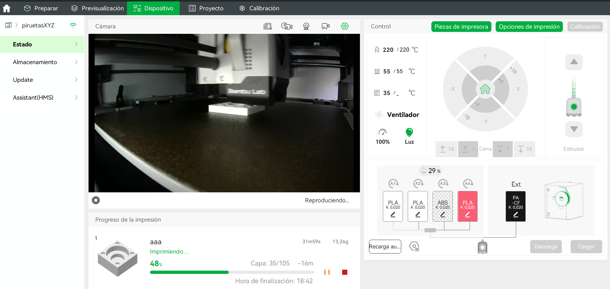

# Sesión-09b

## Trabajo en clase

### Cosas que hablamos en la mañana

- Para repasar <https://www.w3schools.com/>

### Cosas que tenemos que ir modificando

Misa nos enseño lo que eran millis, y que debiamos cambiarlo por los delay.

hacer carcasas para el proyecto y la parte formal

### Parte conseptual del proyecto

Antes de diseñar la carcasa, deberíamos retomar bien el lado simbólico y conceptual del trabajo. Nuestra primera opción, antes de profundizar en el funcionamiento y en los cambios técnicos que fuimos realizando, fue trabajar con el concepto del sin sentido y la sinestesia, mezclando los sentidos como experiencia a través de los sensores.

Incorporamos unos ojos que te siguen y detectan qué tan cerca estás, además de una oreja que emite sonidos, desarrollando así la idea de sinestesia y lo absurdo como ejes del proyecto.

Insertar foto*

Luego nos pareció un poco incompleta esa idea y que faltaba desarrollarla, entonces quisimos darle una especie de enfoque conceptual a nuestro proyecto, tomando los elementos que habíamos definido. Siguiendo con eso, se nos ocurrió transformar la idea de la oreja que habla y situar el resto de los elementos dentro de un contexto inspirado en Van Gogh. Hicimos algunos bocetos, pero luego Aarón nos hizo replantearnos la propuesta, ya que provenía de un contexto violento, lo cual nos hizo bastante sentido.

Insertar foto*


Y finalmente volvimos a las ideas iniciales. Repasamos nuestros actuadores y pensamos qué podríamos hacer con ellos para las carcasas. Primero, con el elemento del speaker, decidimos diseñarle una carcasa con forma de concha, de modo que al acercarla a la oreja se pueda escuchar el mar. Pero no solo las olas, sino también ruidos del ambiente, como gritos, pájaros y sonidos de gaviotas, creando la sensación de teletransportarse a una playa chilena.

Insertar foto*

#### Modelado 3D

Primero partí modelando una pieza con las formas base del parlante, para estimar más o menos el tamaño que debía tener el speaker. Este modelado lo imprimí en el laboratorio, aunque no sirvió de mucho porque me equivoqué al no considerar el espacio para los cables.



Para el modelado de la concha tuve que buscar algunos videos tutoriales, ya que su forma es bastante orgánica y compleja, con curvas irregulares y detalles difíciles de replicar sin una guía. Estos recursos me ayudaron a entender mejor cómo construir la estructura y lograr que se viera natural.


Insertar foto de boceto*

Insertar foto de boceto*

#### Sonido

Para el sonido que se reproducirá en el speaker con forma de concha, encontramos una página con grabaciones de campo de [Felix Blume](https://felixblume.com/bio/?lang=es), de la playa de Valparaíso. Era justo lo que estábamos buscando, sonidos reales de las olas, la caleta, los vendedores y la gente conversando, junto con ruidos naturales del entorno. Todo esto recrea de manera auténtica la atmósfera sonora de una playa chilena. 

https://felixblume.com/valparaiso/

https://soundcloud.com/felixblume/ship-horns-valparaiso

También le pregunté a ChatGPT sobre las licencias para asegurarme de que no me demanden xd .-.

```text
La grabación “Bocinas de barco en el puerto de Valparaíso” está bajo la licencia Creative Commons
Atribución–CompartirIgual 3.0 (CC BY-SA 3.0).

Puedes: Usarla libremente, incluso con fines comerciales. Modificarla, remezclarla o incorporarla en tus propios
proyectos (por ejemplo, en una pieza sonora, video o instalación).

Pero debes: Dar crédito al autor, en este caso Félix Blume, mencionando su nombre y la fuente original (por ejemplo:
“Sonido por Félix Blume, bajo licencia CC BY-SA 3.0”).

Compartir tu obra bajo la misma licencia (es decir, también CC BY-SA 3.0). Esto significa que otras personas podrán
reutilizar tu versión con las mismas libertades y condiciones.
```


---

### Referentes

-

-

### Palabras impoertantes
