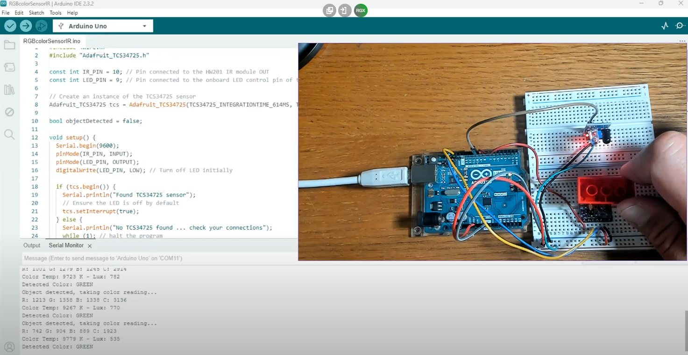

# sesion-06a

## Apuntes clase

!!!!! rellenar esta bitacora !!!!! 
- Falté a la clase por motivos personales, así que tuve que ponerme al día con el [video de la clase](https://www.dropbox.com/scl/fo/ehsibpioii91n7ggaj546/AO7BLMgKRYHgKI4czkODTwQ/original?dl=0&preview=sesion-06a-video-00.mp4&rlkey=kndd4mq9pdfghmp3btp2bk9pp&subfolder_nav_tracking=1) y también me comentaron cosas mis compañeros.

- En el proyecto 2 haremos algo más complejo y con sensores. Trabajaremos con grupos nuevos y podemos volver a trabajar con una sola persona con la que ya hayamos trabajado.

- [Nonsense Machines — Maywa Denki (TEDxUTokyo)](https://www.youtube.com/watch?v=jKPBD3HHU4g)

-----

### Sensores 

- Detecta cambios en el ambiente o en un objeto.

- Transforma lo que detecta en una señal que se puede medir o usar.

- Funcionan como los “sentidos” de una máquina: perciben y reaccionan a estímulos.

- Podemos hacer un montón de cosas con ellos. 
  
- Acelerómetro: mide cambios en la velocidad o movimiento de un objeto.
  
- Giroscopio: detecta la orientación y rotación de un objeto.

- Luz: mide intensidad de luz en el entorno.

- Infrarrojo: detecta objetos u obstáculos usando luz invisible.

- Presión: mide fuerza aplicada sobre una superficie.

- Color: detecta colores o cambios de luz visible.

- [AFEL - Sensores](https://afel.cl)cuenta con distintos tipos de sensores, y en la página aparecen organizados por secciones, lo cual me ayuda a ver la variedad que existe.

-----

## Encargo 11

- Investigar sensores vistos en clases, cotizarlos, encontrar referentes que los usen, y describir 3 pequeñas ideas que podamos aplicar a su proyecto-02 de máquinas de saludar.

- [Sensor Color RGB TCS34725](https://afel.cl/products/sensor-color-rgb-tcs34725): Sensor de color que mide RGB y luz total(la cantidad de luz que recibe el sensor sin filtrar), se conecta por I2C, tiene filtro IR, LED propio y permite ajustar medición y ganancia; detecta colores con alta precisión, incluso a través de vidrios. En BMonster Laboratory, encontré este video en el cual se muestran distintos proyectos y como utilizarlo. El que más me llamó la atención fue el [Sensor del color de piezas LEGO](https://www.youtube.com/watch?v=Ey5UhCxlxi). Este detecta el color de las piezas al acercarlas, pudiendo identificar verde, azul o rojo.

- 
  
- Se me ocurre la idea de que la máquina utilice el sensor TCS34725 para detectar el color de la ropa de la persona que se acerca y, en función del color identificado, responda con un saludo personalizado. Por ejemplo, si detecta rojo, la máquina podría decir: “¡Hola! Qué color tan llamativo llevas”, transmitiendo un mensaje positivo para empezar el día con buen ánimo. La idea es que cada saludo se adapte al color detectado. Pensando en que la ropa que la gente usa es muy variada, quizá sea conveniente hacer un estimado de los colores de poleras más comunes para cubrir una mayor variedad y poder adaptar los saludos de manera más efectiva.

- Su valor es de 4.000

