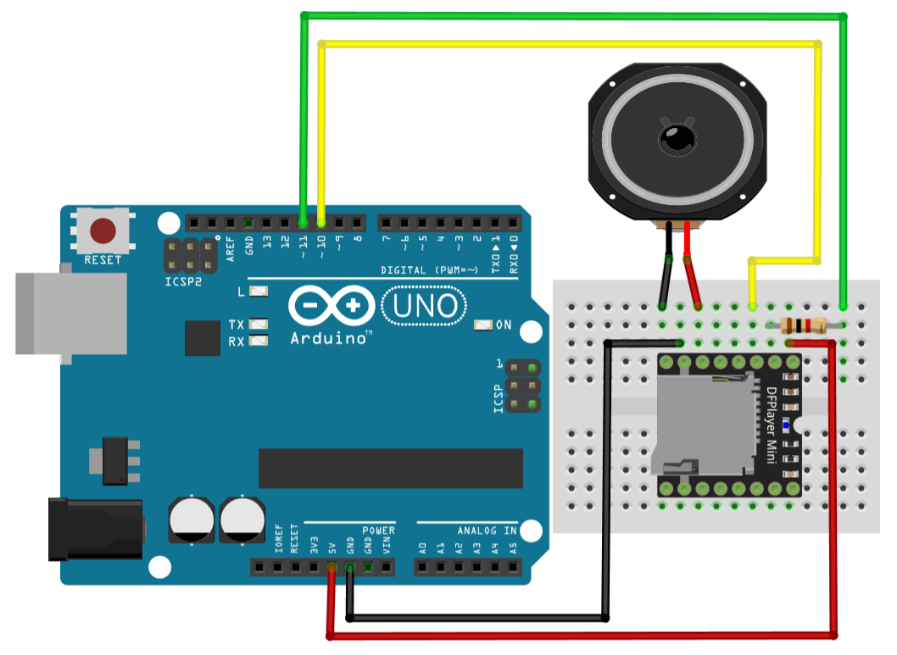

# sesion-09a


### Reproductor mp3 

Una parte del proyecto requiere hacer que el reproudctor mp3 reproduzca audios randomizados


```cpp
<@746126402121629817> /***************************************************
DFPlayer - A Mini MP3 Player For Arduino
 <https://www.dfrobot.com/product-1121.html>
 
 ***************************************************
 This example shows the basic function of library for DFPlayer.
 
 Created 2016-12-07
 By [Angelo qiao](Angelo.qiao@dfrobot.com)
 
 GNU Lesser General Public License.
 See <http://www.gnu.org/licenses/> for details.
 All above must be included in any redistribution
 ****************************************************/

/***********Notice and Trouble shooting***************
 1.Connection and Diagram can be found here
 <https://www.dfrobot.com/wiki/index.php/DFPlayer_Mini_SKU:DFR0299#Connection_Diagram>
 2.This code is tested on Arduino Uno, Leonardo, Mega boards.
 ****************************************************/

#include "Arduino.h"
#include "DFRobotDFPlayerMini.h"

#if (defined(ARDUINO_AVR_UNO) || defined(ESP8266))   // Using a soft serial port
#include <SoftwareSerial.h>
SoftwareSerial softSerial(/*rx =*/4, /*tx =*/5);
#define FPSerial softSerial
#else
#define FPSerial Serial1
#endif

DFRobotDFPlayerMini myDFPlayer;
void printDetail(uint8_t type, int value);

void setup()
{
#if (defined ESP32)
  FPSerial.begin(9600, SERIAL_8N1, /*rx =*/A3, /*tx =*/A2);
#else
  FPSerial.begin(9600);
#endif

  Serial.begin(115200);

  Serial.println();
  Serial.println(F("DFRobot DFPlayer Mini Demo"));
  Serial.println(F("Initializing DFPlayer ... (May take 3~5 seconds)"));
  
  if (!myDFPlayer.begin(FPSerial, /*isACK = */true, /*doReset = */true)) {  //Use serial to communicate with mp3.
    Serial.println(F("Unable to begin:"));
    Serial.println(F("1.Please recheck the connection!"));
    Serial.println(F("2.Please insert the SD card!"));
    while(true){
      delay(0); // Code to compatible with ESP8266 watch dog.
    }
  }
  Serial.println(F("DFPlayer Mini online."));
  
  myDFPlayer.volume(10);  //Set volume value. From 0 to 30
  myDFPlayer.play(1);  //Play the first mp3
}

void loop()
{
  static unsigned long timer = millis();
  
  if (millis() - timer > 3000) {
    timer = millis();
    myDFPlayer.next();  //Play next mp3 every 3 second.
  }
  
  if (myDFPlayer.available()) {
    printDetail(myDFPlayer.readType(), myDFPlayer.read()); //Print the detail message from DFPlayer to handle different errors and states.
  }
}

void printDetail(uint8_t type, int value){
  switch (type) {
    case TimeOut:
      Serial.println(F("Time Out!"));
      break;
    case WrongStack:
      Serial.println(F("Stack Wrong!"));
      break;
    case DFPlayerCardInserted:
      Serial.println(F("Card Inserted!"));
      break;
    case DFPlayerCardRemoved:
      Serial.println(F("Card Removed!"));
      break;
    case DFPlayerCardOnline:
      Serial.println(F("Card Online!"));
      break;
    case DFPlayerUSBInserted:
      Serial.println("USB Inserted!");
      break;
    case DFPlayerUSBRemoved:
      Serial.println("USB Removed!");
      break;
    case DFPlayerPlayFinished:
      Serial.print(F("Number:"));
      Serial.print(value);
      Serial.println(F(" Play Finished!"));
      break;
    case DFPlayerError:
      Serial.print(F("DFPlayerError:"));
      switch (value) {
        case Busy:
          Serial.println(F("Card not found"));
          break;
        case Sleeping:
          Serial.println(F("Sleeping"));
          break;
        case SerialWrongStack:
          Serial.println(F("Get Wrong Stack"));
          break;
        case CheckSumNotMatch:
          Serial.println(F("Check Sum Not Match"));
          break;
        case FileIndexOut:
          Serial.println(F("File Index Out of Bound"));
          break;
        case FileMismatch:
          Serial.println(F("Cannot Find File"));
          break;
        case Advertise:
          Serial.println(F("In Advertise"));
          break;
        default:
          break;
      }
      break;
    default:
      break;
  }
  
}

```

