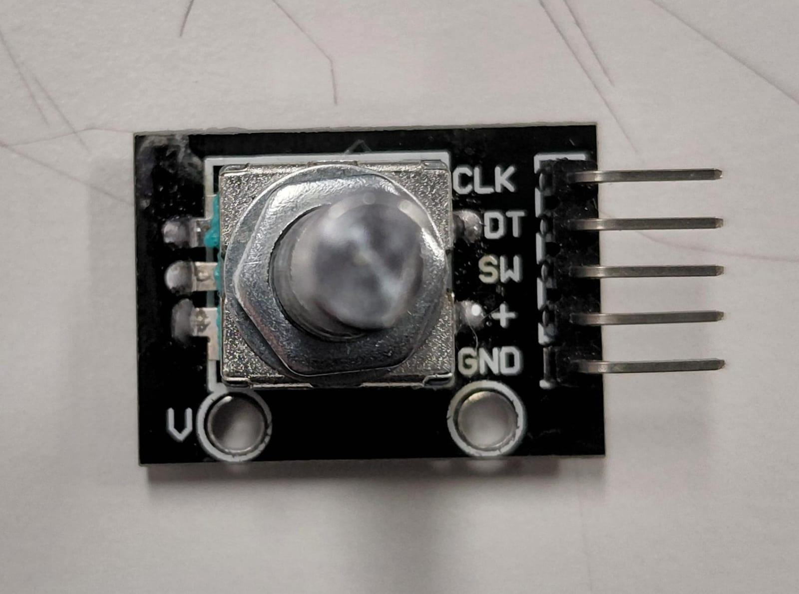
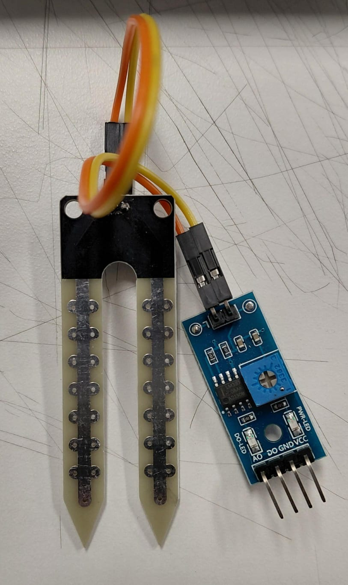

# sesion-06a
## CLASE 09.09.25 ── .✦
### A P U N T E S .ᐟ.ᐟ

✰ [SCRATCH](https://scratch.mit.edu/)

✰ [PURE DATA](https://puredata.info/)

✰ TouchDesigner también se programa pero con cajitas.

✰ [VVVV](https://vvvv.org/)

✰ Action ---> WorkFlow: flujo de trabajo, automatizar dentro del repositorio 

✰ Carpeta .github ---> markdown-lint.yml. (proceso automatizado de limpieza, depuración de estilos y detectar errores en la programación, que se cumplan las leyes de markdown)
Lint: pelusa, archivo para sacar las pelusas.

✰ [OVERLEAF](https://es.overleaf.com/) ----> utiliza LaTeX.

✰LaTeX: no es un lenguaje de programación tradicional, sino un sistema de composición tipográfica para la creación de documentos de alta calidad, especialmente en campos científicos y técnicos. Se asemeja a programar porque separa el contenido de su formato y se basa en comandos específicos que se compilan para generar un documento final, usualmente en formato PDF. [Manual de LaTeX](https://aprendeconalf.es/latex-manual/introduccion.html)

✰Los sensores los usamos como entrada a la caja negra. 

✰ [AFEL](https://afel.cl/) ------> comprar cosas para Arduino.

✰ Sensores:

- Ultrasónico: emite un sonido y cuenta cuanto se demora en volver (es bien impreciso). Medir distancias
- De temperatura y humedad: detecta temperatura y humedad (para ambiente)
- De gas:
- Encoder rotatorio: gira sin límite (diferente al potenciómetro), puede girar y clickearse, como para elegir opciones y presionar (ej: cosito de la lavadora)

- De humedad: se usan para plantas, se puede saber si la planta esta seca y cuando hay que regar.

- De lluvia: detecta gotitas de agua (es una resistencia experimental), sea lo que sea que caiga en la plaquita (incluso si toco con mi dedo) lo detecta. Sensor pasivo.
- Joystick: incluye potenciometros dentro, tene un botón también, es como los de mandos de juego.
- fotodio:
- De sonido: usan micrófono, se usan para medir intensidad de sonido o detectar si se emitió un sonido. (ejemplos: detectos de aplausos, de portazos, cada 4 aplausos quiero que mi robot salude)
