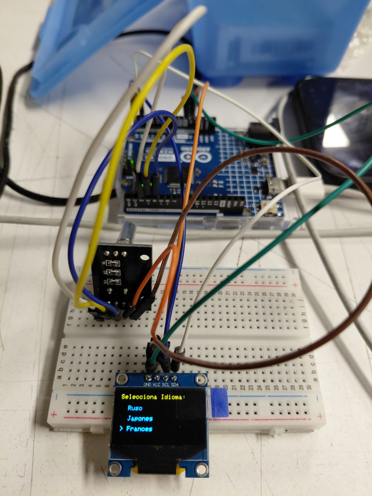

# sesion-08a
## Clase 30.09.25

### Prueba de sensores y código ── .✦

❀ Seudo codigo (llaman funciones) ✔

❀ Encoder (funciona) ✔

❀ Sonido (funciona, falta elegir archivos)

❀ Actuador Reproductor (funciona, falta archivo)

❀ Pantallita (funciona) ✔

❀ Menú (listo, ver si agregaremos más idiomas) ✔

❀ Loops (listos) ✔

❀ Actuadores (estan, falta probar)

❀ Carcasa

❀ Montaje

❀ Que todo funcione junto.

1. Pantalla: hubo leves problemas ya que el código compilaba bien y no habian errores, pero la pantalla se mantenía en negro. Probamos y estaba bien conectada y no habia fallos a nivel físico. Revisamos nuevamente con los profesores. El problema era en el código, en la dirección de la pantalla que teniamos, teniamos puesto "3C" con letra mayúscula, y resulta que se debe poner "3c", en minúscula, se puede revisar en el código de prueba original de la biblioteca de AdaFruit. Se pudo observar sin ningún problema el menú de idiomas.

2. Encoder: no hubo ningún problema al momento de conectar el encoder y el código funcionaba bien, gira sin problemas entre las tres opciones de idioma que entregamos. Aún falta configurar que al presionar el botón se seleccione el idioma y continúe la interación. Tenemos videos también de que funciona.

3. La otra parte de nuestro grupo, se encargó de probar la conexión de altavoz. Tuvieron problemas y el grupo tralalero nos ayudó, al parecer el cableado era el problema y TX y RX estaban al reves, finalmente funcióno y probamos unos audios que realizamos en una página de inteligencia artificial. Probamos el idioma francés, y se escucho como decia "bonjour".

[Aplicación que utilizamos para crear los audios](https://www.narakeet.com/)

