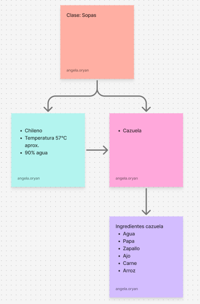

# sesion-05b

5 Septiembre 2025

## Repaso clase pasada

Vamos a repasar lo que se vió la semana pasada. (Yo estuve ausente así que agradezco el repaso.)
Hay que entender bien que la programación no es solo programar, sino que todo el proceso detrás. Es un estilo de vida.

El #include significa “anda al computador y busca donde sea que exista.”

Existen archivos .cpp y .h
En el .h dice que cosas puedo hacer con la pantallita. Es corto. Este archivo **promete**.
El .cpp hace que las cosas ocurran. Es largo. Este archivo **cumple**.

El #ifndef evita que haya problemas al llamar a un archivo más de una vez.

<https://www.reddit.com/r/cpp_questions/comments/j7wfef/what_is_the_need_for_ifndef_define_endif_inside/?tl=es-419>
Aquí hay una página para entenderlo mejor. Además de proteger, también es útil para la compilación condicional.

El arduino R4 Minima funciona con arm

Recordatorio que GFX significa efectos gráficos.

```cpp
class Completo_Italiano : public Completo {{
```
Significa que todos los completos son parte de un completo italiano

Una clase es un tipo de data definido por el usuario. 

w3schools tienen tutoriales buenos para hacer código web, pero también tiene unos buenos para C++.

La herencia le permite a una clase reutilizar un atributo y métodos de otra clase. 
Toda la parte de clases es para abordar proyectos más complejos que requieren más archivos.

Las clases se usan para crear estructuras de datos cuando no nos cabe en los lenguajes de programación que ya tenemos. Cuando no nos sirven las variables booleanas, los integers, etc, podemos usar las clases. Esto es como hacer una subestructura.

Volviendo a la parte de archivos .h y .cpp, vimos que es bueno crear esqueletos crudos de código para entenderlos. Vimos un esqueleto para texto.

```cpp
#ifndef TEXTO_H
#define TEXTO_H

class Poema : public Texto
  {
  public:
// constructor
Poema()

// destructor
~Poema();

// definiendo que es un texto
Tipo tipografia;

// la dirección en el cual se va a leer el texto
bool izquierdaADerecha = true;

// algunas otras cosas que incluye un texto
// Tinta es el tipo y tinta es el nombre de la variable
Tinta tinta;
Autoria autora;
};

#endif

```

No relacionado, pero no tan no relacionado, hoy es el cumpleaños de Nicanor Parra (yipee)

En contexto de C++, se usa true o false para variables booleanas. Dentro del contexto de arduino se utiliza high y low.

Puedo hacer dos archivos .h
Aarón hizo dos que se llaman Poema.h y PoemaParra.h
Se pueden crear algoritmos distintos.

Este código: class Poema : public Texto
Está llamando a Texto.h

Vamos a hacer una tareita de dibujo en la sala de interacción.



## Encargo charla Mitchel Resnick

Para el encargo, vi esta charla de aqui <https://youtu.be/42_30Rgf6F0?si=IllIg0C5UpVzMyKP>

A pesar de ser una charla de hace ya doce años, encuentro que sus palabras siguen siendo una muy buena lección.
Siendo el creador de Scratch, le dio una muy buena oportunidad a gente que hasta ahora solo ha sido “consumidor”, a poder entender cuál es el proceso detrás de cada objeto que utilizan.
Al principio mencionaba que las generaciones de esa época parecían ser “nativos de la tecnología”, ósea que nacieron con tanta cercanía a la tecnología que saben manejarla al 100%. Y después hacía a su público entender que en realidad no es el caso. Sino que esa generación sólo sabe cómo usar lo que ya fue creado, y no saben cómo involucrarse en el proceso de creación. Pero si que hay más y más personas interesadas en adentrarse en todo el mundo de la programación.

Se podría decir que esa realidad de hace doce años sigue siendo la misma de ahora. No todos saben cómo programar, solo consumen. Pero cada vez hay más personas dispuestas a aprender más.

En algún punto de la charla, mencionó algo muy interesante que me hizo recordar algo que dijo Aarón. Que la programación es todo un estilo de vida.
Mitchel Resnick mencionó que la programación, aunque uno no se vuelva realmente un profesional en el área, también nos ayuda en otras cosas. Como por ejemplo, a entender procesos, o desarrollar mejor nuestro pensamiento crítico. Valoro completamente estas palabras. Quizás no tenga mucho interés en volverme una profesional en el tema, pero lo que nada me va a quitar es que todo conocimiento es útil y en mi día a día puedo aplicar ciertas cosas que he aprendido.

## Encargo Primus

Intenté escuchar Pork Soda, el álbum del año 1993. No pude escuchar el álbum completo porque la verdad es que me estaba produciendo mucha ansiedad. Escuché unas 7 canciones más o menos, hasta casi la mitad cada uno, y no me dio para escuchar más. Debo decir que si ese es el efecto que buscaban conseguir, lo lograron. Los sonidos en sí suenan tan extraños que mi cerebro empezó a procesarlos como peligro.

