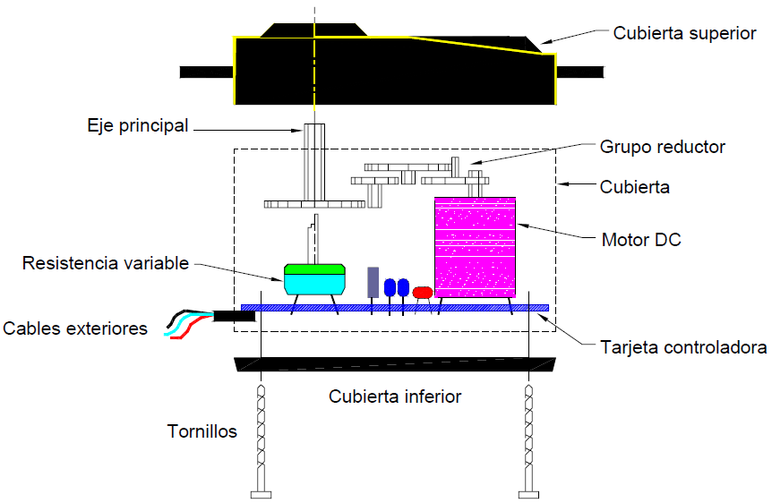

# ⋆₊˚⊹♡ Clase 08a - ... ♡⊹˚₊⋆

Martes 30 Septiembre 2025

***

## Observaciones

Esta clase fue más libre. Tanto así que me incomodo un poco. Por lo que tengo entendido la idea es ir trabajando con código e ir aprendiendo a como usar cada parte de nuestro proyecto (Sensor ultrasónico, servomotores, reproductor mp3, entre otros) a la par que se va realizando códigos para ello.
En mi caso en particular me centré en comprender el funcionamiento del [servomotor sg90](https://arduino.cl/producto/micro-servo-motor-sg90-9g/?srsltid=AfmBOopUK1FSSvEOeee794pcjIBccD8B2MQF36GlEjuMTAzqI4rHkSnN).

***

## Aprendiendo más sobre el "Servomotor S90"

Los servos son actuadores de tipo motor que permiten controlar el posicionamiento físico de manera precisa al moverse según las indicaciones.
Las partes de las que se componen suelen poseer una unidad de control que cuenta con un circuito integrado (controlador), un motor de corriente continua, engranajes (plásticos o metálicos), un potenciómetro además de contener piezas que ayudan a transmitir el movimiento (servo horns o cuernos).
El controlador se encarga de comparar y ajustar la posición del motor a la indicada, mientras que el potenciómetro funciona como un sensor de retroalimentación que informa la posición actual.
Para poder controlar este tipo de motor es necesario el enviarle una serie de pulsos eléctricos (descargas de alto voltaje de pulso rápido y corta duración), cuya longitud determina la posición del servomotor. No existe un estándar para poder relacionar de forma exacta entre los pulsos y la posición del motor.

Toda esta teoría sobre los servos fue adquirida gracias a [MCI Electronics](https://cursos.mcielectronics.cl/2023/06/28/como-utilizar-un-servo-motor-con-arduino).

-> Recuperado de: https://naylampmechatronics.com/blog/33_tutorial-uso-de-servomotores-con-arduino.html

Puesto que soy de ir a la práctica y luego al estudio es que estuve averiguando a través de videos de youtube para saber la implementación del código. Estuve viendo varios tutoriales explicativos, de los cuales pude identificar que algunos utilizaban los pines análogos y otros los pines digitales (de los cuales sólo 1 utilizaban los pwm).

https://github.com/ManlyMorgan/Animatronic-Eye/blob/main/03_calibration/calibration/calibration.ino

https://www.instructables.com/Animatronic-Eyes-Double-and-Single-Fully-3D-Printe/

***

### Posdata

Hoy estoy cansadita, muchos días quedándome hasta tarde en la u por gusto.

Estoy intentando esforzarme lo más que puedo... me da miedo que mi mente no lo soporte.
Se que nadie me fuerza. Mis ansias de ser más.

***

°˖✧◝(⁰ ^ ⁰)◜✧˖°
