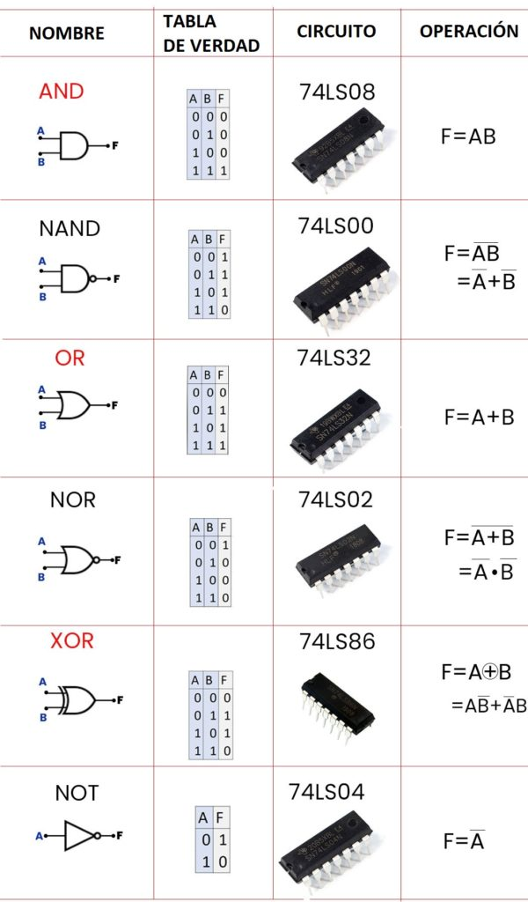

# sesion-03a

## Condicionales

If (boolean condición)  
(consequent)  
Else (alternative)  
End if  

"=" se usa para asignar un valor  
"==" comparar (¿Son lo mismo?)  
"!" lo contrario  
"++" = decir x = x + x  
print(ln) = imprime y hace enter para la próxima vez que imprima  
"%" Módulo, para saber el resto (7%2 = 1)  

<https://docs.arduino.cc/language-reference/>

## Examples

```cpp
if (itIsRaining == true) {
  makeSopaipillas();
}
_______________________________
// Se puede escribir una condición dentro de otra.
if (see == false) {
  useGlasses();
}
if (dirty == true) {
  cleanGlasses();
}
else {
  continuarConMiVida();
}
_______________________________
// Más de una pregunta
if (edad >= 18 AND edad <= 80) {
  permisoConducir();
}

if (edad >= 18 AND !(edad == 81)) {
  permisoConducir();
}

if (december AND donFrancisco == true AND !godZilla AND !elecciones) {
  teleton();
}
else {
  normalTransmision();
}
```
digitalWrite(LED_BUILTIN, prender);
Mayúscula = variable
Minúscula = constante

millis() (positivos (+0))

unsigned long

Operadores lógicos

Conmutativas, el orden no cambia el resultado

Compuertas

AND &

Mutuamente dependiente
A B | out
0 0 | 0
0 1 | 0
1 0 | 0
1 1 | 1

OR ||

Si alguna de las entradas es sí, la respuesta es sí.
Independiente
A B | out
0 0 | 0
0 1 | 1
1 0 | 1
1 1 | 1

NOT

Tenemos una variable y queremos detectar la ausencia de esta
A | out
0 | 1
1 | 0

Investigar
NAND
NOR
XOR

### Iterar

 // cuantas veces itero (variable i)
 int veces;

 // se itera con for
 // se pone entre p() 3 cosas
 // 1 partida
 // 2 termino
 // 3 actualización
 // y entre {} lo que quiero iterar
 // for (parto; termino; que hago cada paso)

```cpp
 for (int i = 0; i<veces; i = i + 1)

 {
 hazEsto();
 }

 Example:
 for (int j = 0; j<alto; j = j +1)
 dibujarPixel(i,j);
 }
```

## Encargo

### NAND, NOR y XOR

Una compuerta lógica es un dispositivo digital que realiza operaciones binarias con uno o dos estados lógicos (0,1) en la entrada y obteniendo resultados booleanos (0,1) en la salida del sistema. Se pueden combinar entre si para obtener nuevas funciones.

Las compuertas básicas son tres AND, OR y NOT, y sus compuertas complementarias son NAND, NOR. También existe una compuerta suplementaria XOR y su compuerta complementaria XNOR.
Cada compuerta está asociada a un símbolo, una tabla de verdad y una operación booleana; que expresa el estado de su salida para cada combinación posible de las entradas.



Dependiendo los resultados que la operación nos arroje se pueden clasificar los resultados en:

Producto de Sumas (maxitérminos): Expresión booleana que reúne las variables de entrada que a su salida tengan un cero lógico.
Suma de Productos (minitérminos): Expresión booleana que reúne las variables de entrada que a su salida tengan un uno lógico.


Fuente: <https://blog.uelectronics.com/electronica/circuitos-integrados-compuertas-logicas-and-or-nand-xor-y-not/>
