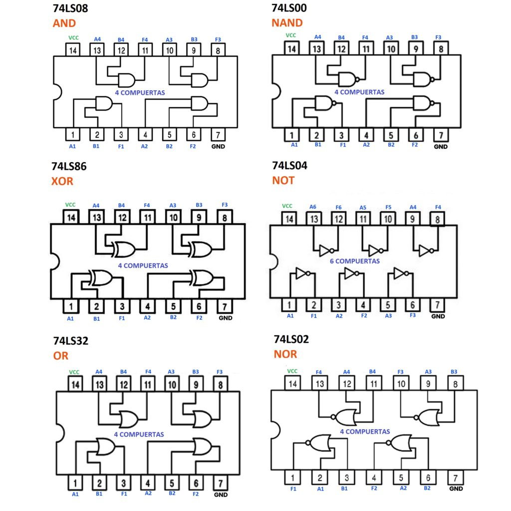

# sesion-03a

## Condicionales

+ If (boolean condición)  
+ (consequent)  
+ Else (alternative)  
+ End if  

- **"="** se usa para asignar un valor  
- **"=="** comparar (¿Son lo mismo?)  
- **"!"** lo contrario  
- **"++"** = decir x = x + x  
- **print(ln)** = imprime y hace enter para la próxima vez que imprima  
- **"%"** Módulo, para saber el resto (7%2 = 1)  

<https://docs.arduino.cc/language-reference/>

## Examples

```cpp
if (itIsRaining == true) {
  makeSopaipillas();
}
_______________________________
// Se puede escribir una condición dentro de otra.
if (see == false) {
  useGlasses();
}
if (dirty == true) {
  cleanGlasses();
}
else {
  continuarConMiVida();
}
_______________________________
// Más de una pregunta
if (edad >= 18 AND edad <= 80) {
  permisoConducir();
}

if (edad >= 18 AND !(edad == 81)) {
  permisoConducir();
}

if (december AND donFrancisco == true AND !godZilla AND !elecciones) {
  teleton();
}
else {
  normalTransmision();
}
```
+ digitalWrite(LED_BUILTIN, prender);
+ Mayúscula = variable
+ Minúscula = constante

+ millis() (positivos (+0))

- unsigned long
- Operadores lógicos
- Conmutativas, el orden no cambia el resultado
  
**Compuertas**

+ **AND "&"**

- Mutuamente dependiente
A B | out
0 0 | 0
0 1 | 0
1 0 | 0
1 1 | 1

+ **OR "||"**

- Si alguna de las entradas es sí, la respuesta es sí.
- Independiente
A B | out
0 0 | 0
0 1 | 1
1 0 | 1
1 1 | 1

+ **NOT "!"**

- Tenemos una variable y queremos detectar la ausencia de esta
A | out
0 | 1
1 | 0

**Investigar**
- NAND
- NOR
- XOR

### Iterar

-  // cuantas veces itero (variable i)
 int veces;

-  // se itera con for
-  // se pone entre p() 3 cosas
 - // 1 partida
 - // 2 termino
 - // 3 actualización
 - // y entre {} lo que quiero iterar
 - // for (parto; termino; que hago cada paso)

```cpp
 for (int i = 0; i<veces; i = i + 1)

 {
 hazEsto();
 }

 Example:
 for (int j = 0; j<alto; j = j +1)
 dibujarPixel(i,j);
 }
```

```cpp
//variable booleana
//la inicializamos falsa
bool prender = false;

// despues de 3 sec.
// led se apaga

void setup() {
  // put your setup code here, to run once:
 
 // abrir puerto serial
 Seria.begin(9600);


 //digitalWrite(LED_BUILTON, prender);
 //delay(3000);
 //prender = true;
 //digitalWrite(LED_BUILTON, prender);
 
// hacer que la patita sea output, salida
// usamos la constante incluida en Arduino
//BUILTON_LED, porque sabe donde esta el led interno
 pinMode (LED_BUILTIN, OUTPUT);
}

void loop() {
  // put your main code here, to run repeatedly:

 //solamente este prendido los primeros 3 seg
 
 unsigned long segundos = millis() / 1000;
 
 if (segundos < 3) {
  prendido = true;
 } else if (segundos > 10){
    prendido = true;
  } else {
     prendido = false;
 }

 digitalWrite(LED_BUILTIN, prendido);

 Serial.println(millis() / 1000);
}
 //delay(3000);
 //prender = true;
 //digitalWrite(LED_BUILTON, prender);

}
```
```cpp
//quiero poder decirle a arduino en el monitor serial
//cada cuanto tiempo parpadee el led
bool estadoLed = 0;
int numero1 = 6;

void setup() {
  pinMode(LED_BUILTIN, OUTPUT);
  Serial.begin(9600)
}

void loop() {
  unigned long seconds = millis() / 1000;

  int numero2 = 2;
  int division;
  int resto;

  //ya que DIVISION es un int 
  //elimina (trunca) todo lo que esta despues de la coma
  division = numero1 / numero2;
  resto = numero1 % numero2;
  //resultado será "2" no "2,5"
  Serial.print("numero1 es ");
  Serial.print(numero1);
  Serial.print(" y el modulo al dividir por 2 es ");
  Serial.println(resto);

  //incrementar numero1 de 1 en 1
  numero1++;
  if (seconds%2 == 0){ //si es un sec par
    estadoLed = false;
  } else {
    estadoLed = true;  //si es un segundo impar
  }
    digitalWrite(LED_BUILTIN,estadoLed);
  }
```
```cpp

int numEstudiantes = 29;

void setup() {
  // put your setup code here, to run once:

Serial.begin(9600);

for (int i = 0; i < numEstudiantes; i++) {
  Serial.print("estudiante:");
  Serial.print(" ");

  if (i < 10) {
    Serial.print(" ");
  }

  if (i != 13) {
  Serial.print(i);
  }

  Serial.print("\n");
  delay(500);
}

void loop() {
  // put your main code here, to run repeatedly:

}
```


## Encargo

### NAND, NOR y XOR

- Una compuerta lógica es un dispositivo digital que realiza operaciones binarias con uno o dos estados lógicos (0,1) en la entrada y obteniendo resultados booleanos (0,1) en la salida del sistema. Se pueden combinar entre si para obtener nuevas funciones.

- Las compuertas básicas son tres AND, OR y NOT, y sus compuertas complementarias son NAND, NOR. También existe una compuerta suplementaria XOR y su compuerta complementaria XNOR.
Cada compuerta está asociada a un símbolo, una tabla de verdad y una operación booleana; que expresa el estado de su salida para cada combinación posible de las entradas.


+ Dependiendo los resultados que la operación nos arroje se pueden clasificar los resultados en:

+ Producto de Sumas (maxitérminos): Expresión booleana que reúne las variables de entrada que a su salida tengan un cero lógico.
+ Suma de Productos (minitérminos): Expresión booleana que reúne las variables de entrada que a su salida tengan un uno lógico.


- Fuente: <https://blog.uelectronics.com/electronica/circuitos-integrados-compuertas-logicas-and-or-nand-xor-y-not/>
