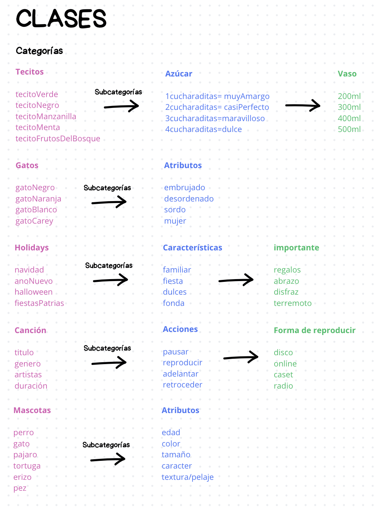

# sesion-05b 
## 05.09.24

"Buscar nuestro rango en todo" <3

+ #include "<>" Búscalo en el computador donde sea que exista.
+ Archivo ".h" Se especifican las posibilidades que hay. ¿Qué es lo que existe?/Prometo
+ Archivo ".cpp" donde nos encargamos que las cosas ocurran. ¿Cómo se hace?/Me hago cargo

+ "_arm_" Computadores chiquitos (celulares, etc)
+ "GFX" Biblioteca para hacer Gráficas. Clase abstracta y genérica.

**C++ Tutorial**
<https://www.w3schools.com/cpp/default.asp>

+ C++ es un lenguaje de programación popular.

+ C++ se utiliza para crear programas de computadora y es uno de los lenguajes más utilizados en el desarrollo de juegos.

+ C++ se desarrolló como una extensión de C y ambos lenguajes tienen casi la misma sintaxis.

### En clases

Se usan cuando queremos crear estructuras de datos que no nos caben en los bloques fundamentales que vienen en un lenguaje de programación.
Si quiero tener la complejidad de darle mas detalles, info y funciones a mis carácteres.

+ Atributos son variables
+ Métodos son funciones
+ "Jig" Hrramienta hecha por mi que me ayuda a hacer cosas

  ## Planificación
  1 clase de texto en general
  1 clase que herede de texto, que sea poema
  
  + todos los poemas son textos pero no todos los textos son poemas
    
  1 clase que contenga un pixel  art en magen
  1 clase que herede de pixel art, que sea una colección de imágenes relacionadas, un array.

  + EL _Constructor_ y el _Destructor_ se llama exactamente igual que la clase.
    
 
  + Esqueleto para Archivo.h
    
    ```cpp
    #ifndef TEXTO_H
    #define TEXTO_H
    
    class Texto {
    
    //Constructor
    Texto();

    //Destructor
    ~Texto();
    
    };
    #endif
    ```
  + Esqueleto para otro Archivo.h
  
    ```cpp
    #ifndef POEMAPARRA_H
    #define POEMAPARRA_H

    #include "texto.h"
    
    class PoemaParra : public Poema
    {
    public:
    //Constructor
    PoemaParra();

    //Destructor
    ~PoemaParra();

    };
    #endif
    ```
    + TODOS LOS TEXTOS TIENEN UN _TIPO_ - topografía
    + Pueden tener una _dirección_ - bool
    + Puede usar _tinta_ - tinta
    + Tendrán una autoría - autora
   
    + En el contexto de cpp se usa solo _true or false_
      
+ Planificar Clases!
  Conjunto
  subconjunto
  que valores tiene
  etc.
    
### Ejercicio en clases "dibujar y escribir clases y subclases"



## Encargo
+ Escuchar primer disco de banda primus
+ ver alguna charla de Mitsh Resnick: Comentarios de él.

+ Según Wikipedia **Suck on This** es un álbum en vivo de la banda de rock estadounidense Primus, publicado en 1989.​ Este álbum, junto al disco debut de la banda Jane's Addiction, son reconocidos como pioneros del metal alternativo y como fuertes influencias para el nacimiento del nu metal.​
+ jajaj la verdad pensé que lo odiaría porque no me gusta en general éste género de música, la verdad es que no lo odié tanto, era bastante entretenido, algunas me gustaronmas que otras, me gusta lo alternativos que son.

+ **¿Quién es Mitch Resnick?**
+ Mitchel Resnick, profesor en el MIT Media Lab y líder del grupo Lifelong Kindergarten, desarrolla tecnologías y actividades para fomentar el aprendizaje creativo, especialmente en niños. Su grupo creó el software Scratch y colaboró con LEGO en Mindstorms. También cofundó Computer Clubhouse, una red internacional de centros para jóvenes de bajos recursos.
+ <https://www.media.mit.edu/people/mres/overview/>

Formado en física en Princeton y con maestría y doctorado en informática en el MIT, también trabajó como periodista científico. Es autor de varios libros, entre ellos Lifelong Kindergarten (premio PROSE 2018). Ha recibido múltiples reconocimientos, como el Premio McGraw en Educación (2011), el Premio LEGO (2021) y el Premio SIGCSE (2025) por su contribución a la educación en informática.


+ Me vi la charla **"Let's teach kids to code"** <https://www.ted.com/talks/mitch_resnick_let_s_teach_kids_to_code?subtitle=en> donde Mitchel presenta su software "scratch" <https://scratch.mit.edu/>, que es una página para que las personas desde los 8 años comiencen a programar de una manera en verdad súper amistosa. Él hace referencia continuamente a la similitud entre leer y escribir con programar, cómo aprender estas cosas te habre las puertas a aprender muchas más, y una frase que me gustó mucho fué "So when u learn through coding, and coding to learn, you are learning it in a meaningful context, and that is the best way of learning things", esto desde mi perspectiva hace referencia a que si aprendes cosas sabiendo para qué y como las usarás, aprendes mejor porque aprendes con ganas! Me encantó la página para codificar, que entretenido hubiera sido aprender los primeros acercamientos a este mundo desde ahí, creo que su charla fué súper motivante hasta para los que no les guta codificar.


  
