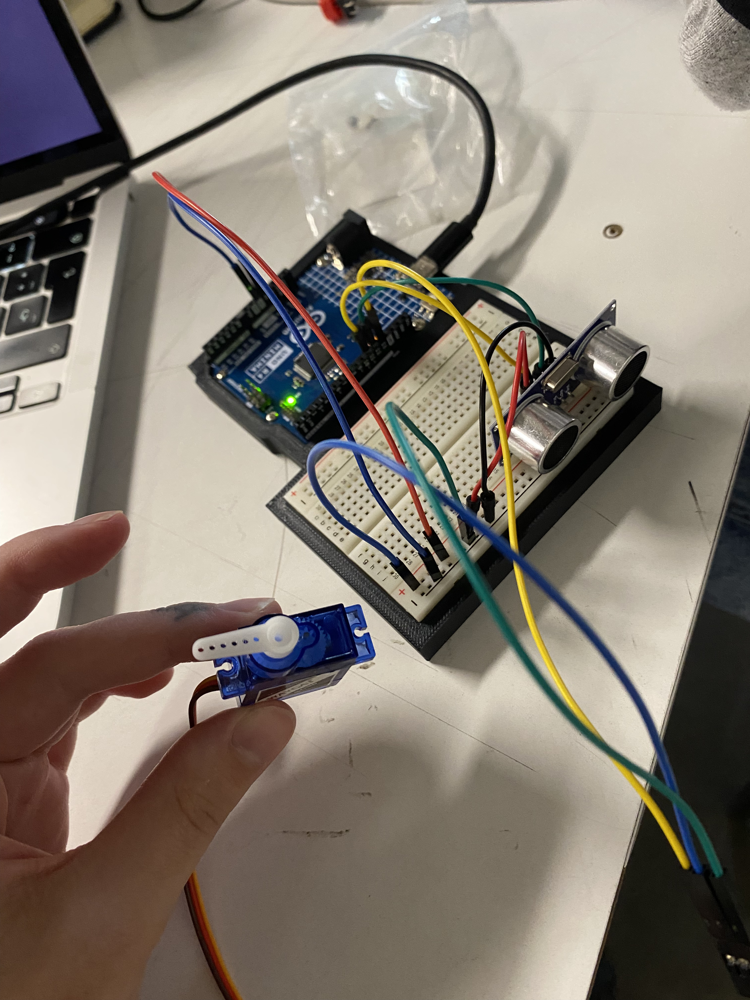
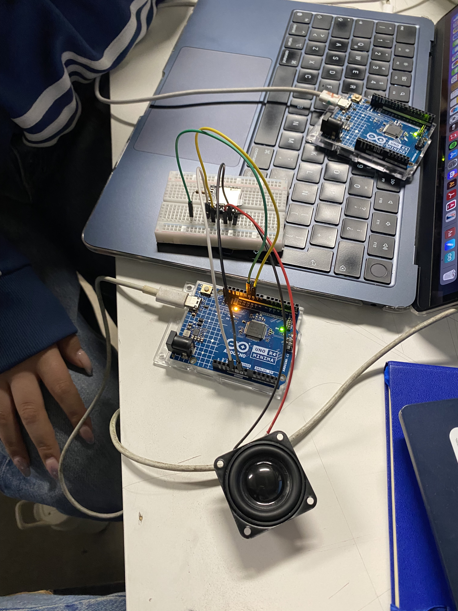

# sesion-08a 30.09.25

## Proyecto 02
+ **Errores y problemas en el código:** El reproductor mp3 no nos funcionaba, no sonaba el altavoz, pensamos que un problema podría ser la tarjeta SD.
+ La formateamos con las instrucciones que nos dió gemini:

"Para formatear una tarjeta SD para Arduino Uno, conéctala a tu computadora e inicia la herramienta de formateo de tu sistema operativo. En la configuración de formato, elige FAT32 como sistema de archivos, o FAT para tarjetas de menos de 2GB, y luego inicia el formateo. Para obtener los mejores resultados, considera usar la herramienta oficial SD Formatter de la SD Association."

Conecciones y registro:

## Proyecto_02 - Máquina que da datos random
¿Qué necesitamos?: Sensor ultrasónico, Servo Motor, Motor DC, Reproductor mp3 y Altavoz
Entrada: Mediante el sensor ultrsónico la máquina detecta presencia y detalles de distancia de esta presencia (idealmente humana:P)
Salida: Al detectar la distancia de la presencia la máquina reacciona de diferentes maneras:
1. Cuando detecte una presencia esta comenzará a temblar (de nervios) mediante el motor DC el tembleque aumentará entre más cerca estés. 😋
2. El sensor detectará presencia en 3 instancias: 2 - 10cm, 40 - 60cm, 80 - 100cm
3. En cada parámetro la máquina reproduce un audio de voz distinto mediante la microSD en el reproductor MP3 y el altavoz.
4. Los parametros son:
80 - 100cm = Te "grita" que vengas diciendo: "HOLA HUMANO, VEEEN!"
40 - 60cm = Te grita de nuevo pidiendo que te acerque más, diciendo: "HOOLAA, MÁS CERCA!"
2 - 10cm = Levanta un "dedo" usando el servo motor, este se moverá de los 0 grados a los 180 mientras estés a esa distancia. Al mismo tiempo te dirá algún dato interesante como "El maní es una legumbre, no un fruto seco.”

Se probó el código subido en la sesión anterior y esta, con el ultrasónico y el servo motor.
Funcionó!

