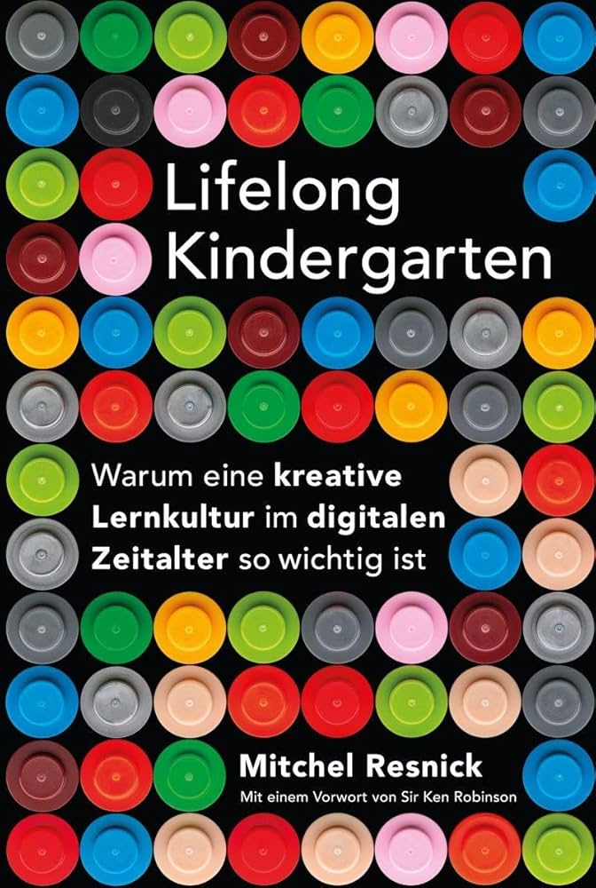
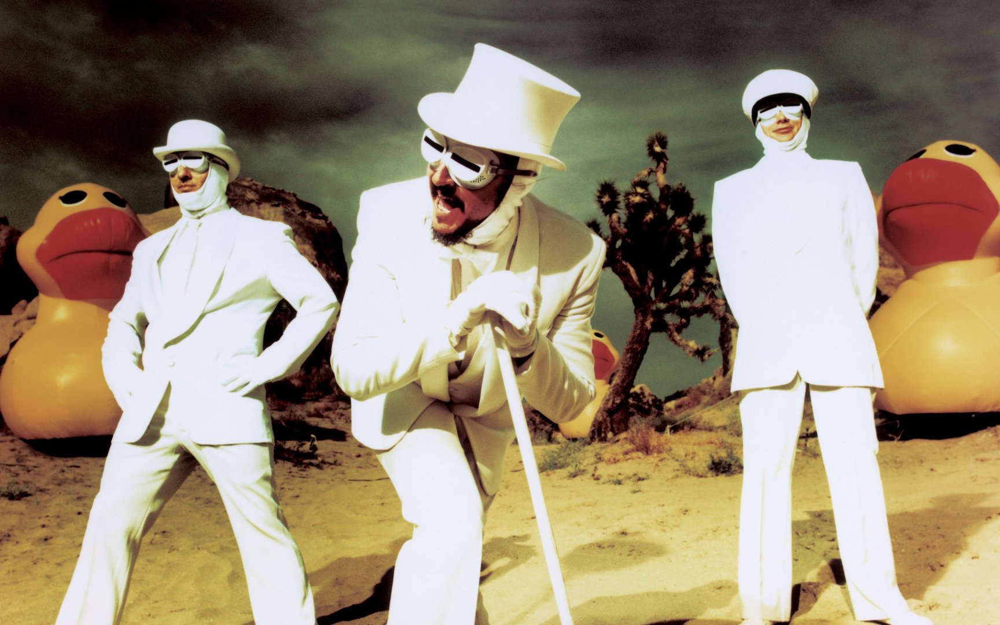
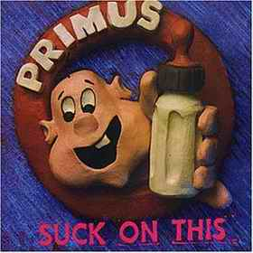
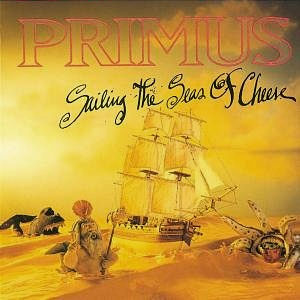

# sesion-05b
05-09-25
## Apuntes 
Teloneo

Programar es el estilo de vida que lleva un código.

- <>: Busca el archivo para colocarlo en el código.
- .h: Posibilidades de cosas que puede hacer la pantallita, los h son los encabezados; me entero de lo que existen. Prometo.
- archivo cpp: Se llevan a cabo esas posibilidades; me entero de lo que hace esto. Me hago cargo. Responsabilidad afectiva.
- Parte central del código es: Comentar antes de hacer el código, para saber que es lo que hace el código en si.
- Se puede incluir bibliotecas dentro de bibliotecas.
- #ifndef: Significa "si no está definido". Evita la inclusión múltiple de archivos, y verifica si el identificador que sigue no está definido.
- #define: Para que funcione, en un algún lugar se debe definir el identificador. Se usa para marcarlo como existente.
- #endif: Cierra el bloque condicional.
- array: Es una colección o lista de cosas.

---

https://www.w3schools.com/ --> Sitio web educacional gratuito para aprender sobre código


Adafruit_GFX: es la bilbioteca de las gráficas 

AdafruitSSD1306: es la biblioteca para hacer funcionar la pantalla OLED


```cpp
Adafruitssd1306 : public Adafruit_GFX
```

Es como decir

```cpp
class Completo_italiano : public Completo {}
```
Es decir, Completo italiano es un tipo de completo

 : public (espacio/doble punto/espacio) 
 

 es como decir Completo italiano es un tipo de completo
class Completo_italiano : public Completo {}

**¿Qué son las clases/class?**

- Las clases se usan cuando queremos crear estructuras de datos; cuando no nos cabe en el lenguaje de programación.
- Define que es, que tiene y que puede hacer un objeto.

**¿Qué es un objeto?**
- Es el ejemplar o tipo de un objeto.

Ejemplos:

Clase perro -> dice que todos los perros pueden ladrar 

Objetos -> firulai, max -> son los distintos perros que hay 

Código:

```cpp
class perro {
 public: void ladrar ()}
  Serial.println ("guau");
}
};

perro firulais; //objeto
perro max; // otro objeto
  void setup(){
    Serial.begin (9600);
    firulais.ladrar(); // "guau!"
     max.ladrar(); //"guau!"
}
```
### Ejercicio en clases
Hacer varios ejemplos de clases.

```cpp
1.Archivo personaje.h

//Definir clase personaje
#ifnef PERSONAJE_H
#define PERSONA_H
#include <Arduino.h>

class Personaje{
 public:
   String nombre;
   int energia;

Personje (String n, int e);
void hablar (String frase);
void gastarEnergia (int cantidad);

};
#endif
```

```cpp
2.Archivo Finn.h

#ifndef FINN_H
#define FINN_H
#include "Personaje.h"

 class Finn : public Personaje{
   public:
    Finn (); // constructor
    void atacar();
};
#endif
```
```cpp
3.Archivo jake.h

#ifnedf JAKE_H
#define JAKE_H
#iclude "Personaje.h"

class JAKE : public Personaje {
 public:
  JAKE(); //constructor
  void estirarse (int metros);
};
#endif
```
```cpp
3.Archivo personajes_horaDeAventura.h

#include "Personajes.h"

 class HoraDeAventura{
Personajes [Finn,Jake,Marceline,PrincessBubblegum]

  agregarPersonaje (Personaje agregado);
  quitarPersonajes (Personaje quitado);
};

#include "cualidad.h"

 class Personaje{
 Personaje (String.nombre);
String nombre = "marceline";
Cualidad [] cualidad;
 agregar Cualidad (Cualidad agregada);
};

class Cualidad public Cualidad{
 TipoCualidad = Reina vampiro;
};
#endif

```

### investigar Mitchel Resnick


Es un destacado investigador estadounidense en el campo de la educación y la informática, especialmente enfocado en el aprendizaje creativo.

- Es el LEGO Papert Professor of Learning Research y dirige el grupo Lifelong Kindergarten en el MIT Media Lab.
- Su grupo desarrolló Scratch, un entorno de programación visual y comunidad en línea para niños que permite crear animaciones, historias interactivas y juegos.
- También participó en la creación de las "programmable bricks", que más tarde se convirtieron en el famoso kit educativo LEGO Mindstorms, así como el software StarLogo.
- Cofundó Computer Clubhouse, una red de centros de aprendizaje después de la escuela destinados a jóvenes de comunidades con menos recursos.
- Fue cofundador y co-investigador principal del Center for Civic Media en el MIT.
- Participó también en el proyecto One Laptop Per Child (OLPC) con el diseño del portátil económico XO.

Además, promueve el aprendizaje constructivista: la idea de que los estudiantes aprenden mejor cuando crean, comparten, experimentan y reciben retroalimentación en un entorno colaborativo y creativo. Propone que los niños no sean simples consumidores de tecnología, sino creadores activos, desarrollando habilidades creativas, pensamiento sistemático y una voz propia. De aquí nace la temática que aborda en su libro Lifelong Kindergarten: Cultivating Creativity through Projects, Passion, Peers, and Play (2017).



trata sobre cómo podemos fomentar la creatividad y el aprendizaje significativo en todas las etapas de la vida, no solo en la infancia.

Resnick sostiene que la educación debería parecerse más a un jardín infantil (“kindergarten”) y menos a un sistema rígido de memorización y exámenes. En el jardín infantil, los niños aprenden explorando, construyendo, jugando y compartiendo: un enfoque que él cree que debería acompañar a las personas toda la vida.

### escuchar primero albums de Primus
Primus banda de rock experimental caracterizada por su estilo único que fusiona funk, metal, rock progresivo y humor surrealista.



Su música desafía categorías, mezclando funk, metal alternativo, rock progresivo y elementos experimentales. Aunque suelen etiquetarlos como "funk metal", ellos rechazan esa clasificación. Letras excéntricas, animaciones en stop-motion y un CD muy personalizable son parte de su identidad cultural.

Primeros álbumes de primus:

- Suck on This (1989): Destaca por romper con el rol tradicional del bajo, convirtiendolo el protagonista. Este albúm se caracterizó por tener un sonido crudo, cercano al punk, y un humor surrealista en las letras.



- Frizzle Fry (1990): Destaca por sus letras extrañas y personajes únicos y caracteristicos de la banda. Además de incorporar una técnica en el bajo con slap y tapping, lo que fue una gran innovación.


- Sailing the Seas of Cheese (1991): Este es el disco que los lleva a la fama y destaca por tener letras sátiricas y surrealistas.
  

  
- Pork Soda (1993): Se podría considerar como el álbum más oscuro de su carrera temprana, con un sonido más denso y experimental. Destaca por tener un sonido mas sombrio y "extraño", además mezclan el humor negro con la crítica social, y agregan una gran exploración rítmica y una estética o atmosfera más oscura.


