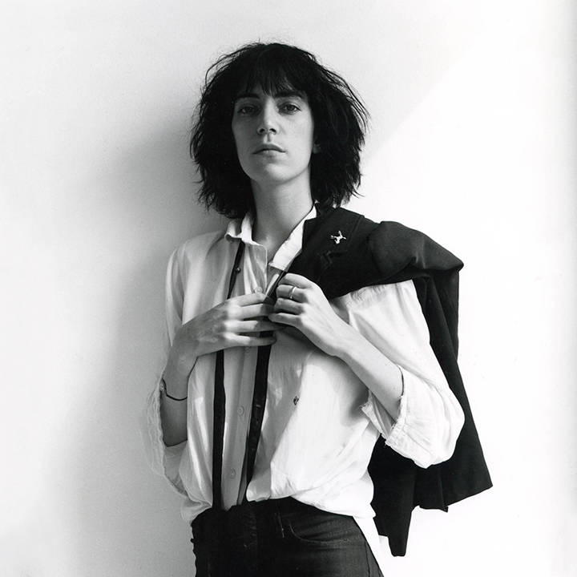

# sesion-07a
23/09/25

Teloneo

Actualización sobre la vida de Matías. 

Toda la teoría del universo. Es una plataforma que organiza festivales, talleres y encuentros para fomentar el intercambio de conocimientos en las áreas híbridas del arte y la tecnología en Latinoamérica. 

- La segunda nota es antes de las solemnes, el 21 de Octubre.
- 17 de Octubre entrega proyecto 2.
- Semana 9: trabajo en clases.

## Hoy: 
- Primeros acercamientos de proyecto desde el planteamiento.
- Creación de grupos por intereses.
- Lista de materiales.
  
---

### Encargo viernes:

traer por grupo, 10 proyectos de internet que se puedan probar y usar como inspiración, y herramientas de estudio para documentar.

Material para hacer tu propio NFC:

https://www.amazon.com/Beginning-NFC-Communication-Arduino-PhoneGap/dp/1449372066

https://itp.nyu.edu/physcomp/

leer: Eramos unos niños de Patti Smith
  


Robert Mapplethorpe for the gays

Patti Smith for the lesbianitas (yo)
  


Cierre telón 

---

## Apuntes
Módulo RTC --> Reloj en tiempo real

Actuadores:

- Motores
- Mini motor paso a paso driver
- Motor DC
- Servomotor
- Solenoides
- Sincrono
  
Luces:

- Tiras LED
- Diodo Led RGB
- Neo Pixel (animaciones), se puede controlar cada led
- Parlantes


## Segunda parte
Juntarse en grupos y trabajar en el proyecto. Especificar inputs y outputs, agregar links y cotizaciones de los sensores que nos interesan.

Buscar (2 de cada uno) referentes de:
  
Código:

para el moviemiento de los servos

```cpp
- #include <Servo.h>

const int servo1 = 2;
const int servo2 = 3;
const int servo3 = 5;
const int servo4 = 6;
const int servo5 = 9;

Servo myservo1;
Servo myservo2;
Servo myservo3;
Servo myservo4;
Servo myservo5;

void setup() {
  myservo1.attach(servo1);
  myservo2.attach(servo2);
  myservo3.attach(servo3);
  myservo4.attach(servo4);
  myservo5.attach(servo5);

  myservo1.write(75);  //right 60 - center 75 - left 90
  myservo2.write(95);  //down 70 - center 95 - up 110
  myservo3.write(50);  //close 50 - open 80
  myservo4.write(80);  //down 110 - center 80 - up 60
  myservo5.write(90);  //right 70 - center 90 - left 110
  delay(2000);
}

void loop() {
  // MOVE 1
  myservo3.write(80);  //close 50 - open 80
  delay(2000);
  myservo1.write(90);   //right 60 - center 75 - left 90
  myservo5.write(110);  //right 70 - center 90 - left 110
  delay(1000);

  // MOVE 2
  myservo1.write(60);  //right 60 - center 75 - left 90
  myservo5.write(70);  //right 70 - center 90 - left 110
  delay(1000);

  // MOVE 3
  myservo1.write(90);   //right 60 - center 75 - left 90
  myservo5.write(110);  //right 70 - center 90 - left 110
  delay(1000);

  // MOVE 4
  myservo1.write(60);  //right 60 - center 75 - left 90
  myservo5.write(70);  //right 70 - center 90 - left 110
  delay(1000);

  // MOVE 5
  myservo1.write(75);  //right 60 - center 75 - left 90
  myservo5.write(90);  //right 70 - center 90 - left 110
  delay(1000);

  // MOVE 6
  myservo2.write(70);  //down 70 - center 95 - up 110
  myservo4.write(110);  //down 110 - center 80 - up 60
  delay(1000);

  // MOVE 7
  myservo2.write(110);  //down 70 - center 95 - up 110
  myservo4.write(60);  //down 110 - center 80 - up 60
  delay(1000);

  // MOVE 8
  myservo2.write(95);  //down 70 - center 95 - up 110
  myservo4.write(80);  //down 110 - center 80 - up 60
  delay(1000);

  // MOVE 9
  myservo3.write(50);  //close 50 - open 80
  delay(2000);
}
```

```cpp
  // Eyelids close
  myservo3.write(50);
  delay(pauseTime);
}

void loop() {
  int pirSensor = digitalRead(SENSORPIN);
  
  // If the PIR sensor is active and no action has been taken
  if (pirSensor == HIGH && pirEnabled) {
    pirEnabled = false;  // PIR sensor deactivated
    openEyes();          // Eyes open
    playSound();         // Audio file is played
    moveServos();        // Servo movements are started
    pirEnabled = true;   // PIR sensor reactivated
  }

  delay(50);  // A very short delay, for sensor stability
}
```

Materialidad:

Impresión 3d para la estructura completa, entiendase esto como, los parpados, los globos oculares, y la base giratoria.

- https://www.instructables.com/Simplified-3D-Printed-Animatronic-Dual-Eye-Mechani/
- https://www.instructables.com/How-to-Make-Ultra-Realistic-Eyes-Using-3D-Printing/?linkId=76371911
  
Documentación:

- https://cl.pinterest.com/pin/325103666870948995/feedback/?invite_code=0b7e4d1c62174736a48ecd4087471047&sender_id=748512537976250155
- https://www.instructables.com/10-Animatronics-With-Arduino-Eyesight-Directed-by-/?utm_source=chatgpt.com

  
