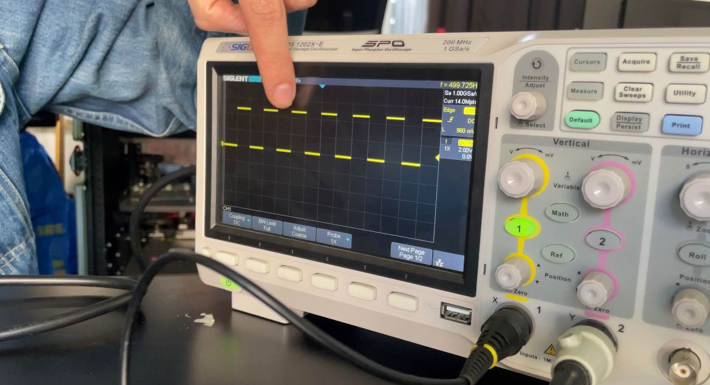
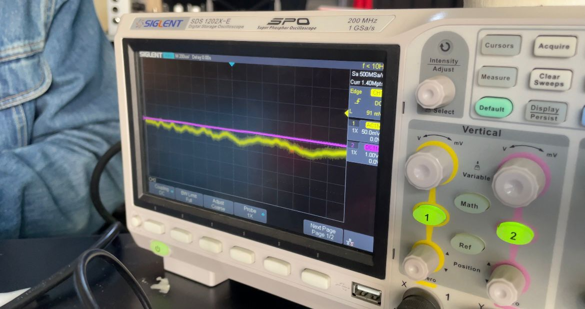

# sesion-09a
07/10/25

No vine a clases, me quedé dormida lo siento 

Según lo que me estuvieron contando mis compañeros de grupo del proyecto. Nuestros sensores, no funcionaron, debido a que los micrófonos no lograban detectar correctamente las variaciones de sonido, por lo que los resultados no fueron los esperados, y para hacer que funcionen necesitamos un tipo de software, por lo que se descartó el uso de micrófonos.  Como grupo estamos viendo por que sensor cambiar, estamos entre un sensor ultrasónico o dos LDR.

## Código de microfonos 
```cpp
// Calibración y mapeo de 2 micrófonos MAX4466 a rango 512..1023 
// Este código mide la amplitud relativa del sonido en dos micrófonos

#include <Arduino.h>

//  Pines de conexión 
const int micPin1 = A0;
const int micPin2 = A1;

// Parámetros de calibración
const int NUM_SAMPLES = 1000;
const int VIRTUAL_PEAK = 511;
const int ADC_MIN_OUT = 512;
const int ADC_MAX_OUT = 1023;

// Variables dinámicas (calculadas en calibración)
float mean1 = 512.0;
float mean2 = 512.0;
float scale1 = 1.0;
float scale2 = 1.0;

void setup() {
  Serial.begin(9600);
  while (!Serial) {}  // Espera conexión serial
  randomSeed(analogRead(0)); // semilla para empate aleatorio
  Serial.println("Calibracion y mapeo mic MAX4466 -> rango 512..1023");
  delay(300);
  
  // Calibración inicial
  calibrateOffsets();  // Ajusta offset (ruido en silencio)
  calibrateScales();   // Ajusta escala (ganancia relativa)
  Serial.println("Calibracion completada. Entradas en tiempo real a continuacion.");
}

void loop() {
  int peak1 = 0, peak2 = 0;
  
  // --- Ventana de lectura para medir amplitud ---
  // Se toman 50 lecturas rápidas para estimar el “peak” de sonido
  for (int i = 0; i < 50; i++) {
    int r1 = analogRead(micPin1);   // Lectura micrófono 1 (0-1023)
    int r2 = analogRead(micPin2);   // Lectura micrófono 2

   // Calcula diferencia respecto al valor medio (amplitud)
    int delta1 = abs(r1 - mean1);
    int delta2 = abs(r2 - mean2);

    // Guarda el peak máximo detectado
    if (delta1 > peak1) peak1 = delta1;
    if (delta2 > peak2) peak2 = delta2;

    delayMicroseconds(200);   // Pequeña pausa entre lecturas (~0.2 ms)
  }

  // Aplicar escalas y mapear al rango 512..1023
  int out1 = (int)round(ADC_MIN_OUT + peak1 * scale1);
  int out2 = (int)round(ADC_MIN_OUT + peak2 * scale2);

  // Limita los valores al rango permitido
  if (out1 < ADC_MIN_OUT) out1 = ADC_MIN_OUT;
  if (out1 > ADC_MAX_OUT) out1 = ADC_MAX_OUT;
  if (out2 < ADC_MIN_OUT) out2 = ADC_MIN_OUT;
  if (out2 > ADC_MAX_OUT) out2 = ADC_MAX_OUT;

  // Determinar ganador 
  // Se elige el micrófono con mayor amplitud
  int ganador = 0;
  if (out1 > out2) ganador = 1;
  else if (out2 > out1) ganador = 2;
  else ganador = random(1, 3); // Si hay empate, elige uno al azar (1 o 2)
  
  
  // Mostrar resultados en el monitor serial
  Serial.print("mic1:"); Serial.print(out1);
  Serial.print(" | mic2:"); Serial.print(out2);
  Serial.print(" -> Ganador: Mic"); Serial.println(ganador);

  delay(25);   // Pequeña pausa entre ciclos (~25 ms)
}

//  FUNCIONES DE CALIBRACIÓN 

// Calibración de offset 
// Mide los valores promedio en silencio para restar el ruido base.
void calibrateOffsets() {
  Serial.println("Midiendo offsets en silencio... mantén silencio ahora.");
  delay(2000);  // Tiempo para prepararse (2 segundos)
  
  
  long sum1 = 0, sum2 = 0;
  for (int i = 0; i < NUM_SAMPLES; i++) {
    sum1 += analogRead(micPin1);
    sum2 += analogRead(micPin2);
  }
  
  // Calcula el promedio (nivel DC)
  mean1 = (float)sum1 / NUM_SAMPLES;
  mean2 = (float)sum2 / NUM_SAMPLES;
  
  // Muestra los resultados
  Serial.print("Offset medido mic1: "); Serial.println(mean1, 3);
  Serial.print("Offset medido mic2: "); Serial.println(mean2, 3);
}

//  Calibración de escala 
// Ajusta la ganancia relativa según un tono constante
void calibrateScales() {
  Serial.println("Ahora reproduce un tono constante (p. ej. 1 kHz) al volumen que usaras.");
  Serial.println("Esperando 3 segundos...");
  delay(3000);   // Tiempo para preparar la fuente de sonido

  double sumsq1 = 0, sumsq2 = 0;
  
  // Calcula RMS (raíz cuadrática media) del sonido captado
  for (int i = 0; i < NUM_SAMPLES; i++) {
    int r1 = analogRead(micPin1);
    int r2 = analogRead(micPin2);
    float a1 = r1 - mean1;
    float a2 = r2 - mean2;
    sumsq1 += (double)a1 * a1;
    sumsq2 += (double)a2 * a2;
  }
  
  // RMS = intensidad media efectiva del sonido
  double rms1 = sqrt(sumsq1 / NUM_SAMPLES);
  double rms2 = sqrt(sumsq2 / NUM_SAMPLES);

// Evita divisiones por cero; ajusta escala para igualar amplitudes
  if (rms1 < 0.0001) scale1 = 1.0; else scale1 = (float)(VIRTUAL_PEAK / rms1);
  if (rms2 < 0.0001) scale2 = 1.0; else scale2 = (float)(VIRTUAL_PEAK / rms2);

  // Limita las escalas para evitar valores extremos
  const float MAX_SCALE = 10.0;
  if (scale1 > MAX_SCALE) scale1 = MAX_SCALE;
  if (scale2 > MAX_SCALE) scale2 = MAX_SCALE;

  // Muestra resultados de la calibración
  Serial.print("Scale mic1: "); Serial.println(scale1, 6);
  Serial.print("Scale mic2: "); Serial.println(scale2, 6);
  Serial.println("Si saturan (valores 1023 frecuentes), reduce VIRTUAL_PEAK o baja ganancia hardware.");
}
```

### Microclase de Misaa


Onda cuadrada, súper definida.


Prueba con uno de los micrófonos.



En esta medición se ve la línea amarilla con un poco de ruido (uno de los micrófonos) y la línea rosada más estable (el otro micrófono). Ya que un micrófono estaba captando más sonido que el otro.
