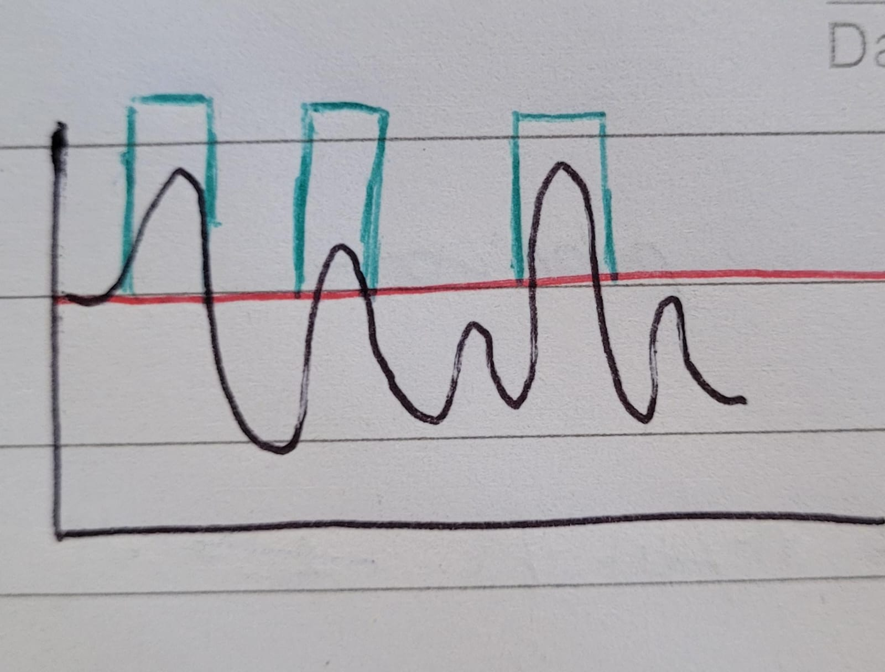

# sesion-09a
## Trabajo en clase 

Trabajo con [@Hiinalia](https://github.com/disenoUDP/dis8645-2025-02-procesos/tree/main/19-Hiinalia)
para ver el funcionamiento del sensor de sonido, en la web se encontro que todos utilizan un led con el sensor de sonido , lo que facilita al tener un recurso visual de como se detecta el sonido. 

Misa nos ayudo explicando de como el sonido es una onda que ocila y si pasa el lumbrar que tiene el sensor de sonido de detecta como 1 esta es una imagen de como se explico 

El sensor que teniamos se trato de ajustar el lumbrar de sonido para que detecte solo un ruido fuerte cercano como los apausos que queremos trabajar pero tene un marjer para ajustar muy grande para lo que necesitabamos , asi que Misa nos cambio el sensor que contaba con mas margenes para ajustar el lumbral del sensor. 
Nos dimos cuenta que al ajustar el sensor que un solo aplauso o ruido fuerte es algo muy comun que pase , por lo que  se dicidio ingrementar el numero a dos

Se encontro un codigo que es para prender una lampara con aplausos se utilizara para modificar a lo que queremos como grupo
### codigos trabajado

Este es un ejemplo que se encontro , se utiliza como base para lo que buscamos generar 
```cpp
// luz led
#define signalToRelayPin 13
// sensor de sonido
#define sensorPin 2

int lastSoundValue;
int soundValue;
long lastNoiseTime = 0;
long currentNoiseTime = 0;
long lastLightChange = 0;
int relayStatus = HIGH;

void setup() {

  //se enciende 
  pinMode(sensorPin, INPUT);
  pinMode(signalToRelayPin, OUTPUT);
}

void loop() {
  soundValue = digitalRead(sensorPin);
  currentNoiseTime = millis();

  if (soundValue == 1) { // if there is currently a noise

    if (
      (currentNoiseTime > lastNoiseTime + 200) && // to debounce a sound occurring in more than a loop cycle as a single noise
      (lastSoundValue == 0) &&  // if it was silent before
      (currentNoiseTime < lastNoiseTime + 800) && // if current clap is less than 0.8 seconds after the first clap
      (currentNoiseTime > lastLightChange + 1000) // to avoid taking a third clap as part of a pattern
    ) {

      relayStatus = !relayStatus;
      digitalWrite(signalToRelayPin, relayStatus);
      lastLightChange = currentNoiseTime;
     }

     lastNoiseTime = currentNoiseTime;
  }

  lastSoundValue = soundValue;
}
```

Se Logro identificar que parte el codigo habla de mantener la luz prendida se edito para que solo se prendiera un tiempo establecido es este caso medio segundo 

```cpp

      digitalWrite(signalToRelayPin, HIGH);   // Enciende el relé o luz
      delay(700);                             // Espera 500 milisegundos (medio segundo)
      digitalWrite(signalToRelayPin, LOW);    // Apaga el relé o luz
      lastLightChange = currentNoiseTime;     // Actualiza el último cambio

  
```
Despues se edito para que despues de detectar los dos aplausos se nuestre un mensaje en el monitor serial 

```cpp
// luz led
#define signalToRelayPin 13
// sensor de sonido
#define sensorPin 2

// variables de sonido
int lastSoundValue; // ultimo sonido 
int soundValue; // valor actual del sensor (0 o 1)
long lastNoiseTime = 0; // momento de último sonido
long currentNoiseTime = 0; // momento actual
// DEFINIR ESTE PARA SONIDO O PANTALLA
long lastLightChange = 0; //último cambio de luz (por definir)
int relayStatus = HIGH; //estado de parpadeo del led

void setup() {
  Serial.begin(9600); // comunicación serial
  pinMode(sensorPin, INPUT); //entrada es el sensor
  pinMode(signalToRelayPin, OUTPUT); //salida es el led
}

void loop() {

  //lee el valor del sensor
  soundValue = digitalRead(sensorPin);
  // tiempo desde que se encendió el arduino
  currentNoiseTime = millis(); //para medir el tiempo entre aplausos

  if (soundValue == 1) { // si hay sonido...

    if (
       // para evitar detectar el sonido varias veces
      (currentNoiseTime > lastNoiseTime + 200) &&
      // para asegurarse de que no haya sonido antes
      (lastSoundValue == 0) &&
      // segundo aplauso en 0.8 segundos
      (currentNoiseTime < lastNoiseTime + 800) &&
      // evitar un tercer aplauso
      (currentNoiseTime > lastLightChange + 1000)
    ) {
      // CAMBIAR PARA REPRODUCIR SONIDO Y MOSTRAR MENSAJE
      Serial.println("wenos dias");
      // lo de aqui abajo es del código anterior
      // para usar la luz led como lámpara
      //relayStatus = !relayStatus;
      //digitalWrite(signalToRelayPin, relayStatus);
      //lastLightChange = currentNoiseTime;
     }

     lastNoiseTime = currentNoiseTime;
  }

  lastSoundValue = soundValue;
}
  
```
 
El Profe explico como se debe poner el codigo , ya que tenemos todos en .ino y eso hace que no converse entre si. Se debe cambiar a .h y .cpp para que desde el principal pueda pedir informacion . Por lo que entiendo el .h es como un indice donde esta declarado todo , mientras que el .cpp son los capitulos dondes esta la info. 
