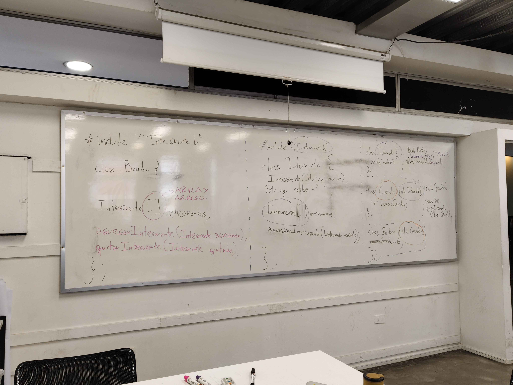

# sesion-05b

viernes 05 de septiembre

- las 4 P del aprendizaje según Aarón: pasion - proyectos - piers (colegas) - play (jugando)

---

En los `#include` se le pide al código que llame al archivo nombrado.

- Se le ponen `<>` cuando el archivo está en alguna parte del computador.
- Se le pone `""` cuando el archivo está en la misma carpeta del archivo principal.

"En el `h` prometo y en el `cpp` resulvo" ~Aarón

El `#ifndef` sirve si queremos abrir más de una vez un mismo archivo sin que todo colapse.

Arquitectura "arm" es una forma de programar computadores más chicos.

- matodo son funciones dentro de una clase
- atributos son 

Las clases se usan cuando queremos crear estructuras de código, pero que es demasiado grande para hacerlo sólo en uno

## Viendo el código de adafruit

Tiene muchas bibliotecas que están dentro del computador, por eso aparecen con "<>"

También hay bibliotecas que dependen de otra, eso se pone con ":" entremedio: `class Adafruit_SSD1306 : public Adafruit_GFX {` dice "la clase `Adafruit_SSD1306` depende del archivo `Adafruit_GFX`"

## Planificación

Una clase que sea texto en general
Una clase que herede de texto, que sea un poema

entonces todos los poemas son textos, pero no todos loa textos son poemas

Una clase que contenga un pixel art en imagen
Una clase que herede pixel artm que sea una colección de imagenes

## Apuntes

Creamos varios archivos: `Texto.h` - `Poema.h` - `PoemaParra.h` - `Texto.cpp` - `Poema.cpp` - `PoemaParra.cpp`

## Actividad

Ejemplo de Aarón:



Existe un archivo principal llamado "GuiasScout", que tiene varios archivos que serían las unidades: **Manada - Compañia - Tropa - Avanzada - Clan - Dirigentes**. Dentro de **Manada** está incluida una clase **Seisena**. Dentro de **Compañia y Tropa** se incluye la clase **Patrulla**

Una persona está dentro de una seisena --> que está dentro de una unidad manada ---> que está dentro de un grupo

DEBERÍA ESTAR AL REVÉS - EMPEAZAR CON INTEGRANTE, LUEGO SUBDIVISIÓN, DESPUÉS UNIDAD Y POR ÚLTIMO EL GRUPO

### GuiasScout.h
```cpp
// GUIAS-SCOUT.h
#ifndef GUIASSCOUT_H
#define GUIASSCOUT_H

#include "Edad.h"
#include "Unidad.h"
#include "Subdivision.h"

class GUIASSCOUT {
public:
// las clases necesitan un constructor y un destructor
 
// constructor
GUIASSCOUT();

// destructor
~GUIASSCOUT();
// rango de edad dentro de la unidad
int edadMin;
int edadMax;

// unidad a la que pertenece
Unidad unidad;

// es seisena, patrulla, comunidad o equipo
tipoTrabajo subdivision;
};
#endif
```

### Unidad

```cpp
#ifndef UNIDAD_H
#define UNIDAD_H

#include "GuiasScout.h"
// la clase "Compania" necesita de "GuiasScout"
class Unidad : public GuiasScout {
public:
// las clases necesitan un constructor y un destructor 
// constructor
Unidad();
// destructor
~Unidad();
// este es el rango de edad

};
#endif
```

### Compañía
Las demás unidades son lo mismo, pero con edades y Subduvisiones distintas

```cpp
#ifndef COMPANIA_H
#define COMPANIA_H

#include "GuiasScout.h"
#include "Patrulla.h"
// la clase "Compania" necesita de "GuiasScout"
class Compania : public GuiasScout {
public:
// las clases necesitan un constructor y un destructor 
// constructor
Compania();
// destructor
~Compania();
// este es el rango de edad
edadMin = 11;
edadMax = 15;
sebdivision = patrulla;
};
#endif
```

### subdivision

```cpp
#ifndef PATRULLA_H
#define PATRULLA_H

#include "GuiasScout.h"
#include "Compania.h"
// la clase "Patrulla" necesita de "GuiasScout"
class Patrulla : public GuiasScout {
public:
// las clases necesitan un constructor y un destructor 
// constructor
Patrulla();
// destructor
~Patrulla();
// este es el rango de edad
edadMin = 10;
edadMax = 14;
};
#endif
```

Lo otro es que antes de "Compania" exista una "Unidad" 

## ENCARGO

- escuchar los dos primeros discos de primus
- ver alguna charla de Mitch Resnick
