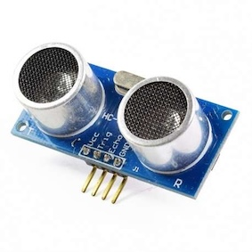
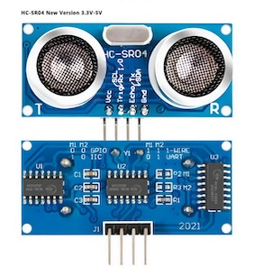
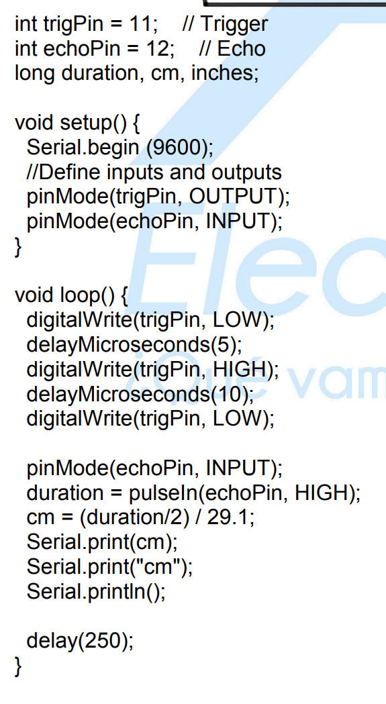
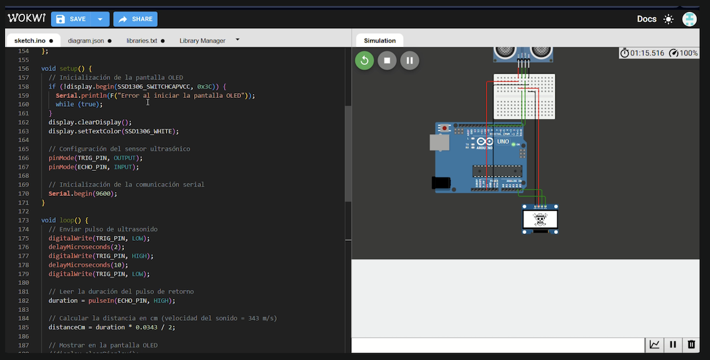

# sesion-06a

09-09-2025

## Apuntes

[Scratch](https://scratch.mit.edu/): Fue desarrollado por MIT Media Lab, es un software de programación para niños. Estrategia de programar con bloques.

[Pure data](https://puredata.info/): Software para programar audios, por dentro está programado en c++.

Miller puckette: Es un matemático, programador y profesor de música estadounidense, director asociado del CRSA, así como miembro del claustro de la facultad de la UC University of California en San Diego donde trabaja desde 1994. Cycling 74 esta empresa vende un software llamado `Max map`.

- Max: gráficas para hacer audios
- Dac: de digital a análogo
- Las cajitas que están arriba, son entradas y las de abajo, son salidas (input/output)
- Si creo algo en puredata se hace un subpach
- La `~` es para la salida del sonido 
- Lint: proceso de automatización para corregir errores, por ejemplo, sacar las pelusas de la ropa.
- YAML: Es un formato de serialización de datos legible por humanos que se utiliza principalmente para archivos de configuración y para transmitir datos entre sistemas, gracias a su fácil lectura y escritura. Es decir, un estilo de lenguaje que sirve para ordenar información.
- [Touchdesigner](https://derivative.ca/)
- [Isadora software](https://en.wikipedia.org/wiki/Isadora_(software))

### Ejemplo para proyecto 2 en clases

La máquina que saluda, dicha máquina te saluda desde lejos, cuando te acercas ocurre algo y cuando te alejas también. Se puede incorporar sensores de movimiento, sensores de luz, luces LEDS. Puede tener audio o micrófono. Pueden variar los INPUTS y OUTPUTS.

--- 

### Trabajo en clases / Encargo

Investigar sobre sensor elegido en clases y buscar 3 ideas para realizar con dicho sensor

### [Sensor de proximidad HC­-SR04](https://afel.cl/products/sensor-de-ultrasonico-hc-sr04?srsltid=AfmBOopiJB4kbuyh1LzlyMIL_vnBDt6UiMfwsZDgQLgASIhoOPDrjGsI)

- Sensor de distancia ultrasónico hc-sr04
- Es capaz de detectar objetos y calcular la distancia a la que se encuentra; en un rango de 2 a 450cm
- El sensor posee dos transductores, un emisor y un receptor, piezoeléctricos.
- El funcionamiento del sensor, se basa en que el emisor, piezoeléctrico, emite 8 pulsos de ultrasonido, la señal eléctrica se convierte en pulsos de sonido ultrasónico. Y el otro actúa como receptor y escucha los pulsos transmitidos. LCuando el receptor recibe estos pulsos, produce un pulso de salida cuyo ancho es proporcional a la distancia del objeto en frente.
- Este sensor proporciona una excelente detección de rango sin contacto.
- Como funciona con 5 volts, se puede conectar directamente a un Arduino o cualquier otro microcontrolador lógico de 5V.
- El sensor posee dos transductores, un emisor y un receptor, piezoeléctricos.
- Luego, de recibir la orden en el pin TRIG, las ondas de sonido viajan en el aire y rebotan al encontrar un objeto, el sonido de rebote es detectado por el receptor piezoeléctrico. Después,el pin ECHO cambia a Alto por un tiempo igual al que demoró la onda, desde que fue emitida hasta que fuedetectada.

---

- VCC: +5V DC
  - suministra energía al sensor ultrasónico HC-SR04. Puedes conectarlo a la salida de 5V de tu Arduino.

- TRIG: Disparo del ultrasonido
  - (disparador) pin se utiliza para disparar pulsos de sonido ultrasónico. Al configurar este pin en ALTO durante 10 µs, el sensor inicia una ráfaga ultrasónica.

- ECHO: Recepción del ultrasonido
  - pin ALTO cuando se transmite la ráfaga ultrasónica y permanece ALTO hasta que el sensor recibe un eco, después de lo cual baja. Al medir el tiempo que el pin Echo permanece alto, se puede calcular la distancia.

- GND: 0V
  - es el pin de tierra. Conéctalo a tierra del Arduino.

---





---

En el pdf de [ULTRASONIC-HC-SR04 sensor de distancia ULTRASONICOHC-SR04](https://agelectronica.lat/pdfs/textos/U/ULTRASONIC-HC-SR04.PDF) sale un ejemplo de cómo conectarlo al arduino y programarlo.




### Referentes

- [Sensor en AFEL](https://afel.cl/products/sensor-de-ultrasonico-hc-sr04?utm_term=&utm_campaign=%40+Campa%C3%B1a+Inteligente+Display&utm_source=adwords&utm_medium=ppc&hsa_acc=1808722794&hsa_cam=11192697983&hsa_grp=&hsa_ad=&hsa_src=x&hsa_tgt=&hsa_kw=&hsa_mt=&hsa_net=adwords&hsa_ver=3&gad_source=1&gad_campaignid=21510966891&gbraid=0AAAAADBMsFTqaXFnAaRCBzwNfYDPlDfVI&gclid=Cj0KCQjwoP_FBhDFARIsANPG24OiqkbTcdGwwMT36ru8LYq9EYJMEDpzSEGAMBCRLESmm6Rqb_nhdEkaAjoGEALw_wcB)
- [PDF sensor 1](https://agelectronica.lat/pdfs/textos/U/ULTRASONIC-HC-SR04.PDF)
- [PDF sensor 2](https://www.alldatasheet.com/view.jsp?Searchword=Hcsr04&gad_source=1&gad_campaignid=1434060638&gbraid=0AAAAADcdDU_3WQz4u0DzpZeXNn-3MtZrJ&gclid=Cj0KCQjww4TGBhCKARIsAFLXndTs1R1fS00TREmq_0RvPVZ1qDk8mfWRS0penD4mX2Y5jNh88lqOTgaAmVzEALw_wcB)
- [Proyectos con el sensor](https://proyectosinteresantes.com/10-proyectos-de-arduino-con-el-sensor-ultrasonico-hc-sr04/)
- [Sensor características](https://cursos.mcielectronics.cl/2022/12/06/como-funciona-el-sensor-ultrasonico-hc-sr04-y-como-se-conecta-con-arduino/)

---

### Ideas de uso

A . Semáforo de distancias

> Cuando un objeto esté cerca un LED rojo se encenderá; si está a una distancia media un LED amarillo se encenderá y si el objeto está a una distancia lejana, un LED verde se encenderá. 
   
B . Juego de saltos

> En esta idea, tenemos el arduino, la pantalla OLED SSD1306 y el sensor. Sería un juego tipo arcade, donde tendremos un monito y obstáculos para saltar; al colocar la mano cerca del sensor, comenzará a avanzar, para saltar estos obstáculos debes quitar la mano, así el monito saltará y para que el juego termine se podría colocar algún botón de reinicio.

C . Dispensador de dulces

> Cuando se acerque la mano al sensor, estará conectado a un motor que abrirá una puertita o tapa y saldrán dulces de dicha puerta. Sería como un dispensador sin contacto, como por ejemplo, los secadores de mano en el baño público.

---

También quiero destacar el código que hizo mi compañero [Nicolás Miranda](https://github.com/vxlentiinaa/dis8645-2025-02-procesos/tree/main/15-Nicolas-Miranda1312), donde lo probó en Wokwi y funcionaba muy bien. 



```cpp
#include <Wire.h>
#include <Adafruit_GFX.h>
#include <Adafruit_SSD1306.h>

// Configuración de la pantalla OLED
#define SCREEN_WIDTH 128
#define SCREEN_HEIGHT 64
#define OLED_RESET    -1  
Adafruit_SSD1306 display(SCREEN_WIDTH, SCREEN_HEIGHT, &Wire, OLED_RESET);


const int TRIG_PIN = 9; // Pin TRIG del sensor
const int ECHO_PIN = 8; // Pin ECHO del sensor
long duration;
float distanceCm;

const unsigned char naku [] PROGMEM = {
  // 'imagen_2025-09-11_200828021', 128x64px
 0xff, 0xff, 0xff, 0xff, 0xff, 0xff, 0xff, 0xff, 0xff, 0xff, 0xff, 0xff, 0xff, 0xff, 0xff, 0xff, 
 0xff, 0xff, 0xff, 0xff, 0xff, 0xff, 0xff, 0xff, 0xff, 0xff, 0xff, 0xff, 0xff, 0xff, 0xff, 0xff, 
 0xff, 0xff, 0xff, 0xff, 0xff, 0xff, 0xff, 0xff, 0xff, 0xff, 0xff, 0xff, 0xff, 0xff, 0xff, 0xff, 
 0xff, 0xff, 0xff, 0xff, 0xff, 0xff, 0xff, 0xff, 0xff, 0xff, 0xff, 0xff, 0xff, 0xff, 0xff, 0xff, 
 0xff, 0xff, 0xff, 0xff, 0xff, 0xfe, 0x00, 0x00, 0x00, 0xff, 0xff, 0xff, 0xff, 0xff, 0xff, 0xff, 
 0xff, 0xff, 0xff, 0xff, 0xff, 0xfe, 0x00, 0x00, 0x00, 0x3f, 0xff, 0xff, 0xff, 0xff, 0xff, 0xff, 
 0xff, 0xff, 0xff, 0xff, 0xff, 0xfe, 0x00, 0x00, 0x00, 0x1f, 0xff, 0xff, 0xff, 0xff, 0xff, 0xff, 
 0xff, 0xff, 0xff, 0xff, 0xff, 0xfe, 0x00, 0x00, 0x78, 0x0f, 0xff, 0xff, 0xff, 0xff, 0xff, 0xff, 
 0xff, 0xff, 0xff, 0xff, 0xff, 0xfe, 0x00, 0x03, 0xff, 0x07, 0xff, 0xff, 0xff, 0xff, 0xff, 0xff, 
 0xff, 0xff, 0xff, 0xff, 0xff, 0xfe, 0x00, 0x07, 0xff, 0x83, 0xff, 0xff, 0xff, 0xff, 0xff, 0xff, 
 0xff, 0xff, 0xff, 0xff, 0xff, 0xfe, 0x00, 0x0f, 0xc7, 0xc3, 0xff, 0xff, 0xff, 0xff, 0xff, 0xff, 
 0xff, 0xff, 0xff, 0xff, 0xff, 0xfe, 0x00, 0x1e, 0x00, 0xe1, 0xff, 0xff, 0xff, 0xff, 0xff, 0xff, 
 0xff, 0xff, 0xff, 0xff, 0xff, 0xfe, 0x00, 0x3c, 0x00, 0x61, 0xff, 0xff, 0xff, 0xff, 0xff, 0xff, 
 0xff, 0xff, 0xff, 0xff, 0xff, 0xfe, 0x00, 0x78, 0x00, 0x21, 0xff, 0xff, 0xff, 0xff, 0xff, 0xff, 
 0xff, 0xff, 0xff, 0xff, 0xff, 0xfe, 0x00, 0x70, 0x0f, 0x81, 0xff, 0xff, 0xff, 0xff, 0xff, 0xff, 
 0xff, 0xff, 0xff, 0xff, 0xff, 0xfe, 0x00, 0xf0, 0x0f, 0x81, 0xff, 0xff, 0xff, 0xff, 0xff, 0xff, 
 0xff, 0xff, 0xff, 0xff, 0xff, 0xff, 0xf8, 0xe0, 0x1f, 0x81, 0xff, 0xff, 0xff, 0xff, 0xff, 0xff, 
 0xff, 0xff, 0xff, 0xff, 0xff, 0xff, 0xf9, 0xe0, 0x3f, 0x83, 0xff, 0xff, 0xff, 0xff, 0xff, 0xff, 
 0xff, 0xff, 0xff, 0xff, 0xff, 0xfe, 0x19, 0xe0, 0x3f, 0x83, 0xff, 0xff, 0xff, 0xff, 0xff, 0xff, 
 0xff, 0xff, 0xff, 0xff, 0xff, 0xfe, 0x19, 0xe0, 0x3f, 0x07, 0xff, 0xff, 0xff, 0xff, 0xff, 0xff, 
 0xff, 0xff, 0xff, 0xff, 0xff, 0xfe, 0x19, 0xe0, 0x3f, 0x8f, 0xff, 0xff, 0xff, 0xff, 0xff, 0xff, 
 0xff, 0xff, 0xff, 0xff, 0xff, 0xfe, 0x19, 0xe0, 0x1f, 0xff, 0xff, 0xff, 0xff, 0xff, 0xff, 0xff, 
 0xff, 0xff, 0xff, 0xff, 0xff, 0xfe, 0x19, 0xe0, 0x1f, 0xff, 0xff, 0xff, 0xff, 0xff, 0xff, 0xff, 
 0xff, 0xff, 0xff, 0xff, 0xff, 0xfe, 0x1f, 0xe0, 0x0f, 0xff, 0xff, 0xff, 0xff, 0xff, 0xff, 0xff, 
 0xff, 0xff, 0xff, 0xff, 0xff, 0xfe, 0x1f, 0xf0, 0x07, 0xff, 0xff, 0xff, 0xff, 0xff, 0xff, 0xff, 
 0xff, 0xff, 0xff, 0xff, 0xff, 0xfe, 0x00, 0xf8, 0x01, 0xf9, 0xff, 0xff, 0xff, 0xff, 0xff, 0xff, 
 0xff, 0xff, 0xff, 0xff, 0xff, 0xfe, 0x00, 0xf8, 0x00, 0x01, 0xff, 0xff, 0xff, 0xff, 0xff, 0xff, 
 0xff, 0xff, 0xff, 0xff, 0xff, 0xfe, 0x00, 0xfc, 0x00, 0x01, 0xff, 0xff, 0xff, 0xff, 0xff, 0xff, 
 0xff, 0xff, 0xff, 0xff, 0xff, 0xfe, 0x00, 0xfe, 0x00, 0x01, 0xff, 0xff, 0xff, 0xff, 0xff, 0xff, 
 0xff, 0xff, 0xff, 0xff, 0xff, 0xfe, 0x00, 0xff, 0x00, 0x01, 0xff, 0xff, 0xff, 0xff, 0xff, 0xff, 
 0xff, 0xff, 0xff, 0xff, 0xff, 0xfe, 0x00, 0x7f, 0xc0, 0x01, 0xff, 0xff, 0xff, 0xff, 0xff, 0xff, 
 0xff, 0xff, 0xff, 0xff, 0xff, 0xfe, 0x00, 0x03, 0xf0, 0x01, 0xff, 0xff, 0xff, 0xff, 0xff, 0xff, 
 0xff, 0xff, 0xff, 0xff, 0xff, 0xfe, 0x00, 0x03, 0xfc, 0x01, 0xff, 0xff, 0xff, 0xff, 0xff, 0xff, 
 0xff, 0xff, 0xff, 0xff, 0xff, 0xfe, 0x00, 0x03, 0xff, 0xe1, 0xff, 0xff, 0xff, 0xff, 0xff, 0xff, 
 0xff, 0xff, 0xff, 0xff, 0xff, 0xff, 0xff, 0xff, 0xff, 0xff, 0xff, 0xff, 0xff, 0xff, 0xff, 0xff, 
 0xff, 0xff, 0xff, 0xff, 0xff, 0xff, 0xff, 0xff, 0xff, 0xff, 0xff, 0xff, 0xff, 0xff, 0xff, 0xff, 
 0xff, 0xff, 0xff, 0xff, 0xff, 0xff, 0xff, 0xff, 0xff, 0xff, 0xff, 0xff, 0xff, 0xff, 0xff, 0xff, 
 0xff, 0xff, 0xff, 0xff, 0xff, 0xff, 0xff, 0xff, 0xff, 0xff, 0xfc, 0xe7, 0xff, 0xff, 0xff, 0xff, 
 0xff, 0xff, 0xff, 0xff, 0xff, 0xff, 0xff, 0xff, 0xff, 0xff, 0xf8, 0x43, 0xff, 0xff, 0xff, 0xff, 
 0xff, 0xff, 0xff, 0xff, 0xff, 0xff, 0xff, 0xff, 0xff, 0xff, 0xf8, 0x43, 0xff, 0xff, 0xff, 0xff, 
 0xff, 0xff, 0xff, 0xff, 0xff, 0xff, 0xff, 0xff, 0xff, 0xff, 0xf8, 0x43, 0xff, 0xff, 0xff, 0xff, 
 0xff, 0xff, 0xff, 0xff, 0xff, 0xff, 0xff, 0xff, 0xff, 0xff, 0xff, 0xff, 0xff, 0xff, 0xff, 0xff, 
 0xff, 0xff, 0xff, 0xff, 0xff, 0xff, 0xff, 0xff, 0xff, 0xff, 0xff, 0xff, 0xff, 0xff, 0xff, 0xff, 
 0xff, 0xff, 0xff, 0xf8, 0x7f, 0x0f, 0xf8, 0x7f, 0xc3, 0xe1, 0xc3, 0xf0, 0x7f, 0xff, 0xff, 0xff, 
 0xff, 0xff, 0xff, 0xf8, 0x3f, 0x0f, 0xf0, 0x3f, 0xc3, 0xc1, 0xc3, 0xf0, 0x7f, 0xff, 0xff, 0xff, 
 0xff, 0xff, 0xff, 0xf8, 0x1f, 0x0f, 0xf0, 0x3f, 0xc3, 0x83, 0xc3, 0xf0, 0x7f, 0xff, 0xff, 0xff, 
 0xff, 0xff, 0xff, 0xf8, 0x1f, 0x0f, 0xe0, 0x3f, 0xc3, 0x07, 0xc3, 0xf0, 0x7f, 0xff, 0xff, 0xff, 
 0xff, 0xff, 0xff, 0xf8, 0x0f, 0x0f, 0xe0, 0x1f, 0xc3, 0x0f, 0xc3, 0xf0, 0x7f, 0xff, 0xff, 0xff, 
 0xff, 0xff, 0xff, 0xf8, 0x07, 0x0f, 0xe0, 0x1f, 0xc2, 0x0f, 0xc3, 0xf0, 0x7f, 0xff, 0xff, 0xff, 
 0xff, 0xff, 0xff, 0xf8, 0x07, 0x0f, 0xc2, 0x1f, 0xc0, 0x1f, 0xc3, 0xf0, 0x7f, 0xff, 0xff, 0xff, 
 0xff, 0xff, 0xff, 0xf8, 0x03, 0x0f, 0xc3, 0x0f, 0xc0, 0x3f, 0xc3, 0xf0, 0x7f, 0xff, 0xff, 0xff, 
 0xff, 0xff, 0xff, 0xf8, 0x41, 0x0f, 0xc3, 0x0f, 0xc0, 0x3f, 0xc3, 0xf0, 0x7f, 0xff, 0xff, 0xff, 
 0xff, 0xff, 0xff, 0xf8, 0x60, 0x0f, 0x87, 0x0f, 0xc0, 0x3f, 0xc3, 0xf0, 0x7f, 0xff, 0xff, 0xff, 
 0xff, 0xff, 0xff, 0xf8, 0x60, 0x0f, 0x80, 0x07, 0xc2, 0x1f, 0xc3, 0xf0, 0x7f, 0xff, 0xff, 0xff, 
 0xff, 0xff, 0xff, 0xf8, 0x70, 0x0f, 0x00, 0x07, 0xc2, 0x0f, 0xc1, 0xf0, 0xff, 0xff, 0xff, 0xff, 
 0xff, 0xff, 0xff, 0xf8, 0x78, 0x0f, 0x00, 0x03, 0xc3, 0x07, 0xc1, 0xf0, 0xff, 0xff, 0xff, 0xff, 
 0xff, 0xff, 0xff, 0xf8, 0x78, 0x0f, 0x00, 0x03, 0xc3, 0x87, 0xe0, 0x00, 0xff, 0xff, 0xff, 0xff, 
 0xff, 0xff, 0xff, 0xf8, 0x7c, 0x0f, 0x0f, 0xc3, 0xc3, 0x83, 0xe0, 0x01, 0xff, 0xff, 0xff, 0xff, 
 0xff, 0xff, 0xff, 0xf8, 0x7e, 0x0e, 0x1f, 0xc3, 0xc3, 0xc1, 0xf0, 0x01, 0xff, 0xff, 0xff, 0xff, 
 0xff, 0xff, 0xff, 0xf8, 0x7f, 0x0e, 0x1f, 0xe1, 0xc3, 0xe0, 0xfc, 0x07, 0xff, 0xff, 0xff, 0xff, 
 0xff, 0xff, 0xff, 0xff, 0xff, 0xff, 0xff, 0xff, 0xff, 0xff, 0xff, 0xff, 0xff, 0xff, 0xff, 0xff, 
 0xff, 0xff, 0xff, 0xff, 0xff, 0xff, 0xff, 0xff, 0xff, 0xff, 0xff, 0xff, 0xff, 0xff, 0xff, 0xff, 
 0xff, 0xff, 0xff, 0xff, 0xff, 0xff, 0xff, 0xff, 0xff, 0xff, 0xff, 0xff, 0xff, 0xff, 0xff, 0xff, 
 0xff, 0xff, 0xff, 0xff, 0xff, 0xff, 0xff, 0xff, 0xff, 0xff, 0xff, 0xff, 0xff, 0xff, 0xff, 0xff
 
};
const unsigned char one_pice [] PROGMEM = {
 // 'imagen_2025-09-11_202826994', 128x64px
 0xff, 0xff, 0xff, 0xff, 0xff, 0xff, 0xff, 0xff, 0xff, 0xff, 0xff, 0xff, 0xff, 0xff, 0xff, 0xff, 
 0xff, 0xff, 0xff, 0xff, 0xff, 0xff, 0xff, 0xff, 0xff, 0xff, 0xff, 0xff, 0xff, 0xff, 0xff, 0xff, 
 0xff, 0xff, 0xff, 0xff, 0xff, 0xff, 0xff, 0xff, 0xff, 0xff, 0xff, 0xff, 0xff, 0xff, 0xff, 0xff, 
 0xff, 0xff, 0xff, 0xff, 0xff, 0xff, 0xff, 0xff, 0xff, 0xff, 0xff, 0xff, 0xff, 0xff, 0xff, 0xff, 
 0xff, 0xff, 0xff, 0xff, 0xff, 0xff, 0xff, 0xff, 0xff, 0xff, 0xff, 0xff, 0xff, 0xff, 0xff, 0xff, 
 0xff, 0xff, 0xff, 0xff, 0xff, 0xff, 0xff, 0xff, 0xff, 0xff, 0xff, 0xff, 0xff, 0xff, 0xff, 0xff, 
 0xff, 0xff, 0xff, 0xff, 0xff, 0xff, 0xff, 0xff, 0xff, 0xff, 0xff, 0xff, 0xff, 0xff, 0xff, 0xff, 
 0xff, 0xff, 0xff, 0xff, 0xff, 0xff, 0xff, 0xff, 0xff, 0xff, 0xff, 0xff, 0xff, 0xff, 0xff, 0xff, 
 0xff, 0xff, 0xff, 0xff, 0xff, 0xff, 0xff, 0xff, 0xff, 0xff, 0xff, 0xff, 0xff, 0xff, 0xff, 0xff, 
 0xff, 0xff, 0xff, 0xff, 0xff, 0x8f, 0xff, 0xff, 0xff, 0xff, 0xe3, 0xff, 0xff, 0xff, 0xff, 0xff, 
 0xff, 0xff, 0xff, 0xff, 0xff, 0x77, 0xff, 0xe0, 0x0f, 0xff, 0xdd, 0xff, 0xff, 0xff, 0xff, 0xff, 
 0xff, 0xff, 0xff, 0xff, 0xff, 0x77, 0xff, 0x80, 0x01, 0xff, 0xdd, 0xff, 0xff, 0xff, 0xff, 0xff, 
 0xff, 0xff, 0xff, 0xff, 0xff, 0x77, 0xff, 0x1f, 0xf1, 0xff, 0xdd, 0xff, 0xff, 0xff, 0xff, 0xff, 
 0xff, 0xff, 0xff, 0xff, 0xf8, 0xef, 0xfc, 0xff, 0xfe, 0x3f, 0xe6, 0x3f, 0xff, 0xff, 0xff, 0xff, 
 0xff, 0xff, 0xff, 0xff, 0xf7, 0xf7, 0xf3, 0xff, 0xff, 0xdf, 0xdf, 0xdf, 0xff, 0xff, 0xff, 0xff, 
 0xff, 0xff, 0xff, 0xff, 0xf7, 0x79, 0xe7, 0xff, 0xff, 0xcf, 0xbd, 0xdf, 0xff, 0xff, 0xff, 0xff, 
 0xff, 0xff, 0xff, 0xff, 0xf7, 0x7d, 0xef, 0xff, 0xff, 0xe7, 0x3d, 0xdf, 0xff, 0xff, 0xff, 0xff, 
 0xff, 0xff, 0xff, 0xff, 0xf8, 0x9e, 0xc0, 0x00, 0x00, 0x02, 0x7a, 0x3f, 0xff, 0xff, 0xff, 0xff, 
 0xff, 0xff, 0xff, 0xff, 0xff, 0xef, 0x00, 0x00, 0x00, 0x01, 0xe7, 0xff, 0xff, 0xff, 0xff, 0xff, 
 0xff, 0xff, 0xff, 0xff, 0xff, 0xef, 0x00, 0x00, 0x00, 0x01, 0xef, 0xff, 0xff, 0xff, 0xff, 0xff, 
 0xff, 0xff, 0xff, 0xff, 0xff, 0xf3, 0x00, 0x00, 0x00, 0x01, 0xdf, 0xff, 0xff, 0xff, 0xff, 0xff, 
 0xff, 0xff, 0xff, 0xff, 0xff, 0x00, 0x00, 0x00, 0x00, 0x00, 0x01, 0xff, 0xff, 0xff, 0xff, 0xff, 
 0xff, 0xff, 0xff, 0xff, 0xfe, 0xff, 0xff, 0xff, 0xff, 0xff, 0xfe, 0x7f, 0xff, 0xff, 0xff, 0xff, 
 0xff, 0xff, 0xff, 0xff, 0xfe, 0xff, 0xff, 0xff, 0xff, 0xff, 0xfe, 0x7f, 0xff, 0xff, 0xff, 0xff, 
 0xff, 0xff, 0xff, 0xff, 0xff, 0x00, 0x00, 0x00, 0x00, 0x00, 0x01, 0xff, 0xff, 0xff, 0xff, 0xff, 
 0xff, 0xff, 0xff, 0xff, 0xff, 0xfe, 0xff, 0xff, 0xff, 0xfe, 0x7f, 0xff, 0xff, 0xff, 0xff, 0xff, 
 0xff, 0xff, 0xff, 0xff, 0xff, 0xfe, 0xfe, 0x1f, 0xf0, 0xfe, 0x7f, 0xff, 0xff, 0xff, 0xff, 0xff, 
 0xff, 0xff, 0xff, 0xff, 0xff, 0xfe, 0xfe, 0x1f, 0xf0, 0x7e, 0x7f, 0xff, 0xff, 0xff, 0xff, 0xff, 
 0xff, 0xff, 0xff, 0xff, 0xff, 0xfe, 0xf8, 0x0f, 0xe0, 0x3e, 0x7f, 0xff, 0xff, 0xff, 0xff, 0xff, 
 0xff, 0xff, 0xff, 0xff, 0xff, 0xfe, 0xf0, 0x03, 0xc0, 0x1e, 0x7f, 0xff, 0xff, 0xff, 0xff, 0xff, 
 0xff, 0xff, 0xff, 0xff, 0xff, 0xfe, 0xf0, 0x03, 0xc0, 0x1e, 0x7f, 0xff, 0xff, 0xff, 0xff, 0xff, 
 0xff, 0xff, 0xff, 0xff, 0xff, 0xfe, 0xf0, 0x03, 0xc0, 0x1e, 0xff, 0xff, 0xff, 0xff, 0xff, 0xff, 
 0xff, 0xff, 0xff, 0xff, 0xff, 0xff, 0x30, 0x03, 0xc0, 0x1d, 0xff, 0xff, 0xff, 0xff, 0xff, 0xff, 
 0xff, 0xff, 0xff, 0xff, 0xff, 0xff, 0x3c, 0x0f, 0xe0, 0x3d, 0xff, 0xff, 0xff, 0xff, 0xff, 0xff, 
 0xff, 0xff, 0xff, 0xff, 0xff, 0xff, 0xde, 0x1f, 0xf0, 0x7b, 0xff, 0xff, 0xff, 0xff, 0xff, 0xff, 
 0xff, 0xff, 0xff, 0xff, 0xff, 0xff, 0xde, 0x1f, 0xf0, 0xfb, 0xff, 0xff, 0xff, 0xff, 0xff, 0xff, 
 0xff, 0xff, 0xff, 0xff, 0xff, 0xff, 0xdf, 0xfc, 0x3f, 0xfb, 0xff, 0xff, 0xff, 0xff, 0xff, 0xff, 
 0xff, 0xff, 0xff, 0xff, 0xff, 0xff, 0xef, 0xf0, 0x1f, 0xe7, 0xff, 0xff, 0xff, 0xff, 0xff, 0xff, 
 0xff, 0xff, 0xff, 0xff, 0xff, 0xff, 0xf7, 0xf8, 0x3f, 0xdf, 0xff, 0xff, 0xff, 0xff, 0xff, 0xff, 
 0xff, 0xff, 0xff, 0xff, 0xff, 0xff, 0xf3, 0xfc, 0x3f, 0xdf, 0xff, 0xff, 0xff, 0xff, 0xff, 0xff, 
 0xff, 0xff, 0xff, 0xff, 0xff, 0xff, 0xfc, 0xff, 0xfe, 0x3f, 0xff, 0xff, 0xff, 0xff, 0xff, 0xff, 
 0xff, 0xff, 0xff, 0xff, 0xff, 0xff, 0xfe, 0x1f, 0xf0, 0x7f, 0xff, 0xff, 0xff, 0xff, 0xff, 0xff, 
 0xff, 0xff, 0xff, 0xff, 0xff, 0xff, 0xfc, 0x00, 0x00, 0x7f, 0xff, 0xff, 0xff, 0xff, 0xff, 0xff, 
 0xff, 0xff, 0xff, 0xff, 0xff, 0xff, 0xf8, 0x80, 0x02, 0x3f, 0xff, 0xff, 0xff, 0xff, 0xff, 0xff, 
 0xff, 0xff, 0xff, 0xff, 0xff, 0xff, 0xf0, 0x1e, 0xf0, 0x1f, 0xff, 0xff, 0xff, 0xff, 0xff, 0xff, 
 0xff, 0xff, 0xff, 0xff, 0xff, 0xff, 0xe2, 0xde, 0xf2, 0x47, 0xff, 0xff, 0xff, 0xff, 0xff, 0xff, 
 0xff, 0xff, 0xff, 0xff, 0xff, 0xff, 0xe2, 0xde, 0x72, 0xc7, 0xff, 0xff, 0xff, 0xff, 0xff, 0xff, 
 0xff, 0xff, 0xff, 0xff, 0xff, 0xff, 0xd2, 0xc0, 0x02, 0xdb, 0xff, 0xff, 0xff, 0xff, 0xff, 0xff, 
 0xff, 0xff, 0xff, 0xff, 0xff, 0xff, 0x33, 0x1e, 0xf1, 0xdd, 0xff, 0xff, 0xff, 0xff, 0xff, 0xff, 
 0xff, 0xff, 0xff, 0xff, 0xff, 0xe6, 0xf1, 0xde, 0xf3, 0x9e, 0xc7, 0xff, 0xff, 0xff, 0xff, 0xff, 
 0xff, 0xff, 0xff, 0xff, 0xff, 0xe2, 0xf1, 0xde, 0x77, 0x1f, 0x47, 0xff, 0xff, 0xff, 0xff, 0xff, 
 0xff, 0xff, 0xff, 0xff, 0xff, 0x99, 0xed, 0xe0, 0x0f, 0x27, 0xbb, 0xff, 0xff, 0xff, 0xff, 0xff, 
 0xff, 0xff, 0xff, 0xff, 0xff, 0x9f, 0xde, 0xff, 0xfe, 0xfb, 0xfb, 0xff, 0xff, 0xff, 0xff, 0xff, 
 0xff, 0xff, 0xff, 0xff, 0xff, 0xe7, 0x3e, 0xff, 0xfe, 0xfd, 0xc7, 0xff, 0xff, 0xff, 0xff, 0xff, 
 0xff, 0xff, 0xff, 0xff, 0xff, 0xe7, 0x3e, 0xff, 0xfe, 0xfd, 0xcf, 0xff, 0xff, 0xff, 0xff, 0xff, 
 0xff, 0xff, 0xff, 0xff, 0xff, 0xf9, 0xdf, 0x1f, 0xf1, 0xfb, 0xbf, 0xff, 0xff, 0xff, 0xff, 0xff, 
 0xff, 0xff, 0xff, 0xff, 0xff, 0xf9, 0xdf, 0xe3, 0xcf, 0xfb, 0xbf, 0xff, 0xff, 0xff, 0xff, 0xff, 
 0xff, 0xff, 0xff, 0xff, 0xff, 0xfe, 0x3f, 0xfc, 0x3f, 0xfc, 0x7f, 0xff, 0xff, 0xff, 0xff, 0xff, 
 0xff, 0xff, 0xff, 0xff, 0xff, 0xfe, 0x7f, 0xfc, 0x3f, 0xfc, 0xff, 0xff, 0xff, 0xff, 0xff, 0xff, 
 0xff, 0xff, 0xff, 0xff, 0xff, 0xff, 0xff, 0xff, 0xff, 0xff, 0xff, 0xff, 0xff, 0xff, 0xff, 0xff, 
 0xff, 0xff, 0xff, 0xff, 0xff, 0xff, 0xff, 0xff, 0xff, 0xff, 0xff, 0xff, 0xff, 0xff, 0xff, 0xff, 
 0xff, 0xff, 0xff, 0xff, 0xff, 0xff, 0xff, 0xff, 0xff, 0xff, 0xff, 0xff, 0xff, 0xff, 0xff, 0xff, 
 0xff, 0xff, 0xff, 0xff, 0xff, 0xff, 0xff, 0xff, 0xff, 0xff, 0xff, 0xff, 0xff, 0xff, 0xff, 0xff, 
 0xff, 0xff, 0xff, 0xff, 0xff, 0xff, 0xff, 0xff, 0xff, 0xff, 0xff, 0xff, 0xff, 0xff, 0xff, 0xff


};

void setup() {
  // Inicialización de la pantalla OLED
  if (!display.begin(SSD1306_SWITCHCAPVCC, 0x3C)) { 
    Serial.println(F("Error al iniciar la pantalla OLED"));
    while (true);
  }
  display.clearDisplay();
  display.setTextColor(SSD1306_WHITE);
  
  // Configuración del sensor ultrasónico
  pinMode(TRIG_PIN, OUTPUT);
  pinMode(ECHO_PIN, INPUT);
  
  // Inicialización de la comunicación serial
  Serial.begin(9600);
}

void loop() {
  // Enviar pulso de ultrasonido
  digitalWrite(TRIG_PIN, LOW);
  delayMicroseconds(2);
  digitalWrite(TRIG_PIN, HIGH);
  delayMicroseconds(10);
  digitalWrite(TRIG_PIN, LOW);

  // Leer la duración del pulso de retorno
  duration = pulseIn(ECHO_PIN, HIGH);
  
  // Calcular la distancia en cm (velocidad del sonido = 343 m/s)
  distanceCm = duration * 0.0343 / 2;

  // Mostrar en la pantalla OLED
  //display.clearDisplay();
  //display.setTextSize(2);
  //display.setCursor(0, 0);
  //display.print("Distancia: ");
  //display.setCursor(0, 20);
  //display.print(distanceCm);
  //display.println(" cm");
  
display.clearDisplay(); 

if (distanceCm < 200) {
    display.drawBitmap(0, 0, naku, 128, 64, WHITE);
  }
else if (distanceCm < 400) {
    display.drawBitmap(0, 0, one_pice, 128, 64, WHITE);
  }
 

  display.display(); // Actualizar la pantalla
  delay(500); // Esperar 500 ms
  }
```

### Encargo 11

- investigar sensores vistos en clases, cotizarlos, encontrar referentes que los usen, y describir 3 pequeñas ideas que podamos aplicar a su proyecto-02 de máquinas de saludar


### Sensor Color RGB TCS34725

Sensor de color que mide RGB y luz total. Puede ser utilizado por microcontroladores o micro-computadores, para obtener los valores RGB del color de un objeto o luz frente al sensor. Se conecta por I2C, tiene filtro IR, LED propio y permite ajustar medición y ganancia; detecta colores con alta precisión, incluso a través de vidrios.

Este sensor es un integrado completo que realiza un tratamiento digital de la medición de color, proporcionando los valores RGB y Clear (medición total sin filtrar)

Encontré este video en youtube, de un proyecto sobre clasificar colores: [Clasificando Objetos por Color con Sensor RGB TCS34725 y Arduino](https://www.youtube.com/watch?v=n18FmtGQdJ8)

Utilizó una tarejeta nano con micro-controlador Arduino y el sensor. El video consta de esferas de colores, que al colocarlas en un riel, el sensor detecta el color y la pelotita cae en el compartimiento correspondiente. 

- Se me imagina que la persona que entre a la sala, eliga un cartón de color (rojo, verde, azul y amarillo) Entonces el sensor detectará el color de la persona, lo llamará y saludará. Donde cada color, tiene un saludo diferente. 

### Sensor de distancia por ToF VL53L0X

El principio de funcionamiento de los sensores de distancia por tiempo de vuelo es similar al de los sensores ultrasonido: El sensor posee un emisor laser que cada cierto tiempo emite un haz de luz, al encontrarse con un objeto la luz es reflejada, el sensor se encarga de medir el tiempo entre la emisión y la detección de la luz y como la velocidad de la luz es un valor conocido entonces se puede calcular la distancia al objeto con el tiempo de vuelo.

Encontré este proyecto en youtube, mide la distancia de los objetos [Sensor de distancia láser VL53L0X | Proyecto Arduino](https://www.youtube.com/watch?v=oe3OnYz5j3E) 

- Esté podría ser una opción para medir la distancia de la máquina hacia la persona y que cada cierta distancia, la máquina lo invite a acercarse más, hasta que llegue a la máquina y este lo salude con un bracito.

### Sensor de Temperatura y Humedad DHT11 

El DHT11 es un sensor de temperatura y humedad digital de bajo costo. Utiliza un sensor capacitivo de humedad y un termistor para medir el aire circundante, y muestra los datos mediante una señal digital en el pin de datos (no hay pines de entrada analógica)

