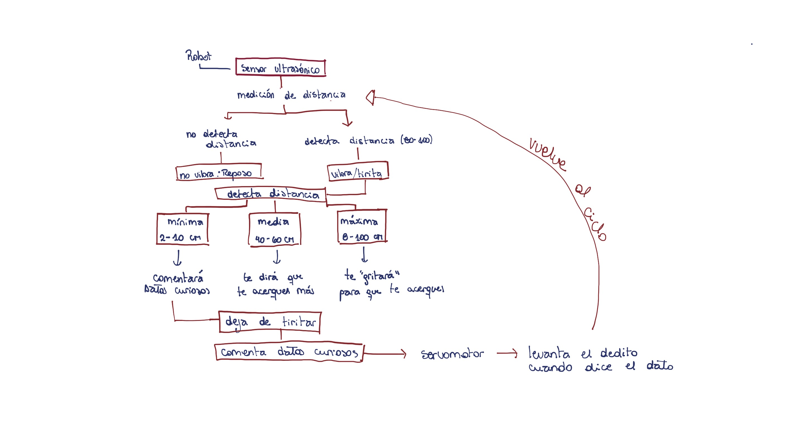

# sesion-07b

26-09-2025

## Apuntes

Comisión Cynthia Shuffer 

- Sensor ultrasónico [HC-sr04](https://afel.cl/products/sensor-de-ultrasonico-hc-sr04) 
- La velocidad del sonido en el aire, a 20°C, es de aproximadamente 343,2 metros por segundo (m/s), lo que equivale a 1234 km/h
  - Ejemplos de velocidad de sonido en diferentes medios:
  - Aire (a 15°C): 340 m/s (1224 km/h)
  - Agua (a 25°C): 1593 m/s
  - Madera: 3700 m/s
  - Acero: 6100 M/s

### Pseudocodigo

- 1. Intentar que el código se pueda ver completo en la primera pantalla
  2. archivo.ino
  3. creditos.ino
  4. cableado.ino

### Archivo principal.ino

- Usar bool para switch
- variables con clases (.cpp/.h)
- Usar booleanas para definir las variables, ej: Persona de 2 a 10 cm de distancia : true / false

### Pasos

- Configurar sensor (ultrasónico en este caso) en archivo principal
- Funciones con void
- Quedaría en setup

```cpp
 void setup() {
  configurarSensoresActuadores();
 }
```

En void loop:

```cpp
void loop() {
  leerSensores();
  tomarDecisiones();
  actuar();
}
```

### Archivo sensorUtlrasónico.ino

Necesitamos

- archivo/ventana del sensor
- decidir en que patita va

```cpp
 void configurarSensorUltrasonico() {
  // conectar la patita

  // definir la distancia minima
  // definir la distancia maxima

}
```

### Archivo sensoresActuadores.ino

- sirve para configurar más sensores y actuadores

```cpp
  void configurarSensoresActuadores() {

  configurarSensorUltrasonico();

  // configurar mas sensores
  // configurar actuadores
  }

  void leerSensores() {}

  void tomarDecisiones() {}

  void actuar() {}
```
---

Comentar lo que vamos hacer, que es lo que hará el código.

Y ver la idea final del proyecto para poder ejecutarla después.

---

## Proyecto 02 

- Sensor ultrasónico/proximidad HC-sr04

```cpp
  const int Trigger = 11;   //Pin digital 11 para el Trigger del sensor
  const int Echo = 12;   //Pin digital 12 para el Echo del sensor
```

Entrada: Al comienzo la máquina está tiritando; al detectar movimiento deja de tiritar y comienza a llamarte según la distancia a la que uno se encuentre.

Hemos decidido las distancias de esta manera:

- distancia mínima de 2 a 10 cm
- distancia media de 45 a 60 cm
- distancia máxima de 80 a 100 cm
- El tiempo de reposo es cuando no siente presencia

Luego hemos visto la configuración del Altavoz:

- tono/volumen del altavoz para cada distancia.
  - distancia minima: 30 - 40 decibeles
  - distancia media: 70- 80 decibeles
  - distancia maxima: 90 - 93 decibeles
 
También definimos la configuración del servomotor:

- Cuando el sensor detecte distancia de 2 a 10cm
  - el movimiento en ángulo es de 0 a 180° grados   
- Servo se mueve desde 0 a 180 grados
- Si no detecta la distancia requerida, se baja 

### Máquina de datos curiosos 🤓

insertas cosas de la maquina 

### Encargo 14

- cada persona del grupo debe implementar en diagrama de flujo dibujado o con la herramienta Mermaid.js con sus propias palabras y subirlo a su README.


