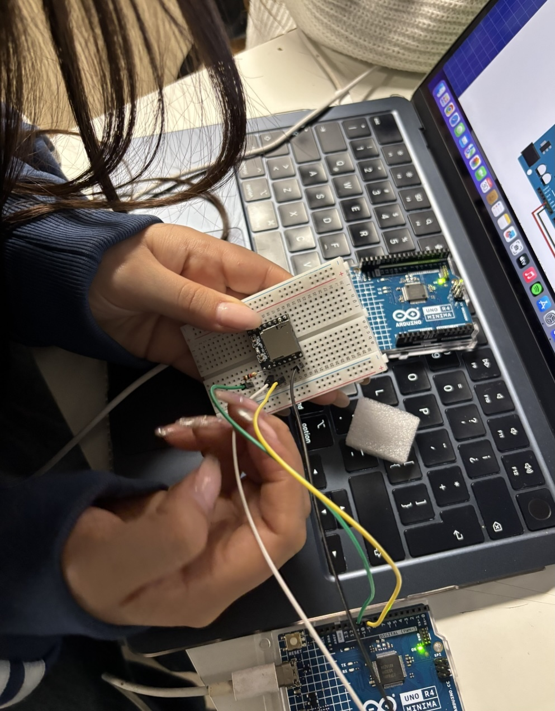
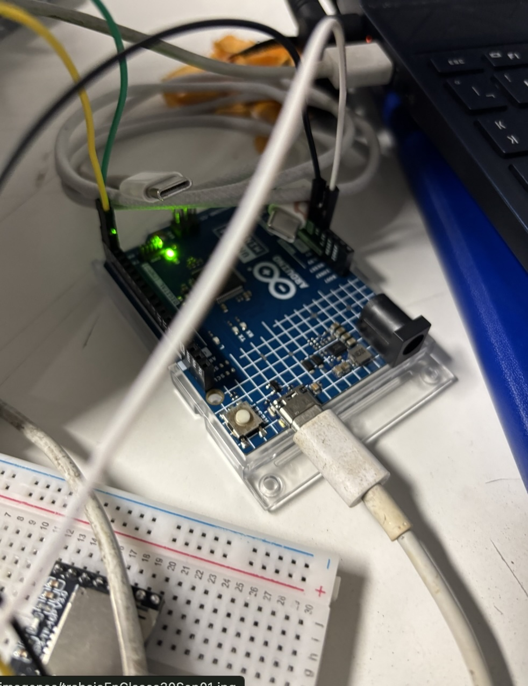
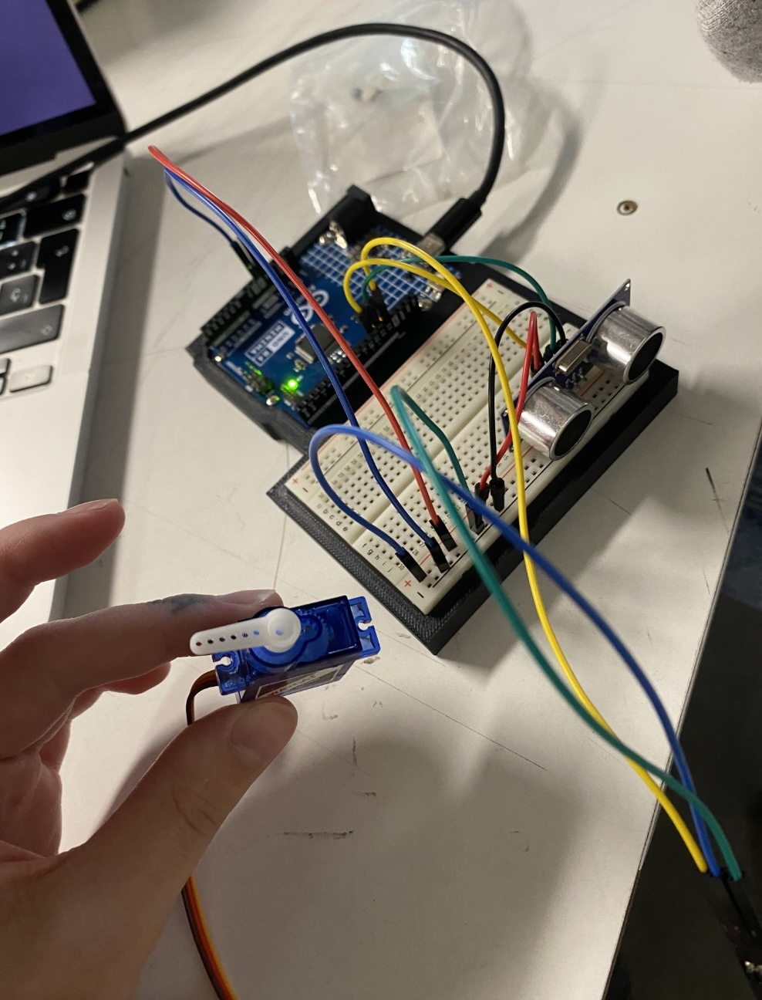

# sesion-08a

30-09-2025

## Apuntes / Proyecto02

`Robot que cuenta datos curiosos`

Componentes que utilizaremos: 

- Sensor ultrasónico, sensor de proximidad HC-SR04
- Servomotor
- Motor DC
- Reproductor MP3
- Altavoz

Entrada: Mediante el sensor ultrasónico, la máquina detecta movimiento/presencia y mide la distancia.

Salida: Al detectar esta presencia y la distancia, la máquina comenzará a hablar y a "tiritar"

1. Cuando detecte una presencia, la máquina comenzará a temblar, mediante el motor DC.
2. El sensor detectará distancias de: 2-10cm / 40-60cm / 80-100cm
3. En cada parámetro de distancia, la máquina reproduce un audio de voz distinto, mediante el Reproductor MP3 con una tarjeta SD
4. Si la distancia es 80-10cmm te grita "HOLA, VEN HUMANO"; de 40-60cm te grita de nuevo diciendo "ACÉRCATE MÁS" y por último la distancia de 2-10cm te susurrará un secreto y un dato curioso.

`Diálogo:`

- Decir "hola humano, ¿porqué estas tan lejos?. Acércate"
- Que tirite con el motor DC al momento de no acercarse hacia el robot.
- "Hola, no seas tímido, más cerca. no tengo, virus creoo"

`Datos curiosos que dirá:`

- “¿Sabías que?, los 99% de los problemas se arreglan reiniciando.”
- “La nube no existe, son computadores de otro.”
- “Los datos nunca se borran, sólo se esconden.”
- “El error 404 es mi manera de hacerme el leso.”
- “El primer mouse era de madera.”

`Cosas faltantes:`

- Mecanismo
- Carcasa
- Motor DC
- Unir código
- Diálogo (listo)
- Tipo de voz: artificial (listo)

### Desarrollo de clases

Código para usar el mp3 y el altavoz funcionó gracias a janis y mateo, el cual es de esta fuente: https://github.com/DFRobot/DFRobotDFPlayerMini

Este código nos ayudó la Janice con el Mateo, ellos encontraron este código para el reproductor MP3

```cpp
<@746126402121629817> /***************************************************
DFPlayer - A Mini MP3 Player For Arduino
<https://www.dfrobot.com/product-1121.html>

***************************************************
This example shows the basic function of library for DFPlayer.

Created 2016-12-07
By [Angelo qiao](Angelo.qiao@dfrobot.com)

GNU Lesser General Public License.
See <http://www.gnu.org/licenses/> for details.
All above must be included in any redistribution
****************************************************/

/***********Notice and Trouble shooting***************
1.Connection and Diagram can be found here
<https://www.dfrobot.com/wiki/index.php/DFPlayer_Mini_SKU:DFR0299#Connection_Diagram>
2.This code is tested on Arduino Uno, Leonardo, Mega boards.
****************************************************/

#include "Arduino.h"
#include "DFRobotDFPlayerMini.h"

#if (defined(ARDUINO_AVR_UNO) || defined(ESP8266))   // Using a soft serial port
#include <SoftwareSerial.h>
SoftwareSerial softSerial(/*rx =*/4, /*tx =*/5);
#define FPSerial softSerial
#else
#define FPSerial Serial1
#endif

DFRobotDFPlayerMini myDFPlayer;
void printDetail(uint8_t type, int value);

void setup()
{
#if (defined ESP32)
 FPSerial.begin(9600, SERIAL_8N1, /*rx =*/A3, /*tx =*/A2);
#else
 FPSerial.begin(9600);
#endif

 Serial.begin(115200);

 Serial.println();
 Serial.println(F("DFRobot DFPlayer Mini Demo"));
 Serial.println(F("Initializing DFPlayer ... (May take 3~5 seconds)"));
 
 if (!myDFPlayer.begin(FPSerial, /*isACK = */true, /*doReset = */true)) {  //Use serial to communicate with mp3.
   Serial.println(F("Unable to begin:"));
   Serial.println(F("1.Please recheck the connection!"));
   Serial.println(F("2.Please insert the SD card!"));
   while(true){
     delay(0); // Code to compatible with ESP8266 watch dog.
   }
 }
 Serial.println(F("DFPlayer Mini online."));
 
 myDFPlayer.volume(10);  //Set volume value. From 0 to 30
 myDFPlayer.play(1);  //Play the first mp3
}

void loop()
{
 static unsigned long timer = millis();
 
 if (millis() - timer > 3000) {
   timer = millis();
   myDFPlayer.next();  //Play next mp3 every 3 second.
 }
 
 if (myDFPlayer.available()) {
   printDetail(myDFPlayer.readType(), myDFPlayer.read()); //Print the detail message from DFPlayer to handle different errors and states.
 }
}

void printDetail(uint8_t type, int value){
 switch (type) {
   case TimeOut:
     Serial.println(F("Time Out!"));
     break;
   case WrongStack:
     Serial.println(F("Stack Wrong!"));
     break;
   case DFPlayerCardInserted:
     Serial.println(F("Card Inserted!"));
     break;
   case DFPlayerCardRemoved:
     Serial.println(F("Card Removed!"));
     break;
   case DFPlayerCardOnline:
     Serial.println(F("Card Online!"));
     break;
   case DFPlayerUSBInserted:
     Serial.println("USB Inserted!");
     break;
   case DFPlayerUSBRemoved:
     Serial.println("USB Removed!");
     break;
   case DFPlayerPlayFinished:
     Serial.print(F("Number:"));
     Serial.print(value);
     Serial.println(F(" Play Finished!"));
     break;
   case DFPlayerError:
     Serial.print(F("DFPlayerError:"));
     switch (value) {
       case Busy:
         Serial.println(F("Card not found"));
         break;
       case Sleeping:
         Serial.println(F("Sleeping"));
         break;
       case SerialWrongStack:
         Serial.println(F("Get Wrong Stack"));
         break;
       case CheckSumNotMatch:
         Serial.println(F("Check Sum Not Match"));
         break;
       case FileIndexOut:
         Serial.println(F("File Index Out of Bound"));
         break;
       case FileMismatch:
         Serial.println(F("Cannot Find File"));
         break;
       case Advertise:
         Serial.println(F("In Advertise"));
         break;
       default:
         break;
     }
     break;
   default:
     break;
 }
 
}
```

Cosas por hacer:

- Carcasa (monito robot) 🤓
- Diálogo 🤓
- Unir código
- Motor DC
- Servomotor 🤓

`Diálogo listo`

Los diálogos serán:
1. "hola1.mp3" de 80-10cm, para llamar a la persona: "Hola humano ¿Por qué estás tan lejos? Acércate."
2. "hola2.mp3" de 40-60cm, para hacer que la persona se acerque más: "Hola! No seas timido, ven más cerca, no tengo virus... creo jiji"
3. "dato1, 2, 3, 4,5 y 6.mp3" de 2-10cm:
   
dato1: "¿Sabías qué? El primer mause era de madera... Seguro también servía de leña jajaj"

dato2: "¿Sabías qué? El error 404 es mi manera de hacerme el leso... jajaja"

dato3: "¿Sabías qué? La nube no existe, son computadores de otro... pero no se lo digas a nadie"

dato4: "¿Sabías qué? Los datos nunca se borran, solo se esconden... igual que tus calcetines"

dato5: "¿Sabías qué? Apagar y prender arregla todo, y sino, un golpecito y como nuevo"

dato6: "¿Sabías qué? El porcentaje exacto de 99,999999999999... Nah, inventé jajaja pero aún sigues aquí ¿no?"

Audios en files! hechos con [VIDNOZ](https://aivoice-es.vidnoz.com/text-to-speech)

### Encargo 16

Cada persona del grupo, debe subir a su README qué es lo que llevan hasta el final de la sesión, que sí funciona, que funciona casi y que no funciona. Después subir nueva versión del código y de la documentación

1. Errores y problemas en el código: El reproductor MP3 no funcionaba, al principio se escuhaba pero no tenía ningún código aplicado. Pensamos que podría ser la tarjeta SD y la formateamos con las introducciones de Gemini: "Para formatear una tarjeta SD para Arduino Uno, conéctala a tu computadora e inicia la herramienta de formateo de tu sistema operativo. En la configuración de formato, elige FAT32 como sistema de archivos, o FAT para tarjetas de menos de 2GB, y luego inicia el formateo. Para obtener los mejores resultados, considera usar la herramienta oficial SD Formatter de la SD Association."
2. Conecciones y registro: Buscamos como conectar el altavoz al Arduino y el Reproductor MP3, en la página de AFEL se encuentra la foto de como conectar el Reproductor MP3 [AFEL](https://afel.cl/products/modulo-reproductor-mp3-dfplayer-mini?srsltid=AfmBOopRNTgHOWYlfaHTtNXuy2sf4_Lw2Spb70NB-QN52b7Sybu8JQWi)








### Proceso motor DC (corriente directa)

No hemos hecho la conexión como tal del Motor DC, solo buscamos referentes.

Video de referencia: "Arduino: Motor DC y transistor NPN (control de velocidad) | TechKrowd"

[Arduino: Motor DC y transistor NPN (control de velocidad) | TechKrowd](https://www.youtube.com/watch?v=crrbujSEjBE)

- Acá ella explica que el motor DC no funciona directamente con arduino ya que el motor necesita bastante corriente y arduino da hasta 5v, por lo que al conectarlo se necesitará un transistor, en este caso ella habla de un transistor NPN (2N2222A), necesitaremos también una resistencia que dependerá del transistor que se use.

Ayuda de como conectarlo: "Conexión de un transistor NPN a un motor DC y a un Arduino"

[Conexión de un transistor NPN a un motor DC y a un Arduino (Parte 1)](https://www.youtube.com/watch?v=O-kuwPfpCng
)
