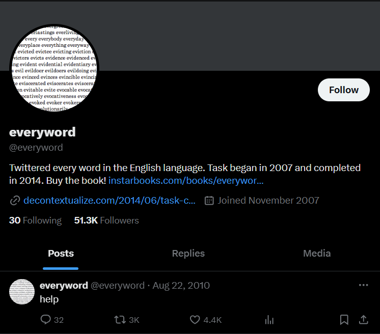
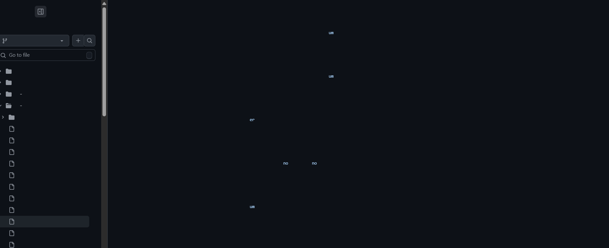
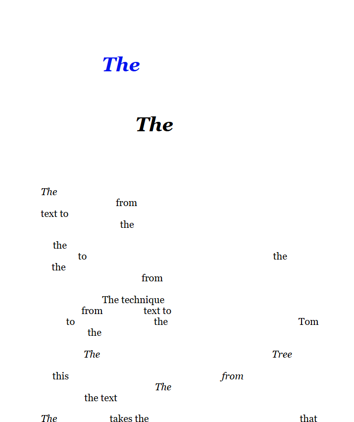

# sesion-04b

El día de hoy tuvimos presentaciones de nuestro proyecto 1.

El primer grupo en presentar fue el grupo 1 “maincraft”, que presentó un muy buen proceso de la toma de decisiones, donde quiero identificar las maneras en las que documentan; también quiero entender los arrays, para comprender qué son y por qué ellos los usaron.

Después, el grupo 2 “Gatolate” presentó un bello proyecto donde se demuestra el cambio desde el texto en el display, para después mostrar un gato.

El grupo 4, “Los Vengadores del Mish”, presentó algo muy bacán, que eran múltiples displays, auditivo, visual en pantalla y con un LED, todo según un mensaje que cargaban al Arduino, básicamente siendo un “traductor”, en el que FranUdp mencionó que programó un traductor de texto a código Morse, que está entrete y quiero revisar.

El grupo 5 presentó un código que se reproducía por sí mismo, donde presentaban un poema que era interrumpido por una imagen, que causaba un descanso para el lector. Su input era un potenciómetro que controla la velocidad en la que pasaba el poema y la imagen, pudiendo darle mayor o menor rapidez.

El grupo 6 “brainrot” investigó un espiral logarítmico, que estaba brutal como efecto visual, no solo en el final, sino también en los errores, muy bello, que quiero revisar cómo se llegó a crearlo. 

El grupo 7 dijo que querían crear una experiencia visual para dar la ilusión de una animación, y les quedó increíble, donde con un potenciómetro pasaban los fotogramas del vuelo de un ave, que iba acompañado por parte del poema en cada fotograma, o sea que podía reproducir más rápido la animación o quedarme parado en el fotograma que quisiera para apreciarlo.

Nos dejaron de tarea ver el significado de hermenéutica; según Google, es: interpretación de los textos, originalmente los sagrados.

El grupo 8, “Las dos”, porque son ellas 2, hicieron un poemario. 

## Encargo 8 "investigar la poesía y el trabajo de las poetas Allison Parrish, Nick Montfort y Martín Gubbins"

### Allison Parrish

Es una poeta, programadora, diseñadora de videojuegos y actualmente profesora asistente de Arte en la NYU, como ella misma describe en su [página web](https://www.decontextualize.com/): “cuya enseñanza y práctica abordan los fenómenos inusuales que surgen cuando el lenguaje y los computadores se encuentran”. 

Según Wikipedia, es una de las más destacadas creadoras de los primeros bots literarios de Twitter, es licenciada en Lingüística por la Universidad de California en Berkeley y tiene un máster en Estudios Profesionales por el Programa de Telecomunicaciones Interactivas (ITP) de la Universidad de Nueva York. Ha sido escritora residente en el Departamento de Inglés de la Universidad de Fordham entre 2014 y 2016, y profesora adjunta de Artes en el ITP desde 2016.

Un extracto directo de su página web, traducido al español con la herramienta [DeepL](https://www.deepl.com/es/translator) :

“Según Ars Technica, el trabajo de Allison «deleita a todo el mundo». Fue nombrada «Mejor creadora de bots poéticos» por Village Voice en 2016, y su fanzine de poemas generados por ordenador, «Compasses», recibió una mención honorífica en el Prix Ars Electronica 2021. Allison es cocreadora del juego de mesa Rewordable (Clarkson Potter, 2017), y sus libros, chapbooks y colaboraciones han sido publicados por editoriales como Counterpath, Instar, Aleator y Nothing to Say. Su poesía ha aparecido en BOMB Magazine, Strange Horizons, Taper y Ninth Letter, entre otras publicaciones. En 2024, recibió el premio «Maverick» de la Electronic Literature Organization.”

También ha hecho muchas charlas, que están disponibles para poder escuchar desde su página web.

Desde su portafolio encontré una obra que es del año 2007 titulada [“@everyword”](https://github.com/aparrish/everywordbot ), que tenía la misión de twittear absolutamente todas las palabras del idioma inglés de manera alfabética, donde se demoró aproximadamente 7 años en terminar.

También otra obra que me llamó la atención fue ["A Gutenberg Poetry Corpus / Gutenberg, Dammit”](https://github.com/aparrish/gutenberg-poetry-corpus), primero por el título, que contenía Gutenberg, un nombre muy importante en el ámbito del diseño, refiriéndose a Johannes Gutenberg, uno de los padres de la tipografía, que imprimió la Biblia de 42, que fue el primer libro impreso con tipos móviles, pero no se trataba sobre esto particularmente la obra, sino de la recopilación de 3 millones de líneas de poesía de una corporación con el nombre de “Project Gutenberg”, que es una librería de más de 75.000 ebooks totalmente gratis.

Esta estaba pensada como base para proyectos en los que se quería generar texto computacional de manera creativa, y al menos con cómo está el mundo de la generación computacional hoy en día, asumo que también esta es una manera mucho más ética de desarrollar estos proyectos que con la inteligencia artificial, donde existe muchísimo plagio.

Referencias:  
- https://www.decontextualize.com/  

- https://en.wikipedia.org/wiki/Allison_Parrish  

- https://portfolio.decontextualize.com/  

### Nick Montfort

Es un informático, artista y poeta estadounidense, es profesor de medios digitales en el MIT e investigador principal del Centro de Narrativa Digital de la Universidad de Bergen en Noruega. 

Montfort obtuvo un doctorado en Informática y Ciencias de la Información por la Universidad de Pensilvania, un máster en Escritura Creativa (Poesía) por la Universidad de Boston, un máster en Artes y Ciencias de los Medios de Comunicación por el MIT y una licenciatura en Humanidades y Ciencias de la Informática por la Universidad de Texas en Austin.

Trabaja en varios contextos diferentes, incluyendo la web, la publicación de libros y las lecturas literarias, pero también exposiciones en galerías, la demoscene y el livecoding.

Sus trabajos son tan interesantes que han sido traducidos, ya sea por él o por otras personas, a distintos lenguajes, para que distintas personas puedan usarlos o disfrutarlos.

Montfort fundó y dirigió The Trope Tank, un laboratorio/estudio de investigación DIY con sede en el MIT y en la ciudad de Nueva York. The Trope Tank lleva a cabo proyectos académicos y artísticos y ofrece recursos informáticos y materiales. Docenas de artistas/investigadores han realizado proyectos individuales y colaborativos en el marco de The Trope Tank, entre ellos profesores visitantes internacionales, becarios Fulbright y, actualmente, un rapero ganador de un premio Grammy.

En sus obras, existen más de 50 proyectos individuales, como también ha publicado 10 distintos libros generados computacionalmente.

Entre estas, unas de las que más me llamaron la atención son:

[“The Deletionist”](https://thedeletionist.com/) donde él, Amaranth Borsuk y Jesper Juul crearon un sistema para generar “erasure poetry” a partir de cualquier página web. Realmente me parece brutal la existencia de una página que cree este tipo de poesía, que al menos yo asocio a documentos que han sido censurados, pero de esta manera, ocurriendo en el mundo digital.

[“Ad Verbum”](https://nickm.com/if/adverbum.html) un juego de ficción interactiva, que realmente me impacta al saber que salió en el año 2000; hace 25 años ya existía un juego gracioso con el que literalmente tienes que ingeniárselas para poder resolver el enigma que te presentan, aunque realmente soy malo, ya que no me lo pasé, pero su existencia me fascinó.

Referencias:  
- https://nickm.com/me.html  
 
- https://en.wikipedia.org/wiki/Nick_Montfort  

### Martín Gubbins

Extracto directamente de su página web: 

“Martín Gubbins (Santiago, 1971), es una figura destacada de la escena literaria de vanguardia en Latinoamérica. En diversos países ha publicado libros de poesía y poesía visual y ha grabado poesía sonora solo y con otros artistas. Su obra aparece en decenas de antologías y ha participado en exposiciones individuales y colectivas, instalaciones, lecturas, conciertos, performances y festivales en varias partes del mundo. Practica la poesía como una exploración multifacética, deteniéndose frecuentemente en intersticios donde lo significante emerge de lo no-significante.”

Martín Gubbins ha participado en múltiples eventos, conversaciones y shows, entre muchas otras cosas, que pueden ser observadas como mínimo con una descripción y fotografías desde las distintas pestañas de su página web, principalmente como diseñador. Me gusta harto el poder observar las gráficas de algunos de los pósters de los eventos a los cuales ha asistido.

Referencias:  

- https://martingubbins.cl/  
