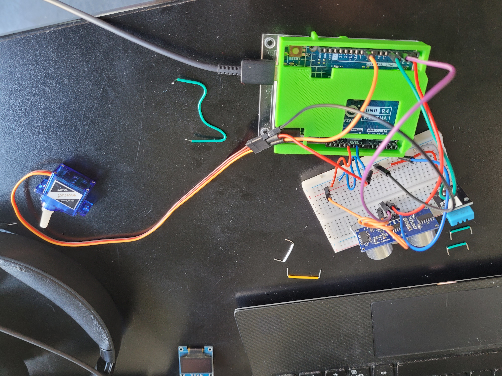
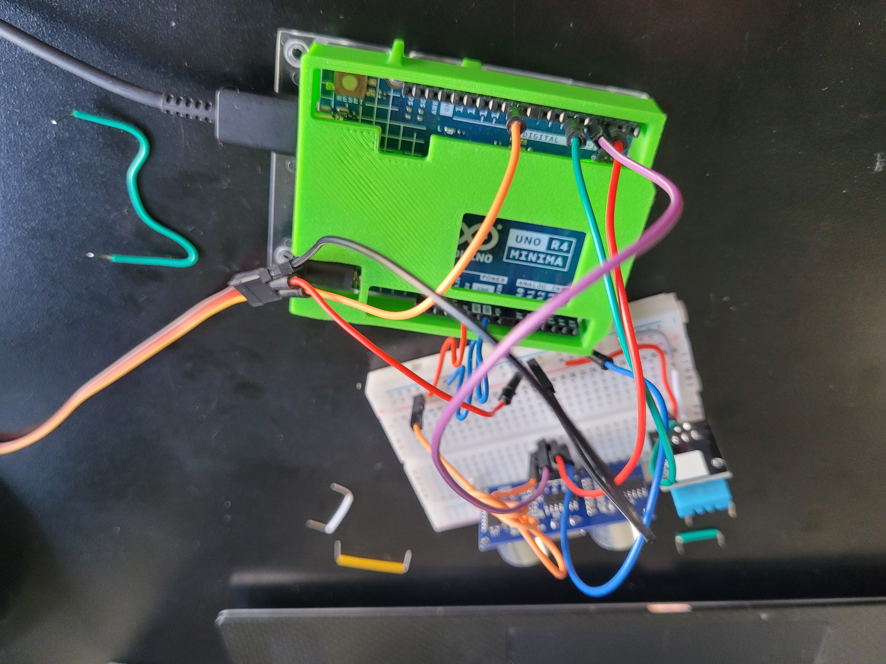

# sesion-09a

Luego para empezar crear el movimiento de nuestro robot, como ya habíamos acordado utilizaramos un servomotor, que me puse a revisar documentación para su uso, en el que me enfoque sería el siguiente [que corresponde a la librería que ocuparemos para el projecto](https://docs.arduino.cc/libraries/servo/).

Primeramente, tenía que declarar el nombre para mi servomotor, el cual le puse actBrazo de la siguiente manera: 

```cpp
// ponerle nombre al servomotor
Servo actBrazo
```
Aahora tenía hartas posibilidades, debido a que un servomotor es dictado por comandos específicos, que en teoría habría que este pseudocódigo estuviese muy corto pero bueno, más oportunidades de hacerlo entretenido.

Algo de lo que estaba seguro es de que debía colocar el pin de control del servo en la parte donde dejaría la parte de configuración de este sensor, el pin de control para el servomotor se escribiría de la siguiente manera:

```cpp
  // configurar en que pin conectar el servo
  actBrazo.attach(9);
```

lo siguiente que se me ocurrió es dejar **int** para los grados en donde se acaba moviendo el servomotor, para que pueda cambiarlos desde una base y que se ocupe ese mismo dato en todas sus instancias, por ejemplo si es que fuese a dejar el servomotor en su estado “standby” en 0°, entonces en vez de escribir en todos lados que quiero que vuela a 0, volverá a”standby”.

La manera que se ocurrió para poder integrarlos sería la siguiente:

```cpp
// escribir datos para el ángulo del servomotor
  int saludoIzq = 135;
  int saludoDer = 45;
  int saludoNeu = 180;
```

Donde saludoIzq sería el “brazo” a su lado izquierdo, saludoDer seria el “brazo” en su lado derecho y por ultimo saludoNeu, que seria ese modo “standby” que mencione antes.

```cpp
void ActuadorServo::configurar() {
// configurar en que pin conecto el servo
  actServo.attach(9);
}
```

Con misaa hable de como poder interconectar archivos entre sí, para empezar a usar mi servomotor y que solo funcione a partir de el dato de temperatura.

Subi la version [codigoRobotFriolento_0_2_4](https://github.com/disenoUDP/dis8645-2025-02-procesos/tree/main/27-SebastianSaez1003/sesion-09a/codigoRobotFriolento_0_2_4) de nuestro código.

A partir de esta versión del código, Aarón me pudo mostrar que aun no es necesario el colocar absolutamente todo de la manera más comprimida posible dentro del main, que para esta entrega no será necesario en realidad.

El primer error era que estaba intentando llamar desde el archivo del servomotor al de temperatura, esto no funciona, los archivos .h y .cpp sólo deberían depender el uno del otro.

Lo que me mostró Aarón fue cómo enlazar el código de manera correcta, ya que mi base estaba buena.

En el archivo de SensorTemp.cpp tenía un void innecesario para establecer que la temperatura era un **int**, cuando esto podía ser establecido en el archivo SensorTemp.h, así que lo eliminé.

También lo más esencial es que me mostró cómo es posible que funcionara el código en el archivo .ino, que pasó en el archivo principal .ino:

```cpp
#include "SensorTemp.h"
#include "SensorUltra.h"
#include "ActuadorServo.h"

SensorUltra sensorUltra;
SensorTemp sensorTemp;
ActuadorServo actuadorServo;

// En los setup pondremos todo lo necesario para que los sensores y actuadores funcionen
// desde los pins donde estaran conectados
// si es que es necesario el puerto serial
// entre otras cosas mas en el futuro
void setup() {
 sensorUltra.configurar();
 sensorTemp.configurar();
 actuadorServo.configurar();
}

// aqui es donde se usan los sensores y actuadores
void loop() {
  sensorUltra.leerDistancia();
  sensorUltra.reconocerDistancia();
  sensorTemp.reconocerTemp();
  sensorTemp.leerTemp();  
}
```

con un archivo de mi servomotor, donde estaba intentando forzar que el dato de “temperature” del SensorTemp fuese reconocido así: 

```cpp
// biblioteca para funcionamiento del servo
#include "ActuadorServo.h"
#include "SensorTemp.cpp"
#include "SensorTemp.h"

ActuadorServo::ActuadorServo() {
}

void ActuadorServo::configurar() {
  // configurar en que pin conectar el servo
  actBrazo.attach(9);
}

void ActuadorServo::posicionBrazo() {
  
}

void ActuadorServo::moverbrazo() {
  // si es que el robot NO tiene frío
  // y se detecta una entidad
  if(temperature < 15){
  actBrazo.write(saludoIzq);
  delay(1000);
  actBrazo.write(saludoDer);
  delay(1000);
  actBrazo.write(saludoNeu);
  }
}
```

Pero no importaba lo que intentará, no se reconoció, por eso es que Aarón me demostró que al pasar este if statement que estaba intentando que fuese realizado dentro del mismo archivo del servomotor hacia el .ino, de la [siguiente manera](https://github.com/disenoUDP/dis8645-2025-02-procesos/tree/main/27-SebastianSaez1003/sesion-09a/codigoRobotFriolento_0_3_0) :

```cpp
#include "SensorTemp.h"
#include "SensorUltra.h"
#include "ActuadorServo.h"

SensorUltra sensorUltra;
SensorTemp sensorTemp;
ActuadorServo actuadorServo;

// En los setup pondremos todo lo necesario para que los sensores y actuadores funcionen
// desde los pins donde estaran conectados
// si es que es necesario el puerto serial
// entre otras cosas mas en el futuro
void setup() {
  sensorUltra.configurar();
  sensorTemp.configurar();
  actuadorServo.configurar();
}

// aqui es donde se usan los sensores y actuadores
void loop() {
  sensorUltra.leerDistancia();
  sensorUltra.reconocerDistancia();

  sensorTemp.reconocerTemp();
  sensorTemp.leerTemp();

  // si temperatura es 15
  // mover brazo

  if (sensorTemp.temperatura < 15) {
    actuadorServo.moverBrazo();
  }
}
```


Junto a un archivo del servomotor que solo tenia las acciones específicas que se iban a realizar en “moverBrazo” : 

```cpp
void ActuadorServo::moverBrazo() {
  actBrazo.write(saludoIzq);
  delay(1000);
  actBrazo.write(saludoDer);
  delay(1000);
  actBrazo.write(saludoNeu);
}
```

En este punto ya empecé a entender un poco el flujo de como tendría que añadir estas funciones, así que lo siguiente que quería agregar era que se repitiera multiples veces solo la parte del “saludo”, asi que use el [“for”](https://docs.arduino.cc/language-reference/en/structure/control-structure/for/), dejando solo el movimiento de brazo a la izquierda y derecha dentro de este “for”, tambien cree un **int** que será capaz de almacenar la cantidad de veces que se ha realizado el saludo, que tendrá de nombre “int cuantosSaludos”.

```cpp
// escribir el movimiento que queremos realizar
void ActuadorServo::moverBrazo() {
    // se repetirá esto 3 veces
    for (cuantosSaludos = 0; cuantosSaludos < 3; cuantosSaludos++){
    // primero hacia la derecha
    actBrazo.write(saludoDer);
    delay(1000);
    // después a la izquierda
    actBrazo.write(saludoIzq);
    delay(1000);
  }
  // vuelve a posición inicial
  actBrazo.write(saludoNeu);
}
```

Con esto en mente, empecé a comentar todo lo posible y llegué al siguiente código, donde detectaba la temperatura, y solo si es que era mayor al rango que establece, empezaba a saludar, que seria la version [codigoRobotFriolento_0_3_1](https://github.com/SebastianSaez1003/dis8645-2025-02-procesos/tree/main/27-SebastianSaez1003/sesion-09a/codigoRobotFriolento_0_3_1).

Para trabajo en el lab, intente el usar nuestro código con clases simultáneamente con todo (menos el display porque no lo tenia) conectado, de la manera que se puede observar en la siguiente imagen:





donde cambié unos cuantos de los pines especificados en nuestro código para poder asegurarme de que no había mas de algun sensor con los mismos pines, después de esto lo envié a mi arduino pero, surgieron unos problemas.

Entre estos habia 2 que encontré graves:

1. El servomotor no se movía, no importaba a cuanto cambiase la temperatura que tenía puesta en el “if” statement.  

2. Se demoraba en 1-2 minutos en recibir algo en el monitor serial, pero que no tenía idea del porque.

Lo del movimiento del servomotor yo me lo imaginaba que era un problema causado por el tema de todo el tiempo que se demoraba en recibir una señal de los sensores, pero no era capaz de descubrir cuál era la razón, intente borrar todos los delays del código y no cambio, intente borrar alguno de los sensores y tampoco funciono. 

Pero bueno lo importante es que si podía leer ambos sensores al mismo tiempo, el ultrasónico y el de temperatura.


